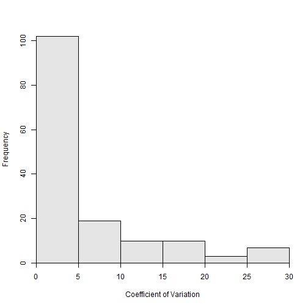

A **FSA** user recently asked me if there was a way to see and work with the age comparison results for individual fish.  In particular, this user wanted to identify each fish for which the individual CV values from comparing two independent age estimates was greater than 10.  It turns out that this is fairly easy to do once you realize how the results are returned from `agePrecision()`.  Here is an example using the `WhitefishLC` data found in the **FSA** package.

The data are loaded and `agePrecision()` is called to compare the ages assigned to otoliths by two different readers.


data(WhitefishLC)
ap1 <- agePrecision(~otolith1+otolith2,data=WhitefishLC)


Examining the structure of the saved object reveals several items returned in a list


str(ap1)



## List of 8
##  $ detail   :'data.frame':	151 obs. of  6 variables:
##   ..$ otolith1: int [1:151] 3 3 3 3 3 6 9 11 3 1 ...
##   ..$ otolith2: int [1:151] 3 3 3 3 3 5 10 12 4 1 ...
##   ..$ avg     : num [1:151] 3 3 3 3 3 5.5 9.5 11.5 3.5 1 ...
##   ..$ sd      : num [1:151] 0 0 0 0 0 ...
##   ..$ APE     : num [1:151] 0 0 0 0 0 ...
##   ..$ ACV     : num [1:151] 0 0 0 0 0 ...
##  $ rawdiff  : 'table' int [1:5(1d)] 3 27 94 21 6
##   ..- attr(*, "dimnames")=List of 1
##   .. ..$ : chr [1:5] "-2" "-1" "0" "1" ...
##  $ absdiff  : 'table' int [1:3(1d)] 94 48 9
##   ..- attr(*, "dimnames")=List of 1
##   .. ..$ : chr [1:3] "0" "1" "2"
##  $ APE      : num 3.34
##  $ ACV      : num 4.72
##  $ PercAgree: num 62.3
##  $ n        : int 151
##  $ R        : int 2
##  - attr(*, "class")= chr "agePrec"


For this problem, the user wants to focus on the results in the `detail` oject.  This object is a data.frame that contains intermediate calculations for each individual fish.


headtail(ap1$detail)



##     otolith1 otolith2 avg sd APE ACV
## 1          3        3   3  0   0   0
## 2          3        3   3  0   0   0
## 3          3        3   3  0   0   0
## 149       16       16  16  0   0   0
## 150       15       15  15  0   0   0
## 151       13       13  13  0   0   0


This object can be treated like any other data.frame.  For example, it can be sorted by ascending order of the CV value (using `arrange()` from `dplyr`)


tmp <- ap1$detail %>% arrange(ACV)
headtail(tmp)



##     otolith1 otolith2 avg        sd APE      ACV
## 1          3        3 3.0 0.0000000   0  0.00000
## 2          3        3 3.0 0.0000000   0  0.00000
## 3          3        3 3.0 0.0000000   0  0.00000
## 149        3        2 2.5 0.7071068  20 28.28427
## 150        3        2 2.5 0.7071068  20 28.28427
## 151        6        4 5.0 1.4142136  20 28.28427


The CV values can be plotted.


hist(~ACV,data=ap1$detail,xlab="Coefficient of Variation")


 

Or, to the user's interest, the individuals with a CV greater than 10 can be isolated.


tmp <- ap1$detail %>% filter(ACV>10)
headtail(tmp)



##    otolith1 otolith2  avg        sd       APE      ACV
## 1         6        5  5.5 0.7071068  9.090909 12.85649
## 2         3        4  3.5 0.7071068 14.285714 20.20305
## 3         2        3  2.5 0.7071068 20.000000 28.28427
## 28        9       11 10.0 1.4142136 10.000000 14.14214
## 29        9        7  8.0 1.4142136 12.500000 17.67767
## 30        5        4  4.5 0.7071068 11.111111 15.71348

