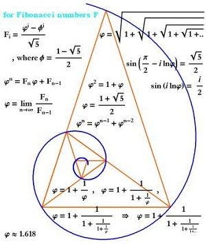

&nbsp;

1. [General t Distribution Questions](#general-t-distribution-questions)
1. [Achievement Test Scores](#achievement-test-scores)
1. [Salaries of College Graduates](#salaries-of-college-graduates)
1. [Fishing Line Strength](#fishing-line-strength)
1. [Strawberries Produced](#strawberries-produced)
1. [Putting Together Toys](#putting-together-toys)
1. [Boat Traffic](#boat-traffic)
1. [Golden Triangle in Beads?](#golden-triangle-in-beads)

&nbsp;

<hr size="30">

&nbsp;

&nbsp;

## General t Distribution Questions

Click on each question to see the answer, click on it again to close the answer.

<div class="panel-group">

<div class="panel panel-default">
<div class="panel-heading">
<div class="panel-title">
<a data-toggle="collapse" href="#pval1">What is the p-value if H<sub>A</sub>: &mu;<125, t = -2.178, and df = 35?</a>
</div>
</div>
<div id="pval1" class="panel-collapse collapse">
<div class="panel-body">The p-value is 0.0181 as computed with distrib(-2.178,distrib="t",df=35)</div>
</div>
</div>

<div class="panel panel-default">
<div class="panel-heading">
<div class="panel-title">
<a data-toggle="collapse" href="#tstar1">What is t<sup>*</sup> for the previous question if &alpha; = 0.05?</a>
</div>
</div>
<div id="tstar1" class="panel-collapse collapse">
<div class="panel-body">The 95% upper confidence bound would use a t<sup>*</sup> of 1.690 as computed with distrib(0.95,distrib="t",df=35,type="q").</div>
</div>
</div>

<div class="panel panel-default">
<div class="panel-heading">
<div class="panel-title">
<a data-toggle="collapse" href="#pval2">What is the p-value if H<sub>A</sub>:&mu;>125, t = 1.856, and df = 81?</a>
</div>
</div>
<div id="pval2" class="panel-collapse collapse">
<div class="panel-body">The p-value is 0.0336 as computed with distrib(1.856,distrib="t",df=81,lower.tail=FALSE).</div>
</div>
</div>

<div class="panel panel-default">
<div class="panel-heading">
<div class="panel-title">
<a data-toggle="collapse" href="#tstar2">What is t<sup>*</sup> for the previous question if &alpha; = 0.01?</a>
</div>
</div>
<div id="tstar2" class="panel-collapse collapse">
<div class="panel-body">The 99% lower confidence bound would use a t<sup>*</sup> of -2.373 as computed with distrib(0.99,distrib="t",df=81,type="q",lower.tail=FALSE).</div>
</div>
</div>

<div class="panel panel-default">
<div class="panel-heading">
<div class="panel-title">
<a data-toggle="collapse" href="#pval3">What is the p-value if H<sub>A</sub>:&mu;&ne;125, t = -2.178, and df = 99?</a>
</div>
</div>
<div id="pval3" class="panel-collapse collapse">
<div class="panel-body">The p-value is 0.0318 as compute with 2*distrib(-2.178,distrib="t",df=99,lower.tail=TRUE).</div>
</div>
</div>

<div class="panel panel-default">
<div class="panel-heading">
<div class="panel-title">
<a data-toggle="collapse" href="#tstar3">What is t<sup>*</sup> for the previous question if &alpha; = 0.10?</a>
</div>
</div>
<div id="tstar3" class="panel-collapse collapse">
<div class="panel-body">The 90% confidence interval would use a t<sup>*</sup> of &plusmn;1.660 as computed with distrib(0.05,distrib="t",type="q",df=99,lower.tail=FALSE).</div>
</div>
</div>

</div>

----

## Achievement Test Scores


A general achievement test is standardized so that students should average 80 with a standard deviation of 5 (this is for the entire population not the population of students at the school described below). The superintendent at a school in a large district would like to show that her students averaged better than the 80 points. To test this, she had the test given to 32 randomly selected students from her school. The summary statistics for those 32 students are: mean=83.2, median=82.5, standard deviation=5.5, and IQR=7. Perform the appropriate hypothesis test for this superintendent at the 0.05 level.

[See answer here](zRevExAns/1Samplet.html#achievement-test-scores)

----

## Salaries of College Graduates


The Northwestern University Placement center conducts random surveys on starting salaries of college graduates and publishes the results every year. The Dean of the College of Liberal Arts suggested to prospective students that graduates from the College would earn more than $32000 as a starting salary on average. The results in the table below are from a part of the Placement Center's results for graduates of the College of Liberal Arts for the year just prior to the Dean's statements [*Note that the measurements are in 1000s of dollars.*]. Use these results at the 10% level to determine the correctness of the Dean's statement.

```
   n   Min. 1st Qu. Median  3rd Qu.   Max.   Mean  StDev
  42  29.30   31.30   32.50    33.80   36.80  32.511  1.713
```

[See answer here](zRevExAns/1Samplet.html#salaries-of-college-graduates)

----


## Fishing Line Strength


Fishing line is graded by the pounds (lbs) of pressure that it can withstand before breaking. For example, line that is rated as 6-lbs should not break for pressures under 6 lbs. Two physics students developed an apparatus for testing the breaking point of 2-foot sections of line to test the manufacturer's claim (i.e., determine if line rated at 6-lbs broke, on average, at pressures below 6 lbs). To test this, they measured the pounds of pressure it took 20 randomly selected 2-foot sections of line to break. Use their results shown below to test their hypothesis at the 10% level.

```
6.1 5.3 5.5 4.9 6.2 6.5 5.7 5.5 4.7 6.2
6.8 5.9 5.8 6.7 6.3 6.2 5.4 5.5 6.7 5.9
```
[See answer here](zRevExAns/1Samplet.html#fishing-line-strength)

----


## Strawberries Produced


Last year I planted 400 everbearing strawberry plants in my garden. The company I bought the plants from claimed that in the year following planting, each plant would produce an average of 12 berries. I was surprised by this claim and hypothesized that the plants would actually produce less than what the company said, on average. To test this claim, I counted the number of ripe berries produced for the entire season on 50 randomly selected plants. Use the data in [Strawberries.csv](https://raw.githubusercontent.com/droglenc/NCData/master/Strawberries.csv) to test the company's claim at the 10% level.

[See answer here](zRevExAns/1Samplet.html#strawberries-produced)

----


## Putting Together Toys


The toy industry rates toys regarding their ease for being put together in three categories: easy, moderate, and difficult. A toy is placed into the easy category if it takes 10 minutes or less to put the toy together, in the moderate category if it takes 20 minutes or less (and more than 10 minutes), and in the difficult category if it takes more than 20 minutes. A randomly selected group of 34 adults were asked to put together a new toy to determine which rating the toy should receive. The results from these 34 individuals are in [ToyTime.csv](https://raw.githubusercontent.com/droglenc/NCData/master/ToyTime.csv). Conduct a hypothesis test, at the 10% level, to determine whether the toy should receive the difficult rating.

[See answer here](zRevExAns/1Samplet.html#putting-together-toys)

----


## Boat Traffic


One of the dominant uses of Madison area lakes is for boating. To develop a long-term data set on the temporal fluctuations and trends in such activity, the Long Term Ecological Research (LTER) project obtained records of boat traffic that passes through the locks at the head of the Yahara River on its stretch between Lake Mendota and Lake Monona. These data in [Yahara.csv](https://raw.githubusercontent.com/droglenc/NCData/master/Yahara.csv) have been collected nearly daily from April through October since 1976. Use these data to determine, at the 5\% level, if the mean total number of boats passing through the locks during the months of June, July, and August of 2005 is greater than 75. HINT: create a new data frame that contains just the data for this period (i.e., the data file contains more data than is needed for this question). I suggest that you do this in three separate steps -- isolate 2005 data, isolate data for months after May (5), and then isolate data for months before September (9).

[See answer here](zRevExAns/1Samplet.html#boat-traffic)

----


## Golden Triangle in Beads?


The [golden rectangle](http://en.wikipedia.org/wiki/Golden_rectangle) is a rectangle with a length-to-width ratio of 1:1.618, or equivalently, a width-to-length ratio of 0.618:1. The golden rectangle is evident in several works by ancient Greeks and Egyptians. Anthropologists measured the width-to-length ratios of beaded rectangles used by the Shoshoni Indians of America to decorate their leather goods. Use their data in [Shoshoni.csv](https://raw.githubusercontent.com/droglenc/NCData/master/Shoshoni.csv) to determine, at the 5% level, if the golden rectangle is evident in the beadwork of the Shoshonis.

[See answer here](zRevExAns/1Samplet.html#golden-triangle-in-beads)

----
