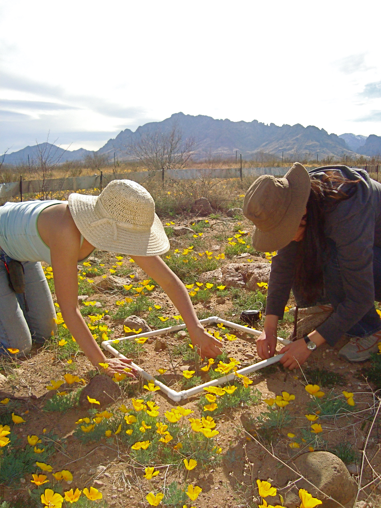

----

  <strong>Note</strong> Your answers to the questions below should follow the <a href="../../resources/hwformat" target="_blank">expectations for homework found here</a> (and <a href="../../resources/FAQ/FAQs/HWFormat_Example.pdf" target="_blank">demonstrated here</a>).

----

## Hawk's Ridge Raptors

The Duluth, MN touristry board would like to advertise that, on average, more than 50,000 raptors are seen at Hawk's Ridge per year. Data was recorded for a number of raptor species from 1971-2003 and recorded in HawksRidge.csv ([data](https://raw.githubusercontent.com/droglenc/NCData/master/HawksRidge.csv), [meta](https://raw.githubusercontent.com/droglenc/NCData/master/HawksRidge_meta.txt)). Note that the `Total` variable should be used from this data file as the Board is focused on the total number of raptors seen in a year. Further, assume that it is known that the population standard deviation is 37000 raptors per year. The Board wants there to be strong, if any, evidence to support their claim (i.e., test at the 1% level). Use these data to determine if there is support in these data for the Board's claim.

----

## Credit Card Limits

Credit card companies use a regression model (includes such factors as income, employment, credit history) to determine the credit worthiness of a prospective card holder. In the past, the companies used a threshold (cutoff) limit of 630 to receive a card. It is also assumed that the standard deviation of all potential credit card holders is 5. Recent information suggests that delinquencies have been increasing and it is hypothesized that credit card companies will raise the "cutoff score" in response. Examine the following results concerning "cutoff scores" from 44 credit card issuers to determine, at the 10% level, if there is evidence that the "cutoff score" has been increased significantly from 630.

<pre>
Variable   Mean  Median StDev  Min  Max    Q1     Q3
CCards   636.86  636.50  4.42  629  647  633.25 640.00
</pre>

----

## Elk Density in Banff

Hebblewhite (2000) recorded the density (number per square km) of Elk (*Cervus elaphus*) in Banff National Park, Alberta, CA from 1986 to 2000. The raw data from his study are shown below. Further assume that it is known from previous studies that the standard deviation of density estimates for all years is 2 elk per square kilometer and the distribution is approximately normal. Use this information to construct and fully interpret a test, at the 10% significance level, of whether the mean density of elk is greater than 8 per square km.

<pre>
 5.20, 7.79, 6.46, 8.60, 8.97,8.65, 9.60, 9.09,
12.42,10.70,11.59,10.68,10.61,9.04,10.89
</pre>

----

## Counting Plants in Plots

Suppose that a plant ecologist is to examine a very large tract of land that has been subdivided into 1400 plots of 10 m^2^ (10 square meters). The researcher wants to determine, with 90% confidence, the mean density of plants per plot for the entire tract of land to within 10 plants per plot. A pilot study indicated that the standard deviation was approximately 50 plants per plot. Determine how many 10 m^2^ plots the researcher should examine to reach her stated goals.

----
