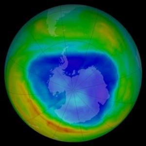

----

## Increased Civility in Nation-States?

Common wisdom has it that the world is becoming more civilized.  This would suggest that nation-states are killing fewer of their citizens (including capital punishment, deaths in civil and international wars and all state-sponsored violence) than was once the case.  An analysis of history textbooks suggests that, in a typical year in the nineteenth century, the mean number of citizens killed by the typical nation-state was 4,104.  To examine if the world is becoming more civilized the number of deaths from state-sponsored violence was recorded from records in the archives of Amnesty International, The International Court of Justice, the United Nations and the World Bank for a random sample of 75 countries.  The mean and standard deviation for these 725 countries was 3,292.8 and 4,814.5, respectively.  Use these results to determine if the "world is becoming more civilized."  Make sure to provide explicit answers with your work shown for all [11 steps of a hypothesis test](../Hypothesis_Testing/11-steps.html).  [*This example was modified [from here](http://www.shortell.org/book/chap12.html)*]

----

## Thickness of the Ozone Layer

The typical thickness of the ozone layer over the Earth's surface is 300 [Dobson units](http://ozonewatch.gsfc.nasa.gov/facts/dobson_SH.html).  Researchers at the Laboratorium für Atmospharensphysic in Switzerland recorded the thickness of the ozone layer over Arosa, Switzerland from 1926 to the present.  The data in OzoneSWI.csv ([file](https://github.com/droglenc/NCData/raw/master/OzoneSWI.csv), [meta](https://github.com/droglenc/NCData/blob/master/OzoneSWI_meta.txt)) contains the measurements from a random sample of 45 years between 1926 and the mid 1990s.  Use these data to determine, at the 1% level, if the thickness of the ozone layer over Arosa is different than that which is typocal for the Earth's surface.  Make sure to provide explicit answers with your work shown for all [11 steps of a hypothesis test](../Hypothesis_Testing/11-steps.html).

----
