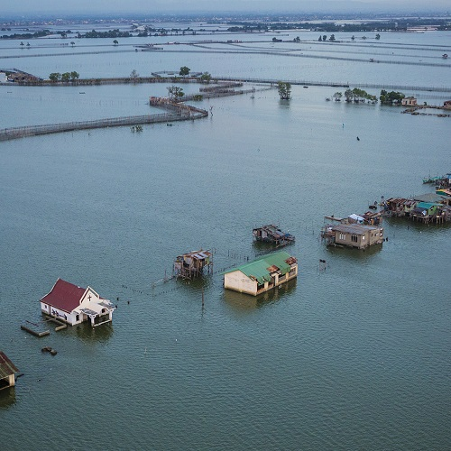

----

  <strong>Note</strong> Your answers to the questions below should follow the <a href="../../resources/hwformat" target="_blank">expectations for homework found here</a> (and <a href="../../resources/FAQ/FAQs/HWFormat_Example.pdf" target="_blank">demonstrated here</a>).

----

## Sea Level Rise Rate

A group of ecologists (work of Sahagian et al.) examined the effects of human activities (including aquifer mining, surface water diversion and volume changes of inland lakes, desertification, wetland drainage, soil erosion in agriculture, deforestation, and dam building) on a number of water quantity measurements, including sea level rise rate, in 23 "ecosystems" in the late 20th century. The mean (standard deviation) total sea level rise rate among the 23 sampled ecosystems was 0.059 (0.135) mm/yr. Use these results, and the assumption that the sample distribution is not skewed, to determine, at the 1% significance level, if the mean sea-level increased significantly over the period of Sahagian's work. [*Hint: When identifying the hypotheses, think about what type of values the measured "sea level rise rate" would be if the sea level was indeed rising. Take special note that a "rise rate" was recorded.*]

----

## Acid Rain in Shenandoah National Park

The pH scales falls between 0 and 14 with values <7 considered acidic and values >7 considered basic. Rain water is naturally acidic, usually around 5.6 on the pH scale. Thus, the EPA defines rainwater with a pH less than 5.6 as being "acid rain." A series of rain collection samples were taken at the Big Meadows Station in the Shenandoah National Park, VA with the results stored in pHlevels.csv ([data](https://raw.githubusercontent.com/droglenc/NCData/master/pHlevels.csv), [meta](https://raw.githubusercontent.com/droglenc/NCData/master/pHlevels_meta.txt)). Use these data to determine, at the 1% level, if there is evidence for "acid rain" at this site. [*Note: This question originate from [here](http://www.cvgs.k12.va.us/DIGSTATS/main/inferant/a_acidrain.htm).*]

----
