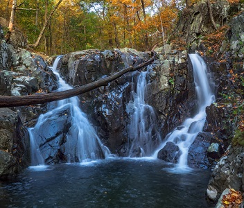
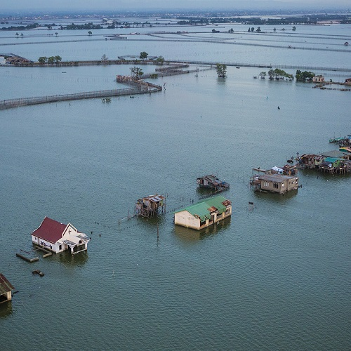
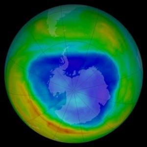

----

For all "hypothesis testing" questions, make sure to provide explicit answers with your work shown for all <a href="../11-steps,html">11 steps of a hypothesis test</a>.

----

## Acid Rain in Shenandoah National Park

The pH scales falls between 0 and 14 with values <7 considered acidic and values >7 considered basic. Rain water is naturally acidic, usually around 5.6 on the pH scale. Thus, the EPA defines rainwater with a pH less than 5.6 as being "acid rain." A series of rain collection samples were taken at the Big Meadows Station in the Shenandoah National Park, VA with the results stored in pHlevels.csv ([data](https://raw.githubusercontent.com/droglenc/NCData/master/pHlevels.csv), [meta](https://raw.githubusercontent.com/droglenc/NCData/master/pHlevels_meta.txt)). Use these data to determine, at the 1% level, if there is evidence for "acid rain" at this site.[^3]

----

## Increased Civility in Nation-States?

Common wisdom has it that the world is becoming more civilized.  This would suggest that nation-states are killing fewer of their citizens (including capital punishment, deaths in civil and international wars, and all state-sponsored violence) than was once the case.  An analysis of history textbooks suggests that, in a typical year in the nineteenth century, the mean number of citizens killed by the typical nation-state was 4,104.  To examine if the world is becoming more civilized, the number of deaths from state-sponsored violence was recorded from records in the archives of [Amnesty International](http://www.amnestyusa.org/), [The International Court of Justice](http://www.icj-cij.org/homepage/), the [United Nations](http://www.un.org/en/index.html), and [The World Bank](http://www.worldbank.org/) for a random sample of 75 countries.  The mean and standard deviation for number of killings in these 75 countries was 3,292.8 and 4,814.5, respectively.  Use these results to determine, at the 5% level, if the "world is becoming more civilized."[^1]

----

## Sea Level Rise Rate

A group of ecologists (work of Sahagian *et al.*) examined the effects of human activities (including aquifer mining, surface water diversion and volume changes of inland lakes, desertification, wetland drainage, soil erosion in agriculture, deforestation, and dam building) on a number of water quantity measurements, including sea level rise rate, in 23 "ecosystems" in the late 20th century. The mean (standard deviation) total sea level rise rate among the 23 sampled ecosystems was 0.059 (0.135) mm/yr. Use these results, and the assumption that the sample distribution is not skewed, to determine, at the 1% significance level, if the mean sea-level increased significantly over the period of Sahagian's work. [*Hint: When identifying the hypotheses, think about what type of values the measured "sea level rise rate" would be if the sea level was indeed rising. Take special note that a "rise rate" was recorded.*]

----

## Thickness of the Ozone Layer

The typical thickness of the ozone layer over the Earth's surface is 300 [Dobson units](http://ozonewatch.gsfc.nasa.gov/facts/dobson_SH.html).  Researchers at the Laboratorium für Atmospharensphysic in Switzerland recorded the thickness of the ozone layer over [Arosa, Switzerland](https://en.wikipedia.org/wiki/Arosa) from 1926 to the present.  The data in OzoneSWI.csv ([file](https://github.com/droglenc/NCData/raw/master/OzoneSWI.csv), [meta](https://github.com/droglenc/NCData/blob/master/OzoneSWI_meta.txt)) contains the measurements from a random sample of 45 years between 1926 and the mid 1990s.  Use these data to determine, at the 1% level, if the thickness of the ozone layer over Arosa is different than that which is typical for the Earth's surface.[^2]

----

## Fecal Coliform Counts III
Use the data in [FecalColiform.csv](FecalColiform.csv) to determine, at the 10% level, if the mean CFU from this event exceeds the 150 CFU/100ml threshold value that would require closing the lake to swimming.

----

## P-Value Calculations and Decisions II

For each situation below, (i) compute the t test statistic, (ii) compute the p-value (include a drawing to support your calculation), and (iii) make a decision about H0.

1. &alpha;=0.01, HA: &mu;<880, n=80, s=92, x&#772;=858.
1. &alpha;=0.05, HA: &mu;&ne;1500, n=40, s=790, x&#772;=1730.

----

## Confidence Interval Calculations II

Compute and interpret confidence regions for the two situations above. You should use the same "steps" as you did in the [confidence regions module](ConfRegions_CE2).

----

## Footnotes

[^1]: This example was modified [from here](http://www.shortell.org/book/chap12.html).

[^2]: This example is based [on this](http://college.cengage.com/mathematics/brase/understandable_statistics/7e/students/datasets/svls/frames/svls11.html).

[^3]: This question originated from [here](http://www.cvgs.k12.va.us/DIGSTATS/main/inferant/a_acidrain.htm).
