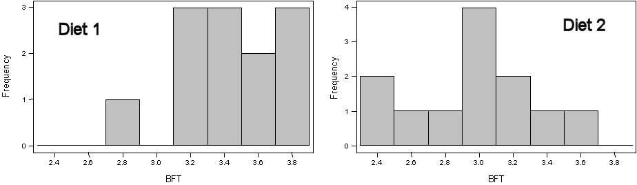

1. **Application Questions**
    1. [Commitment to Adult Animals](#commitment-to-adult-animals)
    1. [Methyl Mercury in Mussels](#methyl-mercury-in-mussels)
    1. [Popcorn Yield by Variety](#popcorn-yield-by-variety)
    1. [Heating System Efficiency](#heating-system-efficiency)
    1. [Pork Quality](#pork-quality)

1. **General t Distribution Questions**
    1. [P-Value Calculations and Decisions](#p-value-calculations-and-decisions)
    1. [Confidence Interval Calculations](#confidence-interval-calculations)


<div class="alert alert-success">For all "hypothesis testing" questions, make sure to provide explicit answers with your work shown for all <a href="../11-steps">11 steps of a hypothesis test</a>.
</div>

&nbsp;

----

## Commitment to Adult Animals

A researcher has constructed a "survey" to determine an individual person's "commitment to adult animals." Each individual survey leads to a single number that measures that individual's "commitment." This number is larger for "greater commitments." The researcher wanted to determine if the mean "commitment" according to this measure was greater for people who evacuated all or some of their pets versus those who did not evacuate any pets during a propane tanker derailment in Weyauwega, Wisconsin in 1996. The table below shows the results for the "commitment" measure for 116 individuals that evacuated all or some of their pets (i.e., `DidEvac`) and for 125 individuals that evacuated none of their pets (i.e., `NoEvac`). Also note that the Levene's p-value for these data is 0.678. Use these results to examine the researcher's hypothesis at the 1% significance level.

<pre>
Variable   n  Mean Median StDev SE Mean   Min    Max    Q1    Q3
DidEvac  116 7.694  7.658 3.410  0.317  -0.863 14.763 5.035 10.204
NoEvac   125 6.640  6.599 3.102  0.277  -1.214 14.444 4.568  8.696
</pre>

----

## Methyl Mercury in Mussels

[Mierzykowski and Carr (2001)](https://www.fws.gov/northeast/mainecontaminants/pdf/nyanmussels.pdf) examined the amount of methyl-mercury in freshwater mussels (*Elliptio complanata*) in four areas in the Sudbury River watershed in Massachusetts. Two of the locations they examined were categorized as reservoirs with one being considered as impacted by the Nyanza Chemical site and the other as not being impacted. The total methyl mercury (in &mu;g meHG per g wet-weight of mussels) for individual mussels sampled from each site is shown below. Use these data to determine if there is a significant difference, at the 5% level, in methyl mercury levels found in mussels between the two locations. Continue with the analysis even if you find that the assumptions have not been met.

<pre>
impacted  0.011 0.054 0.056 0.095 0.051 0.077
reference 0.031 0.040 0.029 0.066 0.018 0.042 0.044
</pre>

## Popcorn Yield by Variety

A student wanted to determine if the number of unpopped kernels differed between yellow and white varieties of a famous brand of popcorn. To test this, he put 100 kernels of either white or yellow popcorn into a standard air popper, popped the corn until no "pops" were heard, and then counted the number of unpopped kernels. He tested 30 randomly selected groups of 100 kernels for both white and yellow varieties. Use the results below to test, at the 10% level, the student's hypothesis.

```
         Variable  N  Mean  Median  StDev  SE Mean
         White    30 4.267   2.000  4.456    0.814
         Yellow   30 3.567   1.500  4.485    0.819

         Levene's Test -- P-Value = 0.972
```

----

## Heating System Efficiency

A study was performed in order to evaluate the effectiveness of two devices for improving the efficiency of gas home-heating systems. Energy consumption in houses was measured after one of the two devices was installed. The two devices were an electric vent damper (DampVent=Electric) and a thermally activated vent damper (DampVent=ThermAct). Energy consumption (in BTUs) was measured for a variety of houses fitted with the two devices. Compare, at the 10% level, the effectiveness of these two devices by determining if a difference exists in energy consumption between houses fitted with the devices. Note that Levene's test p-value is 0.996.

```
DampVent   N    Mean  Median  StDev SE Mean Minimum Maximum     Q1     Q3
Electric  40   9.908   9.590  3.020   0.477   4.000  18.260  7.885 11.555
ThermAct  50  10.143  10.290  2.767   0.391   2.970  16.060  8.127 12.212
```

----

## Pork Quality

A pig diet manufacturer wants to determine if the backfat thickness differs between pigs raised on two different diets. Backfat thickness is an indicator of pork quality; smaller thicknesses mean better quality. A group of 24 pigs was randomly allocated to two groups which differed only in the diet received. Test the results from this experiment to see if a difference in backfat thickness (cm) is evident at the 5% level. Note that Levene's test p-value is 0.532.

```
         Var Diet  N   Mean Median  StDev SE Mean  Min  Max
         BFT    1 12  3.420  3.390  0.295  0.0850  2.87 3.87
                2 12  2.989  3.035  0.375  0.108   2.40 3.62
```



----

&nbsp;

# General t Distribution Questions
## P-Value Calculations and Decisions

For each situation below, (a) compute the t test statistic, (b) compute the p-value (include a drawing to support your calculation), and (c) make a decision about H<sub>0</sub>.

1. &alpha;=0.10, H<sub>A</sub>: &mu;<sub>1</sub>&gt;&mu;<sub>2</sub>, n<sub>1</sub>=12, n<sub>2</sub>=14, s<sub>1</sub>=6.6, s<sub>2</sub>=6.4, x&#772;<sub>1</sub>=27.3, and x&#772;<sub>2</sub>=23.2.
1. &alpha;=0.05, H<sub>A</sub>: &mu;<sub>1</sub>&lt;&mu;<sub>2</sub>, n<sub>1</sub>=n<sub>2</sub>=15, s<sub>1</sub>=8, s<sub>2</sub>=9, x&#772;<sub>1</sub>=79.5, and x&#772;<sub>2</sub>=87.5.
1. &alpha;=0.05, H<sub>A</sub>: &mu;<sub>1</sub>&ne;&mu;<sub>2</sub>, n<sub>1</sub>=20, n<sub>2</sub>=15, s<sub>1</sub>=56, s<sub>2</sub>=64, x&#772;<sub>1</sub>=307, and x&#772;<sub>2</sub>=268.

----

## Confidence Interval Calculations

Compute and interpret confidence regions for the two situations above. You should use the same "steps" as you did in the [confidence regions module](ConfRegions_CE2).
