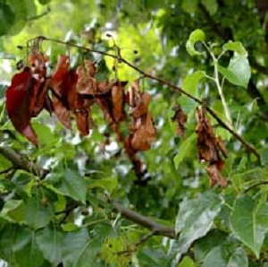

```{r echo=FALSE, eval=FALSE}
# Renders an appropriate HTML file for the webpage
setwd("C:/aaaWork/Web/GitHub/NCMTH107/modules/CE")
source("../../rhelpers/rhelpers.R")
modHTML("BEDACat_CE1")
```

```{r echo=FALSE, results='hide', message=FALSE}
source("../../rhelpers/knitr_setup.R")
```

----

## Hand Calculations

Use the data for the two variables (`VAR1` and `VAR2`) below to construct (by hand without R) a (i) two-way frequency table, (ii) a row-percentage table, (iii) a column-percentage table, and (iv) a total-percentage table. [*Hint: use `VAR1` as the columns.*]

<pre>
VAR1  D C A C A D C A D B A B B A C D A C A B B A D C A C B B
VAR2  z z y z x z x y z y z z y z z z z z y y x y z y x y x y
</pre>

<br>

----

## Fire Blight Disease


Researchers conducted an experiment on 24 trees subject to a fire blight disease.  Each tree was treated with one of several treatments (no action (control), removal of the affected branches, sprayed foliage with an antibiotic and removal of the affected branches). Each tree was then recorded according to one of three outcomes (tree died in the same year, tree died 2-4 years after, or tree died more than 4 years after the disease was noticed). The frequency table below show the treatment and outcome results for each of the 24 trees. Use these results to answer the questions below.

```{r BlightTables, echo=FALSE}
library(dplyr)
d <- data.frame(treat=c("A","A","A","A","A","B","B","B","C","C","A","A",
                        "B","B","B","C","C","C","C","B","B","C","C","C"),
                outcome=factor(c(1,1,1,1,1,1,1,1,1,1,2,2,
                             2,2,2,2,2,2,2,3,3,3,3,3))) %>%
  mutate(treat=FSA::mapvalues(treat,
                                     from=c("A","B","C"),
                                     to=c("No Action (Control)",
                                          "Removed Branches",
                                          "Sprayed and Removed")),
                outcome=FSA::mapvalues(outcome,
                                       from=1:3,
                                       to=c("Within 1 Year",
                                            "2-4 Years Later",
                                            "4+ Years Later")))
xtabs(~treat+outcome,data=d)
```

1. What is the response variable?
1. What percentage of trees in the control treatment died within the first year after the disease was noticed?
1. What percentage of all trees were in the control treatment and died within the first year after the disease was noticed?
1. What percentage of trees in the control treatment died more than four years after the disease was noticed?
1. What percentage of trees that died 2-4 years after the disease was noticed were in the control treatment?
1. What percentage of all trees died within the first year after the disease was noticed?
1. Make an overall conclusion about how the different treatments affected survival of the trees. [*Hint: You may want to construct a specific type of percentage table.*]

----

## Lights and Nearsightedness


An Associated Press article captured the attention of readers with the headline "Night lights bad for kids?" The article was based on [a 1999 study](https://www.ncbi.nlm.nih.gov/pmc/articles/PMC1115762/) at the University of Pennsylvania and Children's Hospital of Philadelphia, in which parents were surveyed about the lighting conditions under which their children slept between birth and age-2 (lamp, night-light, or no light) and whether or not their children developed nearsightedness (myopia). The purpose of their study was to explore the effect of a young child's nighttime exposure to light on later nearsightedness. The results from 479 children were recorded in nightlight.csv ([data](https://raw.githubusercontent.com/droglenc/NCData/master/nightlight.csv), [meta](https://raw.githubusercontent.com/droglenc/NCData/master/nightlight_meta.txt)). Use these data to create a frequency table and each of the three types of percentage tables. Use your results to answer the following questions. [*Make sure to refer to properly labeled tables for each question.*]

1. How many children in the sample slept in "no light" conditions and developed nearsightedness?
1. What percentage of children that slept in "no light" conditions developed nearsightedness?
1. What percentage of all children slept with a "lamp" and developed nearsightedness?
1. What percentage of children that slept with a "night light" did not develop nearsightedness?
1. What percentage of children that developed nearsightedness had slept with a "lamp"?
1. What percentage of children developed nearsightedness?
1. Make an overall conclusion about how the different light conditions affected the development of nearsightedness in the children.

&nbsp;

----

## Additional Practice

[Here are more exercises for practice if time permits.](BEDACat_CE2)

----
