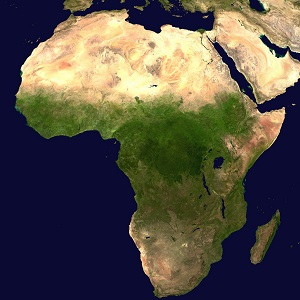

&nbsp;

1. **Applications**
    1. [Rainfall in West Africa](#rainfall-in-west-africa)
    1. [Herring Gulls](#herring-gulls)

&nbsp;

----

## Rainfall in West Africa

In an attempt to study rainfall patterns in West Africa caused by El Nino weather events, Nicholson and Kim (1997) constructed a two-way table that relates the number of days of rainfall that occurred each month to the amount of rain in inches that fell on those days (categorized as less than 1 inch and more than 1 inch). Use the modified version of their table below to answer the questions further below.
 
|        | < 1 in | > 1 in |
|:------:|:------:|:------:|
|  June  |    7   |    5   |
|  July  |   11   |    9   |
| August |   20   |   10   |

&nbsp;

1. How many days did it rain in July?
1. In the months of June and August, how many days did it rain more than 1 inch?
1. What percentage of rainy days in August had less than 1 inch of precipitation?
1. If there are 31 days in July, on what percentage of those days did it rain?
1. What percentage of rainy days did more than 1 inch of rain fall?
1. What percentage of rainy days were in June?

----

## Herring Gulls

The two-way table below depicts the results of an observational study concerned with the timing (i.e., month) of death for young (after fledging) Herring Gulls (*Larus argentatus*) in three locations. Each cell in the table is the number of dead herring gulls in each month-location combination. Use the table to answer the questions below. 

|             | July | August | September | October | November | December |
|:-----------:|:----:|:------:|:---------:|:-------:|:--------:|:--------:|
|  New Jersey |   4  |    7   |     19    |    9    |     2    |     1    |
| Netherlands |   4  |   28   |    130    |   150   |    61    |    32    |
|   England   |  10  |   60   |     89    |    39   |    31    |    12    |

&nbsp;

1. What percentage of the gulls that died in New Jersey died in July?
1. What percentage of all gulls died in July?
1. What percentage of all gulls died in September and in The Netherlands?
