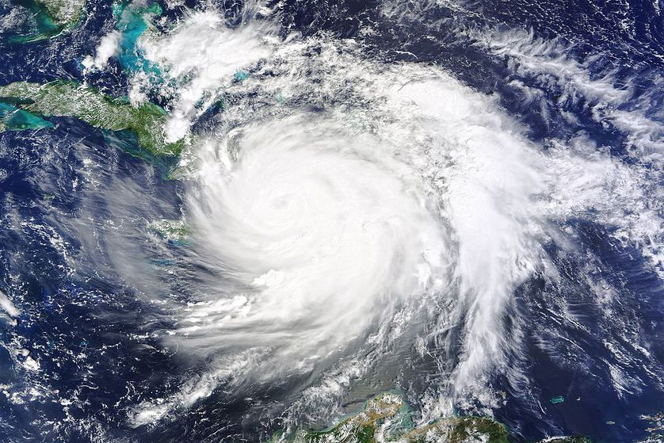

----

For all "hypothesis testing" questions, make sure to provide explicit answers with your work shown for all <a href="../11-steps,html">11 steps of a hypothesis test</a>.

----

## Hurricane Strengths

Atmospheric scientists have hypothesized that the strengths of hurricanes has increased in recent years due to changes in the climate. The [Saffir-Simpson Hurricane Wind Scale](https://www.nhc.noaa.gov/aboutsshws.php) categorizes the strength of hurricanes based on the sustained wind speed. Higher numbers on this scale indicate a strong hurricane, with categories 3, 4, and 5 considered "major hurricanes." Researchers recorded the number of hurricanes in each category (note that categories 1 and 2 were combined as were categories 4 and 5) from the fist and second half of the 20th century in the table below.

&nbsp;     | Cat 1 & 2 | Cat 3 | Cat 4 & 5
:--------: | :-------: | :---: | :------:
1901-1950  |     51    |   26  |    8
1951-2000  |     44    |   21  |    7

Use this information to determine, at the 10% level, if the distribution of hurricanes into the strength categories differs between the two time periods.[^1]

----

<ul class="pagination pagination-lg">
  <li><a href="../ChiSquare.html">^</a></li>
  <li class="active"><a href="#">1</a></li>
  <li><a href="ChiSquare_CE2.html">2</a></li>
</ul>

----

## Footnotes

[^1]: This question was adapted [from here](https://stats.libretexts.org/Bookshelves/Introductory_Statistics/Book%3A_Foundations_in_Statistical_Reasoning_(Kaslik)/8%3A_Chi_Square).
