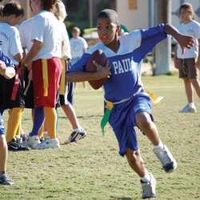

----

For all "hypothesis testing" questions, make sure to provide explicit answers with your work shown for all <a href="../11-steps,html">11 steps of a hypothesis test</a>.

----

## Popularity in Middle School

[Chase and Drummer (1992)](http://www.ncbi.nlm.nih.gov/pubmed/1439167) examined sports as a social status determinant for children. In their study, they surveyed 227 boys and 251 girls in grades 4, 5, and 6 from schools in Michigan to determine which criteria were most important in determining personal popularity. In one part of their study, students were asked what their personal goals were for school (options were "make good grades", "be popular", and "be good in sports"; `goals`). These data (and answers to several other questions) are in PopularKids.csv ([data](https://github.com/droglenc/NCData/raw/master/PopularKids.csv)/[meta](https://github.com/droglenc/NCData/raw/master/PopularKids_meta.txt)). Use these data to determine, at the 5% level, if student's personal goals differed among the grade levels.

----
