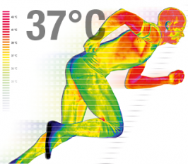

----

I urge you to follow these steps when answering all confidence region questions:
<ol type="a">
  <li>Identify the level of confidence (100(1-&alpha;).</li>
  <li>Identify whether a lower confidence bound (greater than HA), upper confidence bound (less than HA), or confidence interval (not equals HA) should be constructed.</li>
  <li>Find Z* (I suggest including a drawing to illustrate your calculation).</li>
  <li>Calculate the confidence region values (i.e., x&#772;+Z*SE).</li>
  <li>Specifically interpret the confidence region with a complete sentence.</li>
</ol>
A reminder to use these steps will <strong>NOT</strong> be provided on future quizzes, but you should get in the habit of following them.

&nbsp;

## Confidence Region Calculations

For each situation below, calculate and interpret the confidence region.

1. &alpha;=0.10, HA: &mu;>75, n=50, &sigma;=12, x&#772;=79.5.
1. &alpha;=0.05, HA: &mu;&#8800;14, n=25, &sigma;=6, x&#772;=11.2.
1. &alpha;=0.01, HA: &mu;>880, n=80, &sigma;=90, x&#772;=918.
1. &alpha;=0.10, HA: &mu;<15000, n=50, &sigma;=8000, x&#772;=13700.

----

## Body Temperature

[Machowiak (1992)](http://www.ncbi.nlm.nih.gov/pubmed/1302471)[^1] provided a critical examination of whether normal mean body temperature was 37oC (or not). They recorded the orally-determined body temperatures of 65 male and 65 female subjects. Their data are found in NormTemp.csv ([file](https://github.com/droglenc/NCData/raw/master/NormTemp.csv), [meta](https://github.com/droglenc/NCData/blob/master/NormTemp_meta.txt)). Assume that &alpha;=0.05 and &sigma;=0.41. Use this information to construct and interpret a confidence region for the population mean body temperature.

----

## Beetle Size

Researchers examined the size of two different species of beetles. They hypothesized that the mean thorax length of the *Halticus oleracea* species would be greater than 190 &mu;m. The data for their study is in Beetles.csv ([file](https://github.com/droglenc/NCData/raw/master/Beetles.csv), [meta](https://github.com/droglenc/NCData/blob/master/Beetles_meta.txt)). Assume that &sigma;=14 and &alpha;=0.05. Use this information to construct and interpret a confidence region for the beetle's mean thorax length. [*NOTE: Either summarize these quantitative data by group (i.e., species) or filter the data to just the Halticus oleracea species. See your R fact sheet or [this FAQ](../../resources/FAQ/FAQs/subset-1group.html)).*]

----

This is not a confidence region question, rather it is asking you to compute a sample size given &sigma;, a margin-of-error tolerance, and a level of confidence (which, ultimately, is turned into a Z*). See the appropriate section in the reading for the formula and example calculations.

&nbsp;

## Internet Usage

Suppose that you are starting a business and it is important for your business plan to have an estimate of the mean weekly Internet usage of households in your city. Assume that you know from previous surveys that the standard deviation of weekly Internet usage is 6.95 minutes.[^1]

1. How many households must you randomly select to be 95% sure that the sample mean is within 1 minute of the population mean.
1. How many households must you randomly select to be 90% sure that the sample mean is within 1 minute of the population mean.
1. How many households must you randomly select to be 95% sure that the sample mean is within 0.5 minutes of the population mean.

&nbsp;

----

### Footnotes

[^1]: This question was adapted from [iSixSigma](http://www.isixsigma.com/tools-templates/sampling-data/how-determine-sample-size-determining-sample-size/).

----
