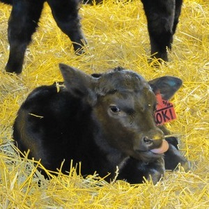

----

## Confidence Region Calculations II

For each situation below, (a) identify the level of confidence; (b) whether a lower confidence bound, upper confidence bound, or confidence interval should be constructed; (c) find Z* (include a drawing that illustrates your calculation); (d) construct the confidence region; and (e) specifically interpret the confidence region.

1. &alpha;=0.01, HA: &mu;&#8800;800, n=25, &sigma;=60, x&#772;=824.
1. &alpha;=0.05, HA: &mu;<80, n=30, &sigma;=20, x&#772;=73.
1. &alpha;=0.05, HA: &mu;&#8800;1500, n=40, &sigma;=800, x&#772;=1370.

----

## Radius of Jupiter

Researchers measured the equatorial radius of [Jupiter](https://en.wikipedia.org/wiki/Jupiter) 40 different times.  The method used is largely without bias but there is measurement-to-measurement variability.  In fact, &sigma; is assumed to be 28 km.  The mean of the 40 measurements was 71492 km.  From this, (i) construct an appropriate confidence **interval** assuming that &alpha;=0.01 and (ii) specifically interpret your findings.[^2]

----

## Blood Pressure in Children

An investigator wants to estimate the mean systolic blood pressure in children with congenital heart disease who are between the ages of 3 and 5.  The investigator plans on using a 99% confidence interval and desires a margin of error of 5 units.  The standard deviation of systolic blood pressure is unknown, but the investigator conducted a literature review and found that the standard deviation of systolic blood pressures in children with other cardiac defects is between 15 and 20.[^1]

1. Use this information to construct a "worst-case scenario" required sample size.
1. How would the required sample size change for the "best-case scenario".

----

## Calf Growth

Calf growth early in life should be approximately 1000 g per day. Owners of a large cattle farm want to assure that their calves are growing at approximately this rate because slow growth might suggest a feeding problem and fast growth would suggest a future size problem (i.e., too many big animals in the available space). The owners want to sample enough of their calves so that they can estimate the growth rate to within 50 g per day, with 99% confidence, assuming that variabilty between individual calves is approximately 200 g per day. Calculate their required sample size.

----

<ul class="pagination pagination-lg">
  <li><a href="../ConfRegions.html">^</a></li>
  <li><a href="ConfRegions_CE1.html">1</a></li>
  <li><a href="ConfRegions_CE2.html">2</a></li>
  <li class="active"><a href="#">3</a></li>
</ul>

----

### Footnotes

[^1]: This was modified from [here](http://sphweb.bumc.bu.edu/otlt/MPH-Modules/BS/BS704_Power/BS704_Power3.html).
