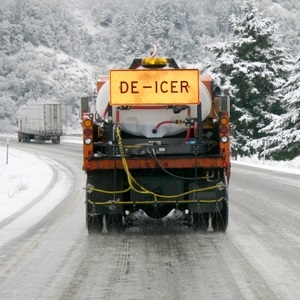

----

## Study Types I
Identify whether each situation below is an observational or experimental study. Explain your reasoning.

1. [Stoll *et al.* (1999)](http://www.ncbi.nlm.nih.gov/pubmed/10232294) followed 30 people with bipolar disorder over a 4‐month period.  Patients who were given a high dose (10 g/day) of omega‐3 fats from fish oil improved more than those given a placebo. 
1. [Phennix *et al.* (2000)](http://ajp.psychiatryonline.org/doi/abs/10.1176/appi.ajp.157.5.715) followed a group of disabled women aged 65 and older for several years.  Those women who had a vitamin B12 deficiency were twice as likely to suffer severe depression as those who did not. 
1. An educational software company wants to compare the effectiveness of its computer animation for teaching biology with that of a textbook presentation.  The company gives a biology pretest to each of a group of high school juniors, and then divides them into two groups.  One group uses the animation, and the other studies the text.  The company retests all students and compares the increase in biology test scores in the two groups.
1. [Helle *et al.* (2002)](http://www.sciencemag.org/content/296/5570/1085.full?ijkey=4842612ad61bcf9386845ff5a129be9ae15c158f&keytype2=tf_ipsecsha) reported on a study of women in Finland that indicated that having sons shortened the lifespan of mothers by about 34 weeks per son, but that daughters helped to lengthen the mothers’ lives. The data came from church records from the period 1640 to 1870.
1. Some gardeners prefer to use nonchemical methods to control insect pests in their gardens. Researchers have designed two kinds of traps and want to know which design will be more effective. They randomly chose 10 locations in a large garden and placed one of each kind of trap at each location. After a week, they counted the number of bugs in each trap.

 

## Types of Observational Studies I
Identify whether each situation below is a voluntary response, convenience, or random sample. Explain your reasoning.

1. A researcher is interested in the makes of cars found in Ashland.  She sits at the corner of Ellis and Hwy 2 and records the makes of cars that are driven by.
1. A researcher is interested in the makes of cars found in Ashland.  She collects a sample of car registrations for Ashland owners from a statewide database such that each registration had the same chance of being selected.
1. A wildlife manager needs to determine the sex ratio of deer in northern Wisconsin.  Towards this end, he records the sex of road-kill deer from along Hwy 2.

 

## Identify Response and Explanatory Variables I

Identify the response variable in each of the following situations. Explain your reasoning.

1. The distance of a putt and the golfer's success rate at making the putt.
1. Response time to a particular dexterity test and the amount of time awake.
1. Amount of fertilizer and growth of tomatoe plants.
1. Number of shoes sold by a company and number of hats sold by that same company.

 

## Blood Pressure Study

A student is designing an experiment to determine the simultaneous effects of calcium in the diet and regular exercise on blood pressure.  Some subjects will be given a calcium supplement pill and some will be given a placebo pill.  In addition, some subjects will be required to perform aerobic exercises once a day, whereas others will not.  The researcher has 32 male subjects available that are as similar as possible (similar ages, weights, initial blood pressures, etc.).

1. Explain why this is an observational or experimental study.
1. What is the response variable?
1. What kind of variable is the response variable?
1. What are the factors? [*List all of them.*]
1. How many levels are there? [*List in same order as your factors.*]
1. How many treatments are there?
1. Physically, what is a replicate (not a number)?
1. How many replicates are there?
1. Diagram the experimental setup, including placing the unique number of each replicate in the respective treatments. [*The table can be similar to Table 3.1. Show your R work for how you placed these individuals in the R appendix.*]

 

## Salt, Sand, and Ice

A salt and sand mixture is often placed on highways in the winter to aid ice removal. The melting rate of the ice is a function of the percent of salt in the mixture and the ambient air temperature. The melting rate probably levels off after a certain percent of salt and that percent probably differs by temperature. The Department of Transportation (DOT) could save some money if they knew the effect of these two things
on the melting rate.

To test for effects such as these, the DOT has 36 test chambers. In each chamber, there is a small (approx. 1 square meter) section of "highway" and all environmental conditions are controlled, including temperature. The DOT researchers would like to measure the rate of melting at 5F, 15F, and 25F and for mixtures with 10% and 20% salt.

Use this information to answer the questions below.

1. Explain why the described setup is consistent with an experimental study.
1. What are the factors? [*List all of them.*]
1. How many levels are there? [*List in same order as your factors.*]
1. How many treatments are there?
1. What is the response variable?
1. What kind of variable is the response variable?
1. Physically, what is a replicate (not a number)?
1. Diagram the experimental setup, including placing the unique number of each replicate in the respective treatments. [*The table can be similar to Table 1. Show your R work for how you placed these individuals in the R appendix.*]
