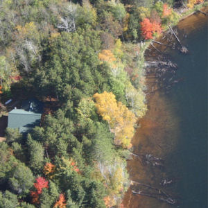
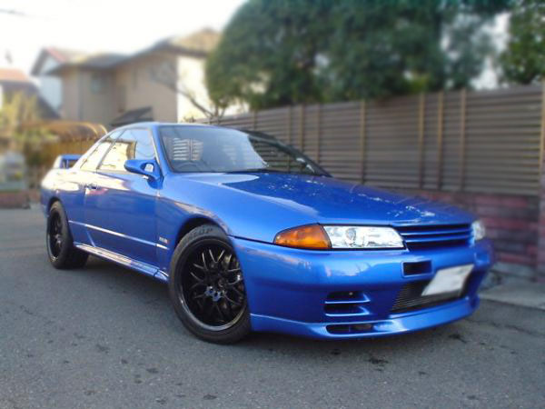

----

## Coarse Woody Debris

Coarse woody debris (CWD) in lakes is important for aquatic systems as it provides refuge for young fish and invertebrates as well as providing areas for periphyton to grow. Coarse woody debris was studied in the north basin of Allequash Lake in northern Wisconsin. Among other things, the researchers recorded the diameter (cm) of CWD found in the lake littoral zone and a qualitative measure of the degree to which the location where the CWD was found was exposed to winds (low or medium). The observed data (sampled from information on the [North Temperate Lakes Long Term Ecological Research website](https://lter.limnology.wisc.edu/datacatalog/search)) are below.

<pre>
diameter  21  15  18  23  18  17  19  17  15  22  16  20  16  17  18  15  16  24  24  23
exposure med med med low med low med med med med med med low med med med med low med med

diameter  18  17  19  17  17  15  17  18  19  31  25  15  17  34  16  18  19  15  16  15
exposure med med med med med med med med low med med med med low low med med med low med

diameter  20  23  34  20  17  20  15  34  18  24
exposure med med low med med med med med med med
</pre>

Use this information to answer the following questions. Use R to answer all questions even though most questions can be answered by observing these simple data from the table above.

1. Enter the data into Excel, save as a CSV file, and load into R.
1. Isolate the following subsets of data (*show the structure or a view of the resultant data.frame to verify your results*).
    * Only low-exposure sites.
    * Only where the CWD diameter was greater than 20 cm.
    * Only where the CWD diameter was greater than 20 cm and from low-exposure sites.
    * Only where the CWD diameter was between 20 and 30 cm.

----
## Cars

[Locke (1993)](http://www.amstat.org/publications/jse/v1n1/datasets.lock.html) recorded data on a random sample of cars from the 1993 model year. His data are in [93cars.csv](https://github.com/droglenc/NCData/raw/master/93cars.csv). Use this information to answer the following questions (by using R).

1. Download the data from the class webpage and load into R.
1. How many variables are recorded in this data.frame?
1. How many individuals are recorded in this data.frame?
1. Isolate the following subsets of data (*show the structure or a view of the resultant data.frame to verify your results*).
    * Cars that were manufactured by Ford.
    * Cars that get more than 30 miles per gallon in the city.
    * Cars that had an automatic transmission and get more than 30 miles per gallon on the highway.
    * Cars that had a horsepower between 175 and 200.
    * Cars that were either domestically manufactured or were four cylinders.

----

## Purple Loosestrife Plants

The data below are the number of Purple Loosestrife (*Lythrum salicaria*) plants found in each of 19 randomly selected plots in Green Gables Creek Slough.

<pre>
13, 2, 1, 0, 9, 11, 5, 5, 14, 23, 0, 2, 3, 3, 6, 7, 4, 16, 1
</pre>

The researchers also recorded a qualitative measure of plot "shadiness", recorded as (along with abbreviations) "completely shaded" (S), "partially shaded" (P), and "completely open" (O). The data below are the "shadiness" of the same 19 plots in the same order as the number of Loosestrife plants shown above.

<pre>
O, S, S, S, O, O, S, P, O, O, S, S, P, P, P, P, S, O, S
</pre>

Enter these data into a CSV file with columns labeled as `lstrf` and `shade`. Read that file into an object called `df` in R. Use this to answer the questions below using R commands (i.e., don't re-type the data). [*Note: Don't use `headtail()` or `str()` when asked to show all individuals. Type the name of the data.frame instead.*]

1. List the data for all completely shaded plots.
1. List the data for all open plots.
1. List the data for all completely open or partially shaded plots (*use only one command in R*).
1. List the data for all plots with more than 10 purple loosestrife plants.
1. List the data for all plots with less than 5 purple loosestrife plants and that are completely shaded (*use only one command in R*).

----
