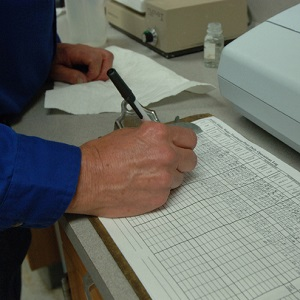
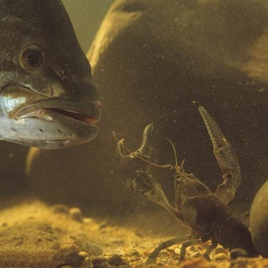
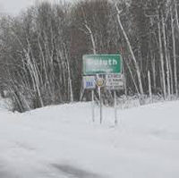
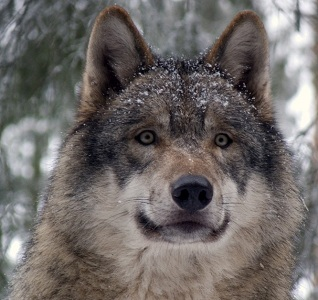

----

## Types of Variables I

Identify the specific type of variable (there are four types) for each variable below. Include a short explanation of your reasoning.

1. Miles driven per week by a student.
1. Type of vehicle (e.g., SUV, sedan, ...) driven by a student.
1. Signs of disease or not (Y/N) on a rabbit.
1. Number of fleas found per rabbit.
1. Relative health of a rabbit (poor, good, excellent).
1. Species of rabbit (Cottontail, Snowshoe, ...).
1. Number of correct answers on an exam.
1. The concentration (ppm) of lead at 119 sites in Chequamegon Bay.
1. An actuary rates potential insurees as "low risk", "moderate risk", or "high risk".
1. A sociologist asked respondents from which medium they receive most of their information about wolves: "TV", "Newspaper", "Outdoor Magazines", "Public Policy Meetings", "Friends or Family", or "Other".
1. The [Koppen scheme of classifying "climates"](https://en.wikipedia.org/wiki/K%C3%B6ppen_climate_classification) contains five principal groups: "Tropical rainy", "dry", "temperate", "Continental", and "Polar".

----

## Types of Variables II

Describe a variable that is of interest to you for each of the four variable types (i.e., make up your own variable for each variable type).

----

## Sustainability Survey

The Sustainability Coordinator surveyed 147 randomly selected Northland students in Fall, 2013 to determine (among other things) the average number of miles that Northland students drove per week.

1. Identify the individual, variable, population, parameter, sample, and statistic.
1. What type of variable is the variable? [*Be specific*]

----

## Crayfish and Bass

As part of their Biology Capstone research, a Northland College student wanted to determine the mean carapace length of Rusty Crayfish (*Orconectes rusticus*) in a lake with Smallmouth Bass (*Micropterus dolomieu*). In 2015, the student gathered (as randomly as possible) and measured the carapace length of 235 Rusty Crayfish from the lake with Smallmouth Bass.

1. Identify the individual, variable, population, parameter, sample, and statistic.
1. What type of variable is the variable? [*Be specific*]

----

## Transfer of Invasive Species

Many invasive aquatic organisms have been transferred to the Great Lakes in the ballast water of trans-oceanic ships. In an effort to minimize the number of new invading species, ships are now required to release their ballast water before entering the St. Lawrence Seaway. Ships laden with cargo generally do not contain ballast. However, their ballast tanks often contain some residual amount of water and, thus, may harbor invasive organisms. Researchers with Michigan Sea Grant ([more information on page 9 here](http://www.miseagrant.umich.edu/downloads/upwellings/sum02.pdf)) examined the water found in 43 ballast tanks from 22 cargo-laden boats entering the Seaway in 2001. They were interested in determining the proportion of ballast tanks that contained living organisms.

1. Identify the individual, variable, population, parameter, sample, and statistic.
1. What type of variable is the variable? [*Be specific*]

----

## Snow in Duluth

A climatologist wanted to determine the average amount of snow for December in Duluth, MN.  She selected a random sample of 35 Decembers (from recorded history) and recorded the total snowfall for each.

1. Identify the individual, variable, population, parameter, sample, and statistic.
1. What type of variable is the variable? [*Be specific*]

----

## Playing Time Among NHL Rookies

Two Northland students were interested in whether the average amount of playing time (mins) per game for NHL rookies differed between those that were drafted straight from college or those that were drafted from professional leagues (minors or European).  To answer this question they generated a random sample of 25 rookies from colleges and 25 rookies from professional leagues.

1. Identify the individual, variable, population, parameter, sample, and statistic. [*Note that there are two populations in this example so you should have two sets of parallel answers.*]
1. What type of variable is the variable? [*Be specific*]

----

## Public Attitudes Towards Wolves in Wisconsin

[Hogberg *et al.* (2013)](http://faculty.nelson.wisc.edu/treves/wolves/reports/hogberg_treves_shaw_naughton_2013surveyreport.pdf) were interested in determining if public attitudes towards wolves had changed following the 2012 wolf harvest (the first legal harvest of wolves in Wisconsin).  The researchers obtained surveys from 773 residents of Wisconsin that had participated in three previous surveys.  Most questions used a five-point agreement scale of "Strongly Agree", "Agree", "Neutral", "Disagree", or "Strongly Disagree".  Among other things, the researchers were interested in determining if the percent of respondents who either agreed or strongly agreed with "*In general, the DNR is responsive to the concerns of most Wisconsin citizens.*" had increased following the wolf harvest.

1. Identify the individual, variable, population, parameter, sample, and statistic.
1. What type of variable is the variable? [*Be specific*]

----
