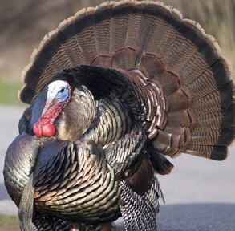

For all "hypothesis testing" questions, make sure to provide explicit answers with your work shown for all <a href="../11-steps">11 steps of a hypothesis test</a>.

 

## Preference for Bottled Water?

Students in an Introduction to Environmental Studies course conducted a study to determine preferences (or not) for types of drinking water. In one part of their study, a sample of students was given four types of drinking water in clear unmarked cups. The water was either from the local water source (tap water) or bottled water from Aquafina, Fiji, or Sam's Choice. Each subject tried each sample of water, without knowing which type they were trying, and then recorded their "preference ranking." They found that 51, 18, 17, and 21 subjects rated tap water, Aquafina, Fiji, and Sam's Choice options, respectively, as their least-preferred choice. Use these results to determine, at the 1% level, if there is any differences in the least-preferred choice of drinking water.[^1]

 

## Habitat Use by Wild Turkeys

[Rumble and Anderson (1992)](http://www.fs.fed.us/rm/pubs_other/rmrs_1992_rumble_m002.pdf) examined habitat use by [Merriam's Wild Turkey (*Meleagris gallopavo merriami*)](http://wildturkeyzone.com/wildturkey/merriams.htm) in South Dakota. In one part of their study they identified the major vegetative type (called Habitat below) in 4-32 hectare sampling units. They then computed the proportions of total area available to turkeys by major vegetation type (first row below). Turkeys' were trapped and fit with radio transmitters. Each bird was then located three times per week with the location of the bird being recorded. The frequency of locations by each major vegatation type was computed for each of four seasons. The area available and the seasonal frequency of turkey locations in each habitat are shown below.

<pre>
Habitat             Aspen    Meadow     Pine    Oak/Spruce
Area Avaialable    0.0516    0.1016    0.8371    0.0100
Winter Use             4        11       186         4         
Spring Use            61         9       807         1
Summer Use            17         5       100         4
Fall Use              14         7       195         2
</pre>

Use these results to determine, at the 5% level, if the turkey's exhibited a habitat preference in the **Spring**.

&nbsp;

----

[^1]: This example is modified from [Lumsford and Fink (2010)](http://www.amstat.org/publications/jse/v18n1/lunsford.pdf)
