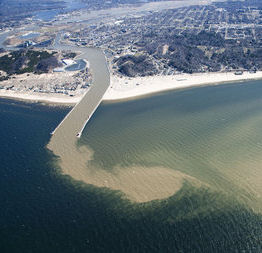

```{r echo=FALSE, eval=FALSE}
# Renders an appropriate HTML file for the webpage
setwd("C:/aaaWork/Web/GitHub/NCMTH107/modules/CE/")
source("../../rhelpers/rhelpers.R")
modHTML("LinearRegression_CE1")
```

```{r echo=FALSE, results='hide', message=FALSE}
library(NCStats)
source("../../rhelpers/knitr_setup.R")
```

----

## Equation of the Line

For each situation below, identify the (a) response variable, (b) explanatory variable, (c) slope, and (d) intercept; interpret the (e) slope and (f) intercept; (g) construct a valid prediction (and answer the question you construct); and (h) identify what an extrapolation would be.

1. A student recorded the height of suds (mm) in a dishwasher for ten different amounts of soap (g).  The resulting best-fit line was Y=-20.2+12.4*X for 24<Y<80 and 3.5<X<8.0.
1. A farmer wants to predict the costs required to produce an amount (in tons) of daily livestock food mix. He recorded costs and amounts for a 20 day period. The resulting best-fit line was Y=190*X+12075 for 19000<Y<21000 and 36.5<X<42.
1. [Poole and Carpenter (1980)](http://www.publish.csiro.au/?paper=ZO9800607) used nasal length (*mm multiplied by 10*) to predict nasal width (*mm multiplied by 10*) of Grey Kangaroos (*Macropus fuliginosus*). The resulting best fit line was Y=0.2876*X+46.451 for 450<X<900 and 180<Y<320.

----

## Beach Sand

Geologists examined the relationship between the median diameter (mm) of sand granules and the slope or angle (degrees) for nine ocean beaches.  Their primary interest was in determining if the variability in sand granule size could be explained by the angle of the beach.  The results of their analysis is shown in the scatterplot below.

```{r echo=FALSE, fig.height=4, fig.width=4, par1=TRUE}
d <- read.csv("Beaches.csv")
lm1 <- lm(sand~angle,data=d)
fitPlot(lm1,xlab="Beach Angle (Degrees)",ylab="Median Sand Diameter (mm)")
legend("topleft",c(paste0("Y=",formatC(coef(lm1)[1],format="f",digits=3),"+",
                          formatC(coef(lm1)[2],format="f",digits=3),"*X"),
                   paste0("r^2=",formatC(rSquared(lm1),format="f",digits=3))),bty="n")
```

Use these results to answer the questions below.

1. In terms of the variables of this problem, what is the equation of the best-fit line?
1. In terms of the variables of this problem, INTERPRET the value of the slope?
1. In terms of the variables of this problem, INTERPRET the value of the y-intercept?
1. What is the predicted median sand diameter for a beach angle of 15<sup>o</sup>?
1. What is the predicted median sand diameter for a beach angle of 4<sup>o</sup>?
1. What is the residual if the beach angle is 5<sup>o</sup> and the median sand diameter is 0.2 mm?
1. What is the correlation coefficient between median sand diameter and the beach angle?
1. What proportion of the variability in median sand diameter is explained by knowing the beach angle?
1. How much would you expect the median sand diameter to change if the beach angle increased by 4<sup>o</sup>?
1. What aspect of this regression analysis concerns you (i.e., consider the regression assumptions)?

----

## Urban Runoff

Urbanization poses a major threat to stream and watershed ecosystems.  One aspect of urbanization is the conversion of natural areas to land with impervious surfaces, thus increasing runoff of rain and, likely, pollutants.  A University of Washington researcher recorded the percent of impervious land and the benthic index of biotic integrity (IBI) for 14 areas in the state of Washington.  The IBI has been described as a measure of "the capability of supporting and maintaining a balanced, integrated, adaptive community of organisms having a species composition and functional organization comparable to that of natural habitat in the region."  In this example, the researchers were attempting to identify how the percentage of impervious surfaces in the area effects the IBI.  The data for this study are below (note that much more information can be obtained at the [QELP site](http://www.seattlecentral.edu/qelp/sets/077/077.html#About).

<pre>
imperv   60 43 43 34 27 25 21 18 11  8  8  8  7  7  5  4  2
IBI       9 11 13 23 31 31 21 23 27 37 39 29 31 43 33 35 37
</pre>

Load these data into R to answer the questions below.  [*Note that these are the same data that you entered in a [previous class exercise](BEDAQuant_CE3.html#urban-runoff).*]

1. In terms of the variables of this problem, what is the equation of the best-fit line?
1. In terms of the variables of this problem, INTERPRET the value of the slope?
1. In terms of the variables of this problem, INTERPRET the value of the y-intercept?
1. What is the predicted IBI for an impervious surface percentage of 80%?
1. What is the predicted IBI for an impervious surface percentage of 20%?
1. What is the residual if the impervious surface percentage is 30 and the IBI is 20?
1. How much will the IBI change if the percentage of impervious surface is decreased by 30%?
1. What is the correlation coefficient between IBI and the percentage of impervious surface?
1. What proportion of the variability in IBI is explained by knowing the percentage of impervious surface?
1. What aspect of this regression analysis concerns you (i.e., consider the regression assumptions)?

----

## Sign Legibility and Age

In a study of the legibility and visibility of highway signs, a Pennsylvania research firm determined the maximum distance at which each of 30 drivers could read a newly designed sign. The participants in the study were from 18 to 82 years old. The government agency that funded the research hoped to improve highway safety for older drivers and wanted to examine the relationship between age and sign legibility distance. Use the data in vision.csv ([data](https://raw.githubusercontent.com/droglenc/NCData/master/vision.csv), [meta](https://raw.githubusercontent.com/droglenc/NCData/master/vision_meta.txt)) to construct results that can be used to answer the questions below. [*Example from [Utts and Heckard, Mind on Statistics](http://www.cengage.com/c/mind-on-statistics-5e-utts)*].

1. What is the response variable? [*Hint: Read the rest of the questions before answering this question.*]
1. What is the explanatory variable?
1. In terms of the variables of this problem, what is the equation of the best-fit line?
1. In terms of the variables of this problem, interpret the value of the slope.
1. In terms of the variables of this problem, interpret the value of the intercept.
1. What is the predicted maximum distance to see the sign for a 40-year-old driver?
1. What is the predicted maximum distance to see the sign for a 90-year-old driver
1. What is the residual if the age of the driver is 50 and the maximum distance is 410 ft?
1. What is the correlation coefficient between age and maximum distance to see the sign?
1. What proportion of the variability in maximum distance to see the sign is explained by knowing the age of the driver?
1. How much will the predicted maximum distance to see the sign change if the driver's age increased by ten years?
1. What aspect of this regression analysis concerns you? [*Hint: consider the regression assumptions*]?

----

<div class="text-center">
<ul class="pagination pagination-lg">
  <li><a href="../LinearRegression.html">^</a></li>
  <li class="active"><a href="#">1</a></li>
  <li><a href="LinearRegression_CE2.html">2</a></li>
</ul>
