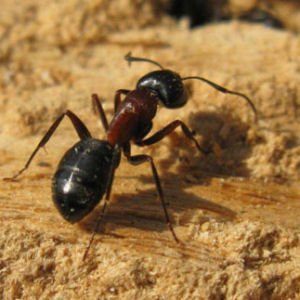
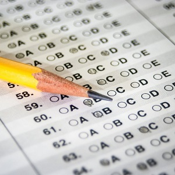
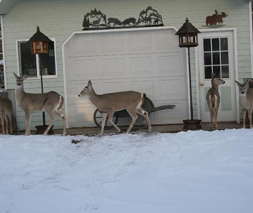

----

## Normal Distribution Characteristics I

1. Use `snorm()` from `NCStats` to answer the following questions.  [*Hint: Click the gear icon, uncheck 'Show PDF & CDF', and then use the slider bars to answer the two questions below.*]
    1. Describe what happens to the normal distribution if &mu; is increased?
    1. Describe what happens to the normal distribution if &sigma; is increased?

1. For each situation below, (i) identify &mu;, (ii) identify &sigma;, and (iii) draw the normal distribution with an approximately accurate scale on the x-axis.
    1. X~N(75,10)
    1. Y~N(5500,600)
    1. Z~N(0,1)

----

## Hand Calculations I

Answer each question below, **without using R**, assuming that X~N(75,10). Show your work with a careful drawing for each question.

1. What percent of X values are less than 95?
1. What percent of X values are greater than 105?
1. What percent of X values are between 65 and 85?
1. What percent of X values are between 55 and 85?
1. What is the value X such that 2.5% of X values are lower?
1. What is the most common 95% of X values?
1. What is the largest 2.5% of X values?

----

## Carpenter Ants

Suppose that the distribution of number of [Carpenter Ants (*Camponotus* spp.)](https://en.wikipedia.org/wiki/Carpenter_ant) in a nest is known to be N(1400,300).  From this, answer the following questions.

1. What is an individual?
1. What is the variable?
1. What type of variable is that?
1. What is &mu;?
1. What is &sigma;?

Additionally, for each question below (a) identify the type of question (e.g., "forward-left", "reverse-between") and then (b) answer the question.

6. What percentage of nests have more than 1900 ants?
1. What is the number of ants such that 15% of nests have more ants?
1. What is the number of ants such that 33% of nests have fewer ants?
1. What percentage of nests have between 700 and 1900 ants?
1. What percentage of nests have fewer than 300 ants?
1. What is the number of ants such that 5% of nests have more ants?
1. The most common 80% of nests have between what two numbers of ants?

----

## SAT Scores

SAT scores are approximately normal with a mean of 550 and standard deviation of 65. School A accepts students with a score of 500 or better. School B accepts students with a score of 650 or better. Use this information to answer the questions below.

1. What type of variable is SAT score?
1. What proportion of students cannot get accepted by School A?
1. What percentage of students can get accepted by School B?
1. What percentage of students can get accepted by School A BUT NOT by School B?
1. What score should School C use so that only 25% of students can get accepted?

----

## Urban Deer Relocations

Relocation methods for controlling the overpopulation of Whitetail Deer (*Odocoileus virginianus*) in urban areas is controversial. Animal rights organizations like the idea because they believe deer are unharmed in this manner, but scientists suspect that translocation can have a higher mortality rate than hunting or culling. On this note, researchers in Wanakena, New York wanted to examine the home-range sizes of resident and translocated female deer ([Jones *et al.* 1997](http://www.porter.fw.msu.edu/Jones%20et%20al%201997%20-%20Translocation%20of%20Deer.pdf)). The average home range size was 0.30 km2, with a standard deviation of 0.095 km2, for 39 translocated does in the Dubuar Forest between 1994 and 1995. Assume that the distribution of home range sizes is normal. Use this information to answer the questions below.

1. What proportion of deer have home range sizes between 0.2 and 0.4 km2?
1. What proportion of deer have a home range size greater than 0.32 km2?
1. How big is the home range such that 17% of deer have a larger home range?
1. How big is the home range such that 32% of deer have a smaller home range?
1. What proportion of deer have a home range size less than 0.4 km2?
1. Between what two sizes of home ranges do the most common 48% of deer inhabit?

----

<ul class="pagination pagination-lg">
  <li><a href="../NormalDist.html">^</a></li>
  <li class="active"><a href="#">1</a></li>
  <li><a href="NormalDist_CE2.html">2</a></li>
</ul>
