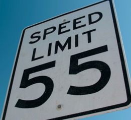
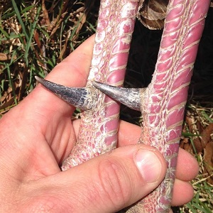

----

## Normal Distribution Characteristics II

1. For each situation below, (i) identify &mu;, (ii) identify &sigma;, and (iii) draw the normal distribution with an approximately accurate scale on the x-axis.
    1. Z~N(0,1)
    1. Y~N(90,8)
    
----

## Hand Calculations II

Answer each question below, **without using R**, assuming that Z~N(0,1). Show your work with a careful drawing for each question.

1. What is the value of Z such that 16% of Z values are greater?
1. What percent of Z values are greater than 2?
1. What percent of Z values are less than 3?
1. What is the most common 99.7% of Z values?

----

## Pollen Counts

Suppose that it is known that the distribution of the total weed pollen count (spores per cubic meter of air) for LaCrosse, WI on a day in early September is approximately normal with a mean of 40 and a standard deviation of 8.  [*FYI, pollen count information is available from [this site](http://www.aaaai.org/nab/index.cfm?p=allergenreport&stationid=28).*]

From this, answer the following questions.

1. What is an individual?
1. What is the variable?
1. What type of variable is that?
1. What is &mu;?
1. What is &sigma;?

Additionally, for each questions below (a) identify the type of question (e.g., "forward-left", "reverse-between") and then (b) answer the question.

1. What is the number of pores/m3 such that 10% of the days have higher pore counts?
1. What proportion of days in LaCrosse have a weed pollen count less than 50 pores/m3?
1. What proportion of days in LaCrosse have a weed pollen count between 32 and 55 pores/m3?
1. What is the number of pores/m3 such that 30% of the days have lower pore counts?
1. What is the most common 70% of number of pores/m3?
1. What proportion of days in LaCrosse have a weed pollen count greater than 35 pores/m3?

----

## Driving Speed

A police officer in Kansas has recorded the amount of time it takes cars to travel between two points.  In a large sample of cars he found the mean time to be 2.5 s with a standard deviation of 0.75 s.  Treat these results as if they represent a population and are normally distributed.

From this, answer the following questions.

1. What is an individual?
1. What is the variable?
1. What type of variable is that?
1. What is &mu;?
1. What is &sigma;?

Additionally, for each questions below (a) identify the type of question (e.g., "forward-left", "reverse-between") and then (b) answer the question.

1. What is the time that identifies the slowest 15% of drivers?
1. What proportion of drivers pass through the two points in less than 1 s?
1. What proportion of drivers pass through the two points in between 1.5 and 4.5 s?
1. What is the IQR for time to pass between the two points?
1. What proportion of drivers pass through the two points in more than 7 s?
1. What is the median time to pass between the two points?

----

## iPhone Battery Lifespan 

Apple suggests that the battery lifespan (i.e., how many charge-cycles a battery will last -- note that every time a phone is plugged in it is considered a "charge-cycle," no matter how long it is plugged in) has a mean of 400 charge-cycles with a standard deviaion of 20 charge-cycles. A research group that tested battery lifespans, rates an individual battery as "exceptional" if it lasts for more than 450 charge-cycles and "unacceptably poor" if it lasts for less than 375 charge-cycles. Answer the questions below assuming that the distribution of charge-cycles is normally distributed.

1. What type of variable is "number of charge-cycles"?
1. What proportion of iPhone batteries would be rated as "exceptional"?
1. What percentage of iPhone batteries would be rated as better than "unacceptably poor," but not "exceptional"?
1. Suppose that the research company wants to change the definition of "exceptional" to include only the top 10% of batteries. What number of charge-cycles would define this new "exceptional"?
1. Similarly, suppose that the research company wants to change the definition of "unacceptably poor" to the include the worst 25% of batteries. What number of charge-cycles would define this new "unacceptably poor"?

----

## Turkey Spur Length

Male wild Turkeys (*Meleagris gallopavo*) have metatarsal spurs (i.e., bone growths on their feet) that may be used as defensive weapons, but they may also be more attractive for acquiring mates. Spurs grow throughout the turkey's life and can be a good indicator of the age of a turkey. [In one study from Arkansas](http://onlinelibrary.wiley.com/doi/10.1046/j.1365-2656.1998.6760845.x/pdf), the mean spur length in a sample of male turkeys that were more than two years old was 20.9 mm with a standard deviation of 3.7 mm. Assume that these values are true for the population of turkeys and that the distribution of spur lengths is normal. Use this information to answer the questions below.

1. How big is the spur length such that 30% of turkeys have a larger spur?
1. What proportion of turkeys have a spur length between 15 and 25 mm?
1. What proportion of turkeys have a spur length greater than 30 mm?
1. How big is the spur length such that 10% of turkeys have a smaller spur?
1. What proportion of turkeys have a spur length less than 18 mm?
1. What is the most common 80% of turkey spur lengths?

----

<ul class="pagination pagination-lg">
  <li><a href="../NormalDist.html">^</a></li>
  <li><a href="NormalDist_CE1.html">1</a></li>
  <li class="active"><a href="#">2</a></li>
</ul>
