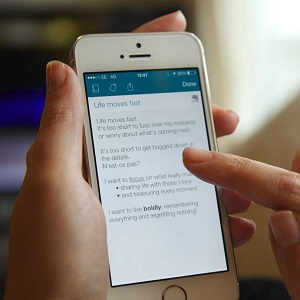

## SAT Scores

SAT scores are approximately normal with a mean of 550 and standard deviation of 65. School A accepts students with a score of 500 or better. School B accepts students with a score of 650 or better. Use this information to answer the questions below (*show the R code that you used*).

1. What type of variable is SAT score?
1. What proportion of students cannot get accepted by School A?
1. What percentage of students can get accepted by School B?
1. What percentage of students can get accepted by School A BUT NOT by School B?
1. What score should School C use so that only 25% of students can get accepted?

 

## Urban Deer Relocations

Relocation methods for controlling the overpopulation of Whitetail Deer (*Odocoileus virginianus*) in urban areas is controversial. Animal rights organizations like the idea because they believe deer are unharmed in this manner, but scientists suspect that translocation can have a higher mortality rate than hunting or culling. On this note, researchers in Wanakena, New York wanted to examine the home-range sizes of resident and translocated female deer ([Jones *et al.* 1997](http://www.porter.fw.msu.edu/Jones%20et%20al%201997%20-%20Translocation%20of%20Deer.pdf)). The average home range size was 0.30 km2, with a standard deviation of 0.095 km2, for 39 translocated does in the Dubuar Forest between 1994 and 1995. Assume that the distribution of home range sizes is normal. Use this information to answer the questions below (*show the R code that you used*).

1. What proportion of deer have home range sizes between 0.2 and 0.4 km2?
1. What proportion of deer have a home range size greater than 0.32 km2?
1. How big is the home range such that 17% of deer have a larger home range?
1. How big is the home range such that 32% of deer have a smaller home range?
1. What proportion of deer have a home range size less than 0.4 km2?
1. Between what two sizes of home ranges do the most common 48% of deer inhabit?

 

## iPhone Battery Lifespan 

Apple suggests that the battery lifespan (i.e., how many charge-cycles a battery will last -- note that every time a phone is plugged in it is considered a "charge-cycle," no matter how long it is plugged in) has a mean of 400 charge-cycles with a standard deviaion of 20 charge-cycles. A research group that tested battery lifespans, rates an individual battery as "exceptional" if it lasts for more than 450 charge-cycles and "unacceptably poor" if it lasts for less than 375 charge-cycles. Answer the questions below assuming that the distribution of charge-cycles is normally distributed (*show the R code that you used*).

1. What type of variable is "number of charge-cycles"?
1. What proportion of iPhone batteries would be rated as "exceptional"?
1. What percentage of iPhone batteries would be rated as better than "unacceptably poor," but not "exceptional"?
1. Suppose that the research company wants to change the definition of "exceptional" to include only the top 10% of batteries. What number of charge-cycles would define this new "exceptional"?
1. Similarly, suppose that the research company wants to change the definition of "unacceptably poor" to the include the worst 25% of batteries. What number of charge-cycles would define this new "unacceptably poor"?
