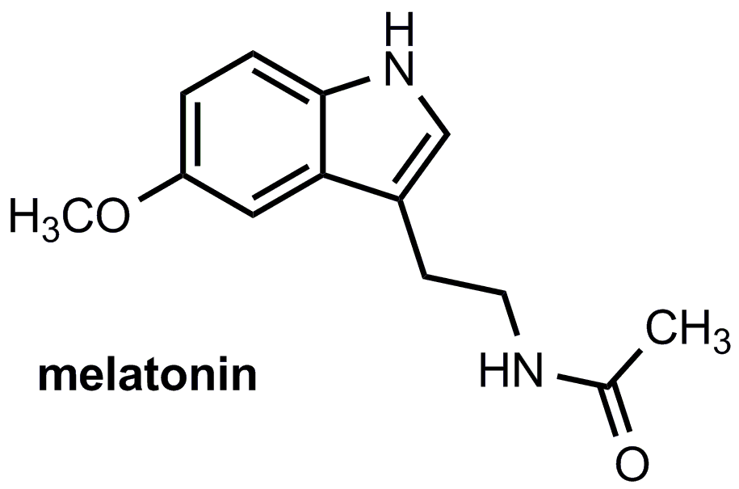

----

## Food Choice by Chipmunks

An "arena" contains 8 acorns and 9 kernels of corn. Assume that a chipmunk placed in the arena chooses items to eat at random. Use this information to answer the questions below.

1. What is the probability that the chipmunk eats an acorn?
1. What is the probability that the chipmunk eats a kernel of corn?
1. What is the probability that the chipmunk eats a kernel of corn assuming that it has already eaten six kernels of corn and no acorns?

----

## Melatonin and Sleep

MIT researchers examined the effect of [melatonin](http://www.webmd.com/sleep-disorders/tc/melatonin-overview) on sleep.  Suppose that we know that men given a placebo fell asleep according to a N(15,5) distribution. For each question below identify (a) the distribution that would be used to answer the question, (b) specific characteristics of the required distribution, (c) whether the question can be answered or not, and (d) if appropriate, the answer to the question.

1. What is the probability, with 4 randomly selected men, of observing a mean of more than 12 mins?
1. What is the probability that a randomly selected man will fall asleep in more than 12 mins?
1. What is the probability that 25 randomly selected will have a mean time to fall asleep of more than 15.5 minutes?

----

## Pollutants in Auto Exhaust

The level of nitrogen oxides (NOX) in the exhaust of a particular car model is right-skewed with a mean of 0.9 grams per mile (g/mi) and a standard deviation of 0.15 g/mi. For each question below identify (a) the distribution that would be used to answer the question, (b) specific characteristics of the required distribution, (c) whether the question can be answered or not, and (d) if appropriate, the answer to the question.

1. What is the probability that a car will have a NOX greater than 1 g/mi?
1. What is the probability that a random sample of 15 cars will have a mean NOX greater than 1 g/mi?
1. What is the probability that a random sample of 50 cars will have a mean NOX greater than 0.92 g/mi?
1. What is the probability that a random sample of 50 cars will have a mean NOX less than 0.85 g/mi?
1. What is the mean NOX such that only 1% of samples of 50 cars have a larger mean?

----

## People in Car

A study of rush-hour traffic in San Francisco counted the number of people in a car entering a freeway at a suburban interchange. Suppose that, in the population, this count has a mean of 1.5 people with a standard deviation of 0.75. For each question below identify (a) the distribution that would be used to answer the question, (b) specific characteristics of the required distribution, (c) whether the question can be answered or not, and (d) if appropriate, the answer to the question.

1. Do you expect this count to follow a normal distribution?  What are two pieces of evidence to support your answer?
1. What is the probability that a random sample of 40 cars will have a mean number of passengers of less than 1.2?
1. What is the probability that a random sample of 50 cars will have a mean number of passengers of greater than 2.0?
1. What is the probability that a random sample of 5 cars will have a mean number of passengers of greater than 2.0?
1. Suppose that 700 cars pass through this intersection in one hour.  What is the probability that these 700 cars will carry more than 1075 people?

----

<ul class="pagination pagination-lg">
  <li><a href="../Probability.html">^</a></li>
  <li class="active"><a href="#">1</a></li>
  <li><a href="Probability_CE2.html">2</a></li>
</ul>

----
