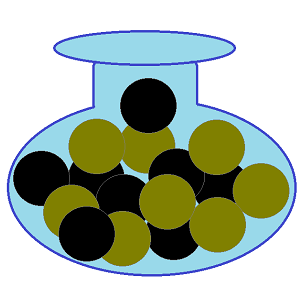
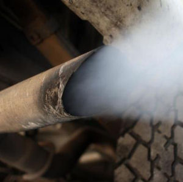
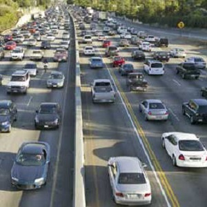
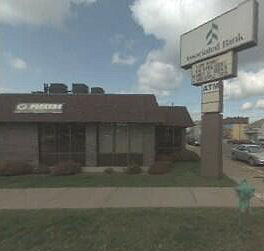

## Food Choice by Chipmunks

An "arena" contains 8 acorns and 9 kernels of corn. Assume that a chipmunk placed in the arena chooses items to eat at random. Use this information to answer the questions below.

1. What is the probability that the chipmunk eats an acorn?
1. What is the probability that the chipmunk eats a kernel of corn?
1. What is the probability that the chipmunk eats a kernel of corn assuming that it has already eaten six kernels of corn and no acorns?

----

&nbsp;

In all of the following questions, I urge you to follow these steps when answering probability questions:
<ol type="a">
  <li>Identify the distribution that would be used to answer the question (population or sampling).</li>
  <li>Identify characteristics of the required distribution; i.e., whether normal or not and, if normal, the center and dispersion (SD or SE).</li>
  <li>Identify whether the question can be answered or not (can be if normal, cannot be if not normal).</li>
  <li>Answer to the question; use <code>distrib()</code> if the probability can be computed (i.e., normal distribution) or explain why the probability cannot be computed (note specifically which distribution is not normal).</li>
</ol>
A reminder to use these steps will <strong>NOT</strong> be provided on future quizzes, but you should get in the habit of following them.

 

## Pollutants in Auto Exhaust

Suppose that the level of nitrogen oxides (NOX) in the exhaust of a particular car model is right-skewed with a mean of 0.9 grams per mile (g/mi) and a standard deviation of 0.15 g/mi.

1. What is the probability that a car will have a NOX greater than 1 g/mi?
1. What is the probability that a random sample of 15 cars will have a mean NOX greater than 1 g/mi?
1. What is the probability that a random sample of 50 cars will have a mean NOX greater than 0.92 g/mi?
1. What is the probability that a random sample of 50 cars will have a mean NOX less than 0.85 g/mi?
1. What is the mean NOX such that only 1% of samples of 50 cars have a larger mean?

 

## People in Car

A study of rush-hour traffic in San Francisco counted the number of people in a car entering a freeway at a suburban interchange. Suppose that this count has a mean of 1.5 people with a standard deviation of 0.75.

1. Information about the shape of the population distibution was not given in the background to this question. So, would you expect this count to follow a normal distribution? What is one piece of evidence to support your answer?
1. What is the probability that a random sample of 40 cars will have a mean number of passengers of less than 1.2?
1. What is the probability that a random sample of 50 cars will have a mean number of passengers of greater than 2.0?
1. What is the probability that a random sample of 5 cars will have a mean number of passengers of greater than 2.0?
1. Suppose that 700 cars pass through this intersection in one hour. What is the probability that these 700 cars will carry more than 1075 people?

 

## Banking

Associated Bank is reviewing its service charges and interest paying policies on checking accounts. Assume that the bank has found that the daily balance on personal checking accounts is normally distributed with an average of $550 and a standard deviation of $150.

1. What is the probability that a personal checking account customer has a daily balance in excess of $800?
1. What is the probability that a personal checking account customer has a balance of $200 or lower?
1. What is the probability that a sample of 5 personal checking account customers has a mean balance of $600 or lower?
1. What is the probability that a sample of 10 personal checking account customers has a mean balance between $500 and $700?
