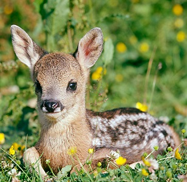
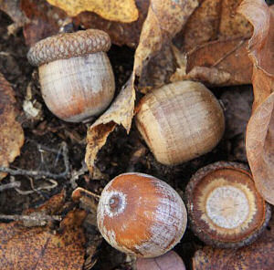
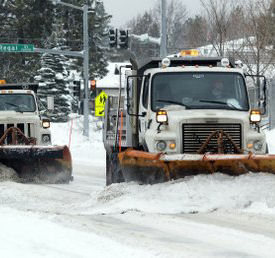

----

## Melatonin and Sleep

MIT researchers examined the effect of [melatonin](http://www.webmd.com/sleep-disorders/tc/melatonin-overview) on sleep. Suppose that we know that men given a placebo fell asleep according to a N(15,5) distribution.

1. What is the probability, with 4 randomly selected men, of observing a mean of more than 12 mins?
1. What is the probability that a randomly selected man will fall asleep in more than 12 mins?
1. What is the probability that 25 randomly selected will have a mean time to fall asleep of more than 15.5 minutes?

----

## Reproductive Habits of Roe Deer

Researchers on Storfosna Island, Norway examined the reproductive habits of Roe Deer (*Capreolus pygargus*) in the northern extremities of the island ([Andersen and Linnell 2000](https://www.researchgate.net/publication/229194908_Irruptive_Potential_in_Roe_Deer_Density-Dependent_Effects_on_Body_Mass_and_Fertility)). The researchers found that the distribution of number of fawns born to a female between 1991 and 1994 was extremely right-skewed with a mean of 2.2 and a standard deviation of 0.46 fawns. Answer the questions below assuming that these values represent the entire population of Roe Deer. [*Note: if you decide that a question cannot be answered, then describe your reasoning very specifically.*]

1. What is the probability that a Roe Deer has more than 2 fawns?
1. What is the probability that a sample of 10 Roe Deer will have an average of more than 2 fawns?
1. What is the probability that a sample of 35 Roe Deer will have an average of more than 2 fawns?
1. What is the probability that a sample of 35 Roe Deer will have a mean between 2.0 and 2.3 fawns?
1. What is the most common 90% of sample means for n=35 Roe Deer?
1. What is the mean such that 20% of all samples of n=35 Roe Deer have a smaller mean?

----

## Acorn Length

Suppose that it is known that the distribution of lengths of acorns is slightly right-skewed with a mean of 21 mm and a standard deviation of 6 mm.

1. What is the probability that an acorn will have a length greater than 25 mm?
1. What is the probability that the mean length of a sample of 20 acorns will be greater than 25 mm?
1. What is the probability that the mean length of a sample of 50 acorns will be between 20 and 25 mm?
1. What is the probability that the mean length of a sample of 6 acorns will be less than 20 mm?
1. What is the probability that an acorn will have a length less than 20 mm?

----

## Plowing Snow

Suppose that it is known that the distribution of times spent plowing a single city block on snow days is right-skewed with a mean of 45 seconds and a standard deviation of 28 seconds.

1. What is the probability that in a sample of 5 blocks that the mean is greater than 60 seconds?
1. What is the probability that it will take longer than 60 seconds for one block?
1. What is the probability that in a sample of 40 blocks will have a mean between 40 and 50 seconds?
1. What is the Q1 for the mean plow time in samples of 40 blocks?

----

