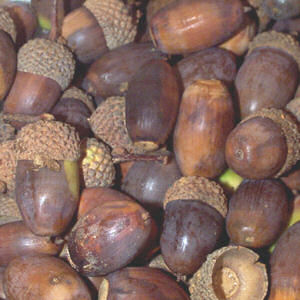

----

## Acorn Production

Suppose that the number of acorns that fall from a mature white oak tree in Bayfield County is strongly right-skewed with a mean of 875 and a standard deviation of 220.

* What is an individual?
* What is the variable?
* What are the appropriate symbols for the 875 and 220?
* Which distribution is strongly right-skewed?

 

I urge you to follow these steps when answering probability questions:
<ol type="a">
  <li>Identify the distribution that would be used to answer the question (population or sampling).</li>
  <li>Identify characteristics of the required distribution; i.e., whether normal or not and, if normal, the center and dispersion (SD or SE).</li>
  <li>Identify whether the question can be answered or not (can be if normal, cannot be if not normal).</li>
  <li>Answer to the question; use <code>distrib()</code> if the probability can be computed (i.e., normal distribution) or explain why the probability cannot be computed (note specifically which distribution is not normal).</li>
</ol>

 

1. What is the probability that a sample of 50 oak trees will produce a mean of more than 900 acorns?
1. What is the probability that a sample of 35 oak trees will produce a mean between 850 and 900 acorns?
1. What is the probability that an oak tree produces more than 1000 acorns?
1. What is the probability that a sample of 20 oak trees will produce a mean with fewer than 1000 acorns?
1. What is the mean number of acorns for a sample of 35 oak trees that has a 15% probability of the mean being greater.
