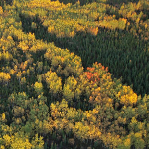

```{r echo=FALSE, eval=FALSE}
# Renders an appropriate HTML file for the webpage
setwd("C:/aaaWork/Web/GitHub/NCMTH107/modules/CE/")
source("../../rhelpers/rhelpers.R")
modHTML("RBivEDA_CE1")
```

```{r echo=FALSE, results='hide', message=FALSE}
source("../../rhelpers/knitr_setup.R")
```

----

## Urban Runoff

Urbanization poses a major threat to stream and watershed ecosystems.  One aspect of urbanization is the conversion of natural areas to land with impervious surfaces, thus increasing runoff of rain and, likely, pollutants.  A University of Washington researcher recorded the percent of impervious land and the benthic index of biotic integrity (IBI) for 14 areas in the state of Washington.  The IBI has been described as a measure of "the capability of supporting and maintaining a balanced, integrated, adaptive community of organisms having a species composition and functional organization comparable to that of natural habitat in the region."  In this example, the researchers were attempting to identify how the percentage of impervious surfaces in the area affects the IBI.  The data for this study are below (*FYI, much more information can be obtained at the [QELP site](http://www.seattlecentral.edu/qelp/sets/077/077.html#About)*).

<pre>
imperv   60 43 43 34 27 25 21 18 11  8  8  8  7  7  5  4  2
IBI       9 11 13 23 31 31 21 23 27 37 39 29 31 43 33 35 37
</pre>

Load these data into R and answer the questions below.

1. What is the response variable?
1. What is the explanatory variable?
1. Describe the relationship between IBI and the percent of impervious area (i.e., perform a bivariate EDA).

----

## Lights and Nearsightedness


An Associated Press article captured the attention of readers with the headline "Night lights bad for kids?" The article was based on [a 1999 study](https://www.ncbi.nlm.nih.gov/pmc/articles/PMC1115762/) at the University of Pennsylvania and Children's Hospital of Philadelphia, in which parents were surveyed about the lighting conditions under which their children slept between birth and age-2 (lamp, night-light, or no light) and whether or not their children developed nearsightedness (myopia). The purpose of their study was to explore the effect of a young child's nighttime exposure to light on later nearsightedness. The results from 479 children were recorded in nightlight.csv ([data](https://raw.githubusercontent.com/droglenc/NCData/master/nightlight.csv), [meta](https://raw.githubusercontent.com/droglenc/NCData/master/nightlight_meta.txt)). Use these data to create a frequency table and each of the three types of percentage tables. Use your results to answer the following questions. [*Make sure to refer to properly labeled tables for each question.*]

1. How many children in the sample slept in "no light" conditions and developed nearsightedness?
1. What percentage of children that slept in "no light" conditions developed nearsightedness?
1. What percentage of all children slept with a "lamp" and developed nearsightedness?
1. What percentage of children that slept with a "night light" did not develop nearsightedness?
1. What percentage of children that developed nearsightedness had slept with a "lamp"?
1. What percentage of children developed nearsightedness?
1. Make an overall conclusion about how the different light conditions affected the development of nearsightedness in the children.

----

## Forest Composition

[Hely *et al.* (2000)](http://onlinelibrary.wiley.com/doi/10.2307/3236551/abstract) examined the effects of stand composition on fire hazard in mixed-wood Canadian boreal forests. Two variables recorded for each stand were stand type (`sttype`, where `d`=deciduous, `c`=coniferous, `mc`=mixed coniferous, and `md`=mixed deciduous) and time since the last fire (`tslf`), which was treated as a categorical variable with the categories corresponding to 100 year blocks of time (i.e., `0-100`, `100-200`, etc.). These data may be found in [Fire.csv](https://github.com/droglenc/NCData/raw/master/Fire.csv). Load these data into R and **refactor** `sttype` so that the categories are arranged from coniferous (`c`) to mixed coniferous (`mc`) to mixed deciduous (`md`) to deciduous (`d`; refer to [this FAQ](../../resources/FAQ/FAQs/reorder-levels.html)). Use that data to create appropriate tables to answer the following questions.

1. How many stands last had a fire between 200 and 300 years ago?
1. Of deciduous tree stands, what percentage last had a fire within the last 100 years?
1. Of mixed-coniferous tree stands, what percentage last had a fire between 200 and 300 years ago?
1. What percentage of all stands were coniferous with a fire between 200 and 300 years ago?
1. What percentage of stands that last had a fire between 200 and 300 years ago were coniferous?
1. What percentage of all stands were deciduous that last had a fire between 100 and 200 years ago?
1. What percentage of mixed deciduous trees last had a fire within the last 100 years?
1. Comment on the distribution of times since last fire among the four levels of stand type.

----

## ANOTHER EXERCISE HERE (should be linear with no outliers)


&nbsp;

----

## Additional Practice

[Here are more exercises for practice if time permits.](BEDAQuant_CE2)

----
