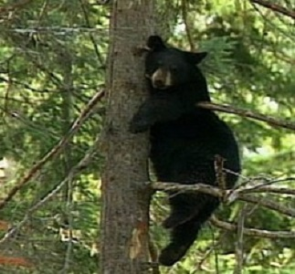

----

For all "hypothesis testing" questions, make sure to provide explicit answers with your work shown for all <a href="../11-steps">11 steps of a hypothesis test</a>.

----

## Popularity in Middle School

[Chase and Drummer (1992)](http://www.ncbi.nlm.nih.gov/pubmed/1439167) examined sports as a social status determinant for children. In their study, they surveyed 227 boys and 251 girls in grades 4, 5, and 6 from schools in Michigan to determine which criteria were most important in determining personal popularity. In one part of their study, students were asked what their personal goals were for school (options were "make good grades", "be popular", and "be good in sports"; `goals`). These data (and answers to several other questions) are in PopularKids.csv ([data](https://github.com/droglenc/NCData/raw/master/PopularKids.csv)/[meta](https://github.com/droglenc/NCData/raw/master/PopularKids_meta.txt)). Use these data to determine, at the 5% level, if student's personal goals differed among the grade levels.

----

## Bear Habitat Use

A researcher for the Wisconsin Department of Natural Resources has radio-collared several Black Bears in northern Wisconsin. At randomly selected times the researcher attempts to locate the bears and record what type of habitat they are in. For one particular bear the researcher recorded the following data: 47 observations in lowland conifer habitat, 12 in aspen, 10 in open areas, 21 in upland hardwood, and 10 in mixed upland. In addition, through GIS analysis of vegetation cover layers the researcher has determined that 34% of the available habitat is lowland conifer, 17% is in aspen, 12% is in open areas, 25% is in upland hardwoods, and 12% is in mixed upland. Use these results to determine, at the 10% level, if this bear uses these habitats in proportion to their availability.

&nbsp;

----

## Additional Practice

[Here are more exercises for practice if time permits.](RChi_CE2)

----

[^1]: This question was adapted [from here](http://uregina.ca/~gingrich/ch10.pdf).

