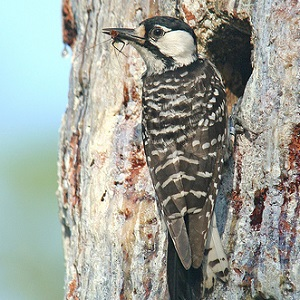
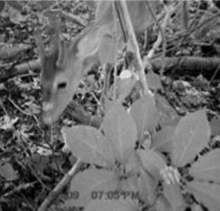
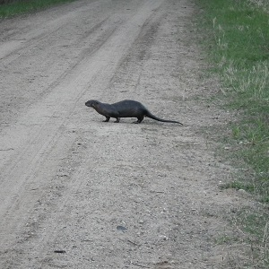

&nbsp;

1. **Chi-Square Application Questions**
    1. [Political Opinion](#political-opinion)
    1. [Forest Composition](#forest-composition)
    1. [Saving Trees from Woodpeckers](#saving-trees-from-woodpeckers)
    1. [Diseases in Rocky Mountain Cervids](#diseases-in-rocky-mountain-cervids)
    1. [Why Americans Do Not Exercise](#why-americans-do-not-exercise)
    1. [Types of Animals in Different Zoos](#types-of-animals-in-different-zoos)
1. **Goodness-of-Fit Application Questions**
    1. [Ginseng Consumption by Deer](#ginseng-consumption-by-deer)
    1. [Road Rage](#road-rage)
    1. [Randomness of CD Player](#randomness-of-cd-player)
    1. [Otter Mortalities](#otter-mortalities)

&nbsp;

----

<div class="alert alert-success">For all "hypothesis testing" questions, make sure to provide explicit answers with your work shown for all <a href="../11-steps">11 steps of a hypothesis test</a>.
</div>

----

&nbsp;

## Political Opinion

Canadian pollsters polled 642 supporters of Progressive Concervative (PC) party and 159 supporters of the Liberal party in Edmonton, Alberta and asked them to rank how strongly they agreed with the statement that "Unemployment is high because trade unions have priced their members out of a job." Ratings of agreement were on a seven point scale where 1 means "strongly disagree" and 7 means "strongly agree." The results of their poll are recorded in EdmontonPoll.csv ([data](https://github.com/droglenc/NCData/raw/master/EdmontonPoll.csv), [meta](https://github.com/droglenc/NCData/raw/master/EdmontonPoll_meta.txt)). Use these data to determine, at the 1% level, if the respondent's level of agreement differed between which party the respondent supported.[^1]

----

## Forest Composition

Hely *et al.* (2000; Journal of Vegetation Science 11:813-824) examined the effects of stand composition on fire hazard in mixed-wood Canadian boreal forests.  Two variables that they recorded for each stand were stand type (`sttype`, where `d`=deciduous, `c`=coniferous, `mc`=mixed coniferous, and `md`=mixed deciduous) and the time since the last fire (`tslf`) which was treated as a categorical variable with the categories corresponding to 100 year blocks of time (i.e., `0-100`, `100-200`, etc.).  Use the data in Fire.csv ([data](https://github.com/droglenc/NCData/raw/master/Fire.csv), [meta](https://github.com/droglenc/NCData/blob/master/Fire_meta.txt)) to determine, at the 5% level, if the distribution of times since last fire differed by type of forest stand.   [Note: **refactor** `sttype` so that the `c` and `d` levels are ordered at the ends (i.e., so that the categories are arranged from mostly coniferous to mostly deciduous).] [Further Note: please **continue** with all steps even though the assumptions are not met with these data.]

----

## Saving Trees from Woodpeckers

[Saenz *et al.* (1998)](https://www.srs.fs.usda.gov/pubs/474) examined the effectiveness of "restrictor plates" (a metal plate designed to reduce pecking by Pileated Woodpeckers (*Dryocopus pileatus*) in reducing damage by Pileated Woodpeckers) on cavity trees for Red-Cockaded Woodpeckers (*Picoides borealis*) in Eastern Texas. For each Red-Cockaded Woodpecker cavity hole they recorded whether the hole was fit with a restrictor plate or not and, ultimately, whether the cavity hole was damaged or not. The results of their study are recorded in RestrictorPlates.csv ([data](https://github.com/droglenc/NCData/raw/master/RestrictorPlates.csv), [meta](https://github.com/droglenc/NCData/blob/master/RestrictorPlates_meta.txt)). Examine these data to determine, at the 5% level, if restrictor plates reduced the damage done by Pileated Woodpeckers.

----

## Diseases in Rocky Mountain Cervids

On the eastern slopes of the Rocky Mountains in Colorado, Wyoming, and Montana, Whitetail Deer (*Odocoileus virginianus*), Mule Deer (*Odocoileus hemionus*), and Elk (*Cervus canadensis*) habitats overlap. It has been observed that in these areas where these species interact, diseases common to each species tend to infect more animals than in other areas. To examine this phenomenon, infection information on all three species was observed from individuals killed during the hunting seasons in areas where the habitats overlapped. In particular, it was recorded whether the animal was infected with one of the diseases common to each species or not. These data are recorded in CervidDisease.csv ([data](https://github.com/droglenc/NCData/raw/master/CervidDisease.csv), [meta](https://github.com/droglenc/NCData/blob/master/CervidDisease_meta.txt)). Test at the 1% significance level if there is a difference in the infection rate among the three species.

----

## Why Americans Do Not Exercise

USA Today presented two sets of data on why Americans don't exercise. One set was for 1000 randomly selected men. The other was for 1000 randomly selected women. The results of the surveys are recorded in Exercise.csv ([data](https://github.com/droglenc/NCData/raw/master/Exercise.csv), [meta](https://github.com/droglenc/NCData/blob/master/Exercise_meta.txt)). Determine, at the 1% level, if the distribution of men and women differs among the six responses given.

&nbsp;

----

## Types of Animals in Different Zoos

The data in Zoo1.csv ([data](https://github.com/droglenc/NCData/raw/master/Zoo1.csv), [meta](https://github.com/droglenc/NCData/blob/master/Zoo1_meta.txt)) contains a list of animals found in several different zoos. In addition, each animal was classified into broad "type" categories ("mammal", "bird", and "amph/rep"). The researchers that collected these data wanted to examine if the distribution of broad animal types differed among zoos. Test the researcher's question at the 5% level.

&nbsp;

&nbsp;

----

# Goodness-of-Fit Test Application Questions
## Ginseng Consumption by Deer

[Furedi and McGraw (2004)](https://www.researchgate.net/publication/228788782_White-tailed_Deer_Dispersers_or_Predators_of_American_Ginseng_Seeds) examined predation of American Ginseng (*Panax quinquefolius* L.) by Whitetail Deer (*Odocoileus virginianus* Z.). At one location and year in their study (P5, 2003) they found that 33 of 73 randomly selected reproductive ginseng plants had been consumed by deer. Use this information to determine, at the 5% significance level, if more than 33% of all plants at this location and year were consumed by deer.

----

## Road Rage

Road rage was defined as "an incident in which an angry or impatient motorist or passenger intentionally injures or kills another motorist, passenger, or pedestrian, or attempts or threatens to injure or kill another motorist, passenger, or pedestrian." [Rathbone and Huckabee (1999)](https://www.aaafoundation.org/sites/default/files/RoadRageFinal.pdf) reported the day of the week that 69 incidents of road rage occurred. The results of the study are in the RoadRage.csv ([data](https://raw.githubusercontent.com/droglenc/NCData/master/RoadRage.csv), [meta](https://raw.githubusercontent.com/droglenc/NCData/master/RoadRage_meta.txt)) data file. Use this information to determine, at the 5% level, if incidents of road rage occur more often on certain days of the week.

----

## Randomness of CD Player

Fisher claims that the randomization function of its "Studio-Standard" 60-disc CD changer is completely random. To test this assertion, the owner of one of these units randomly filled the CD changer with 20 copies of "The Best of Taj Mahal" and 40 copies of "Beethoven's Greatest."  Each CD had 20 songs on it. The owner set out to test the randomness of the CD player by listening to 100 songs chosen by the CD changer. The owner recorded whether a song came from the Taj Mahal (T) CD or the Beethoven (B) CD. The data collected are listed below (organized into rows of 25 for convenience). Test, at the 5% level, the hypothesis that the randomization function on the CD changer is indeed random.

```
    T T B B B B T B T B T B B B T B T B B B B B B B B
    T T T B B T B T T B T B B T B T B B B T T B T T B
    T B B T B B B T B B B B T T B B B B B B B B T T B
    B T T B B T B B T T B T B B T B T B B B B T B T B
```

----

## Otter Mortalities

[Philcox *et al.* (1999)](http://onlinelibrary.wiley.com/doi/10.1046/j.1365-2664.1999.00441.x/full) examined patterns in the road-related mortalities of otters (*Lutra lutra*) in Britain from 1971 to 1996. One aspect of their analysis was to examine the sex ratio of road-killed otters. The sex of all otters for which sex could be identified are recorded in OtterMort.csv ([data](https://github.com/droglenc/NCData/raw/master/OtterMort.csv), [meta](https://github.com/droglenc/NCData/blob/master/OtterMort_meta.txt)). Use these data to determine if there is a significant (at the 1% level) bias in the sex ratio of road-killed otters.

&nbsp;

----

[^1]: This question was adapted [from here](http://uregina.ca/~gingrich/ch10.pdf).
