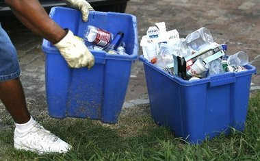

```{r echo=FALSE, eval=FALSE}
# Renders an appropriate HTML file for the webpage
setwd("C:/aaaWork/Web/GitHub/NCMTH107/modules/CE")
source("../../rhelpers/rhelpers.R")
modHTML("RUnivEDA_CE2")
```

```{r echo=FALSE, results='hide', message=FALSE}
library(NCStats)
source("../../rhelpers/knitr_setup.R")
```

----

1. **Quantitative**
    1. [Creatine Phosphate Concentrations](#creatine-phosphate-concentrations)
    1. [Air Pollution](#air-pollution)
    1. [Dow Jones](#dow-jones)
    1. [Zoo Sizes](#zoo-sizes)
1. **Categorical**
    1. [Curbside Recycling](#curbside-recycling)
    1. [Zoo Animal Types](#zoo-animal-types)

&nbsp;

----

# Quantitative
## Creatine Phosphate Concentrations

The table below contains the concentrations (International Units per liter) of creatine phosphokinase (an enzyme related to muscle and brain functions) in 36 male volunteers. Construct a proper EDA for these data.

```
121  82 100 151  68  58  95 145  64 119 104 110 113 118 203  62  83  67
201 101 163  84  57 139  60  78  94  93  92 110  25 123  70  48  95  42
```

----

## Air Pollution

The table below contains the carbon monoxide levels (ppm) arising from one of the stacks for an oil refinery northeast of San Francisco between April 16 and May 16, 1993. The measurements were submitted as evidence for establishing a baseline to the Bay Area Air Quality Management District (BAAQMD). Construct a proper EDA for these data.

```
30 30 34 36 37 38 40 42 43  43  45  52  55  58 58 58
59 63 63 71 75 85 86 86 99 102 102 141 153 261 21
```

----

## Dow Jones

The Dow Jones Travel Index tracks the cost of hotel and car-rental rates in 20 major cities. For its May 7, 1996, survey the rates below were given for the 20 cities. Thoroughly describe the distribution of these data. [*Note: You can use fewer than the ideal number of bars on your histogram because the sample size is so small in this situation.*]

```
152 180 167 119 115 113 119 135 127 161
140 126 114 133 205 104 149 124 106 179
```

----

## Zoo Sizes

The data in [Zoo2.csv](https://raw.githubusercontent.com/droglenc/NCData/master/Zoo2.csv) contains the physical size (in acres) of a sample of zoos from around the United States. Perform a univariate EDA on the "size" variable.

&nbsp;

&nbsp;

----

&nbsp;

# Categorical
## Curbside Recycling

A neighborhood in Honolulu conducted a survey to determine if residents participated in the curbside recycling program. One question on their survey was "How much has curbside recycling reduced your regular refuse? 0%, 25%, 50%, 75%, 100%, or 'too early to tell'?" The individual responses for the returned surveys are shown below with letters corresponding to the category choices offered (e.g., "A"=0%, "B"=25%, and so on). Construct a univariate EDA with these data.

```
C, C, B, B, B, B, C, E, B, B, C, B, C, B, C, C, C, E, B, B, B,
C, B, B, C, C, C, B, C, B, C, B, B, C, B, C, B, B, B, C, E, B,
E, B, B, C, C, B, B, B, E, B, C, C, C, B, B, C, B, B, B, B, B
```

----

## Zoo Animal Types

The data in [Zoo1.csv](https://raw.githubusercontent.com/droglenc/NCData/master/Zoo1.csv) contains a list of animals found in several different zoos. In addition, each animal was classified into broad "type" categories ("mammal", "bird", and "amph/rep"). Perform a univariate EDA for the type of animals in the zoos.
