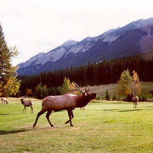
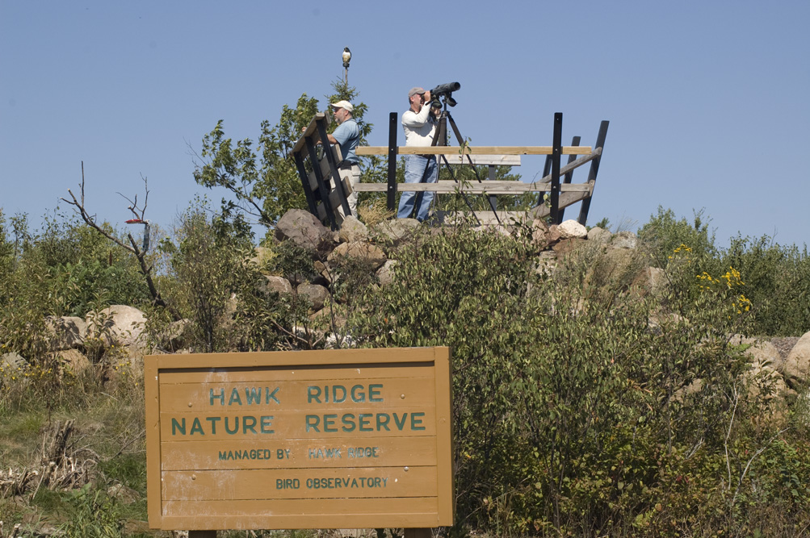
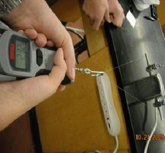
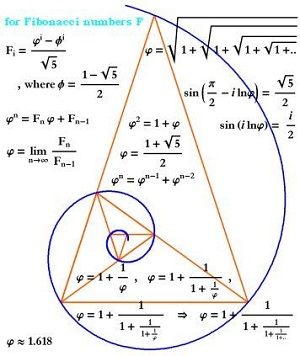
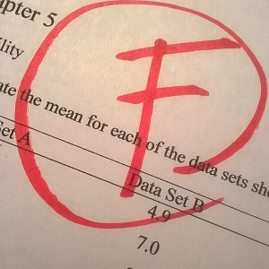
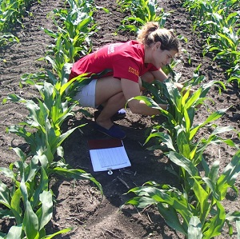

&nbsp;

1. **1-Sample t-Test Applications**
    1. [Thickness of the Ozone Layer](#thickness-of-the-ozone-layer)
    1. [Fecal Coliform Counts II](#fecal-coliform-counts-ii)
    1. [Elk Density in Banff](#elk-density-in-banff)
    1. [Raptors at Hawk Ridge](#raptors-at-hawk-ridge)
    1. [Fishing Line Strength](#fishing-line-strength)
    1. [Strawberries Produced](#strawberries-produced)
    1. [Putting Together Toys](#putting-together-toys)
    1. [Boat Traffic](#boat-traffic)
    1. [Golden Triangle in Beads?](#golden-triangle-in-beads)

1. **2-Sample t-Test Applications**
    1. [Dioxins in Milk Cartons](#dioxins-in-milk-cartons)
    1. [Low Grades in Math](#low-grades-in-math)
    1. [Hours Worked by Medical Interns](#hours-worked-by-medical-interns)
    1. [Corn Crop Yield](#corn-crop-yield)
    1. [Death Anxiety and Organ Donation](#death-anxiety-and-organ-donation)

&nbsp;

----

<div class="alert alert-success">For all "hypothesis testing" questions, make sure to provide explicit answers with your work shown for all <a href="../11-steps">11 steps of a hypothesis test</a>.
</div>

----

# 1-Sample t-Test Applications
## Thickness of the Ozone Layer

The typical thickness of the ozone layer over the Earth's surface is 300 [Dobson units](http://ozonewatch.gsfc.nasa.gov/facts/dobson_SH.html).  Researchers at the Laboratorium für Atmospharensphysic in Switzerland recorded the thickness of the ozone layer over [Arosa, Switzerland](https://en.wikipedia.org/wiki/Arosa) from 1926 to the present.  The data in OzoneSWI.csv ([file](https://github.com/droglenc/NCData/raw/master/OzoneSWI.csv), [meta](https://github.com/droglenc/NCData/blob/master/OzoneSWI_meta.txt)) contains the measurements from a random sample of 45 years between 1926 and the mid 1990s.  Use these data to determine, at the 1% level, if the thickness of the ozone layer over Arosa is different than that which is typical for the Earth's surface.[^3]

----

## Fecal Coliform Counts II

[Fecal coliform](https://en.wikipedia.org/wiki/Fecal_coliform) is a bacterium that originates in the intestines of warm-blooded animals and, thus, may be found in their feces.  Organic matter containing fecal coliform may be washed into lakes and streams in runoff following large rain events.  In lakes and streams, the fecal coliform may lead to the growth of pathogens that are dangerous to the health of humans, or reduce oxygen available to fish and other aquatic life.  Thus, fecal coliform levels are routinely monitored in many waterbodies in the United States.

Students recorded fecal coliform counts (number of colony forming units (CFU) per 100 ml) in water samples from a nearby lake following a rainstorm that resulted in considerable runoff. Use the data in FecalColiform.csv ([data)](FecalColiform.csv)) to determine, at the 10% level, if the mean CFU from this event exceeds the 150 CFU/100ml threshold value that would require closing the lake to swimming.

----

## Elk Density in Banff

[Hebblewhite (2000)](http://www.carnivoreconservation.org/files/thesis/hebblewhite_2000_msc.pdf) recorded the density (number per square km) of Elk (*Cervus elaphus*) in Banff National Park, Alberta, CA from 1986 to 2000. The raw data from his study are shown below. Further assume that it is known from previous studies that the distribution is approximately normal. Use this information to construct and fully interpret a test, at the 10% significance level, of whether the mean density of elk is greater than 8 per square km.

<pre>
 5.20, 7.79, 6.46, 8.60, 8.97,8.65, 9.60, 9.09,
12.42,10.70,11.59,10.68,10.61,9.04,10.89
</pre>

----

## Raptors at Hawk Ridge

The Duluth, MN Tourism Board would like to advertise that, on average, more than 50,000 raptors are seen at [Hawk Ridge](http://www.hawkridge.org/) per year. The numbers of various raptor species was observed from 1971-2003 and recorded in HawksRidge.csv ([data](https://github.com/droglenc/NCData/raw/master/HawksRidge.csv), [meta](https://github.com/droglenc/NCData/blob/master/HawksRidge_meta.txt)). Note that the `Total` variable should be used here as the Board is focused on the total number of raptors seen in a year. The board wants there to be strong, if any, evidence to support their claim (i.e., test at the 1% level). Determine if these data support the Board's claim.

----

## Fishing Line Strength

Fishing line is graded by the pounds (lbs) of pressure that it can withstand before breaking. For example, line that is rated as 6-lbs should not break for pressures under 6 lbs. Two physics students developed an apparatus for testing the breaking point of 2-foot sections of line to test the manufacturer's claim (i.e., determine if line rated at 6-lbs broke, on average, at pressures below 6 lbs). To test this, they measured the pounds of pressure it took 20 randomly selected 2-foot sections of line to break. Use their results shown below to test their hypothesis at the 10% level.

```
6.1 5.3 5.5 4.9 6.2 6.5 5.7 5.5 4.7 6.2
6.8 5.9 5.8 6.7 6.3 6.2 5.4 5.5 6.7 5.9
```

----

## Strawberries Produced

Last year I planted 400 everbearing strawberry plants in my garden. The company I bought the plants from claimed that in the year following planting, each plant would produce an average of 12 berries. I was surprised by this claim and hypothesized that the plants would actually produce less than what the company said, on average. To test this claim, I counted the number of ripe berries produced for the entire season on 50 randomly selected plants. Use the data in Strawberries.csv ([data](https://github.com/droglenc/NCData/raw/master/Strawberries.csv), [meta](https://github.com/droglenc/NCData/blob/master/Strawberries_meta.txt)) to test the company's claim at the 10% level.

----

## Putting Together Toys

The toy industry rates toys regarding their ease for being put together in three categories: easy, moderate, and difficult. A toy is placed into the easy category if it takes 10 minutes or less to put the toy together, in the moderate category if it takes 20 minutes or less (and more than 10 minutes), and in the difficult category if it takes more than 20 minutes. A randomly selected group of 34 adults were asked to put together a new toy to determine which rating the toy should receive. The results from these 34 individuals are in ToyTime.csv ([data](https://github.com/droglenc/NCData/raw/master/ToyTime.csv), [meta](https://github.com/droglenc/NCData/blob/master/ToyTime_meta.txt)). Conduct a hypothesis test, at the 10% level, to determine whether the toy should receive the difficult rating.

----

## Boat Traffic

One of the dominant uses of Madison area lakes is for boating. To develop a long-term data set on the temporal fluctuations and trends in such activity, the Long Term Ecological Research (LTER) project obtained records of boat traffic that passes through the locks at the head of the Yahara River on its stretch between Lake Mendota and Lake Monona. These data in Yahara.csv ([data](https://github.com/droglenc/NCData/raw/master/Yahara.csv), [meta](https://github.com/droglenc/NCData/blob/master/Yahara_meta.txt)) have been collected nearly daily from April through October since 1976. Use these data to determine, at the 5% level, if the mean total number of boats passing through the locks during the months of June, July, and August of 2005 is greater than 75. HINT: create a new data frame that contains just the data for this period (i.e., the data file contains more data than is needed for this question). I suggest that you do this in three separate steps -- isolate 2005 data, isolate data for months after May (5), and then isolate data for months before September (9).

----

## Golden Triangle in Beads?

The [golden rectangle](http://en.wikipedia.org/wiki/Golden_rectangle) is a rectangle with a length-to-width ratio of 1:1.618, or equivalently, a width-to-length ratio of 0.618:1. The golden rectangle is evident in several works by ancient Greeks and Egyptians. Anthropologists measured the width-to-length ratios of beaded rectangles used by the Shoshoni Indians of America to decorate their leather goods. Use their data in Shoshoni.csv ([data](https://github.com/droglenc/NCData/raw/master/Shoshoni.csv), [meta](https://github.com/droglenc/NCData/blob/master/Shoshoni_meta.txt)) to determine, at the 5% level, if the golden rectangle is evident in the beadwork of the Shoshonis.

&nbsp;

----

# 2-Sample t-Test Applications
## Dioxins in Milk Cartons

A study examined the effectiveness of foil-lined milk cartons to reduce "leakage" of dioxins from the carton to the milk (dioxins were found in milk cartons due to the bleaching process). The dioxin content (parts per thousand, ppt) in milk from 50 unlined and 50 lined cartons of milk are recorded in MilkCartons.csv ([data](https://github.com/droglenc/NCData/raw/master/MilkCartons.csv), [meta](https://github.com/droglenc/NCData/blob/master/MilkCartons_meta.txt)). Determine, at the 1% level, if lining the cartons with foil significantly reduced the amount of dioxin in the milk.

----

## Low Grades in Math

The University of North Carolina math department is noted for "giving out" low grades. To examine this, the GPA from a random sample of 22 math classes and 29 "other" university classes (from the last year) are in UNCGrades.csv ([data](https://github.com/droglenc/NCData/raw/master/UNCGrades.csv), [meta](https://github.com/droglenc/NCData/blob/master/UNCGrades_meta.txt)). Determine, at the 10% level, if grades are significantly lower in math than in other classes.

&nbsp;

----

## Hours Worked by Medical Interns

A health commissioner needs to determine if the number of hours worked per week by medical interns differs between two cities. To examine this, the commissioner found the mean number of hours worked by interns in the first city for a random sample of 13 weeks and the same for a random sample of 16 weeks from the second city. Her data are in MedInternHrs.csv ([data](https://github.com/droglenc/NCData/raw/master/MedInternHrs.csv), [meta](https://github.com/droglenc/NCData/blob/master/MedInternHrs_meta.txt)). Determine if the hours worked by the interns differs, at the 10% level, between the two cities.

----

## Corn Crop Yield

Agronomists are interested in determining conditions that increase crop yield. In one experiment, 80 one-acre plots of corn were randomly divided into two groups of 40 plots. An insecticide was used on each plot in one group and sterilized male individuals of an insect pest were released on each of the other plots. The resulting yields are recorded in CropYield.csv ([data](https://github.com/droglenc/NCData/raw/master/CropYield.csv), [meta](https://github.com/droglenc/NCData/blob/master/CropYield_meta.txt)). Is there a difference, at the 10% level, in yield between the two treatments.

----

## Death Anxiety and Organ Donation

Templer's Death Anxiety Scale (DAS) is a measure of an individual's anxiety concerning death. [Robbins (1990)](http://www.tandfonline.com/doi/abs/10.1080/07481189008252363) recorded the DAS score for 25 organ donors and 69 non-organ donors in DeathAnxiety.csv ([data](https://github.com/droglenc/NCData/raw/master/DeathAnxiety.csv), [meta](https://github.com/droglenc/NCData/blob/master/DeathAnxiety_meta.txt)). Determine, at the 1% level, if there is a difference in anxiety levels concerning death between organ and non-organ donors.


&nbsp;


[^3]: This exercise was modified [from here](http://college.cengage.com/mathematics/brase/understandable_statistics/7e/students/datasets/svls/frames/svls11.html).
