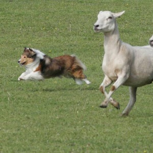

----

## Hand Calculations

The breeds that won the "Herding Group" at the Westminster Kennel Club championships are [listed here](http://www.westminsterkennelclub.org/about-sensation/history/herding-group-winners/). Perform the following tasks with those data "by hand" (i.e., without using R or other software).

1. Construct a table that shows the frequency of breeds that won the group. [*For simplicity, lump all of the "shepherd"s together, all of the "collie"s together, and all of the "corgi"s together. Keep other breeds as separate categories. Ignore minor spelling differences throughout.*]
1. Construct a table that shows the percentage by breed that won the group.
1. Hand draw (roughly) a bar chart of your results.
1. Hand draw (roughly) a pie chart of your results.

----

<ul class="pagination pagination-lg">
  <li><a href="UEDACat.html">^</a></li>
  <li class="active"><a href="#">1</a></li>
  <li><a href="UEDACat_CE2.html">2</a></li>
  <li><a href="UEDACat_CE3.html">3</a></li>
  <li><a href="UEDACat_CE4.html">4</a></li>
  <li><a href="UEDACat_CE5.html">5</a></li>
</ul>
