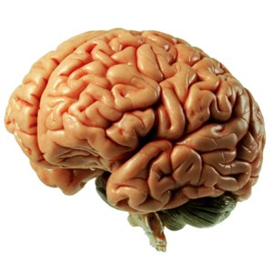

----

## Hand Calculations

Consider the following three data sets for questions below. Show your work for all questions. [[See hints at bottom.](#hints)]

<pre>
Data Set 1
18 28 25 21 16 24

Data Set 2
4 54 16 85 52 29 24 71 61 60 2

Data Set 3
93 81 34 5 54 84 54 13 1 35 79 63 97 71
</pre>

1. Hand calculate the mean of Data Set 1.
1. Hand calculate the standard deviation of Data Set 1.
1. Hand calculate the median of Data Set 2.
1. Hand calculate the IQR of Data Set 2.
1. Hand calculate the median of Dat Set 3.
1. Hand calculate the IQR of Dat Set 3.
1. Hand calculate the range of Data Set 3.

----

## Histograms

The [U.S. Census](http://www.indexmundi.com/facts/united-states/quick-facts/all-states/average-commute-time#map) asked individuals 16 years old and older "How long in minutes is your one-way commute to work each day?".  The mean for individuals from each state was computed and is plotted in the histogram below.


Use this histogram to answer these questions.

1. What is an individual in this example?
1. What is the variable in this example?
1. What type of variable is recorded?
1. How many individuals are represented in this histogram?
1. How many individuals had a mean commute time between 16 and 18 minutes?
1. How many states had a mean commute time between 18 and 24 minutes?
1. What was the range of mean commute times for the bin with exactly five states?

----

## Brain Weight

Use R to answer the following questions for the data in [BrainHead.csv](https://raw.githubusercontent.com/droglenc/NCData/master/BrainHead.csv).

1. Construct a histogram of `brain.weight`.
1. Compute summary statistics for `brain.weight`.
1. Construct histograms of `brain.weight` for each age group.
1. Compute summary statistics of `brain.weight` for each age group.

<br>

----

<div class="text-center">
<ul class="pagination pagination-lg">
  <li><a href="../UEDAQuant1.html">^</a></li>
  <li class="active"><a href="#">1</a></li>
  <li><a href="UEDAQuant1_CE2.html">2</a></li>
</ul>

<br>

----

----

#### Hints

You can check your work with `sdCalc()` and `iqrCalc()`. For example,

```r
> # Enter (example) data into d vector
> d <- c(16,23,47,13,18,12)
> # Check calculations for data in d
> sdCalc(d)
```

```
Demonstration of parts of a std. dev. calculation.

      x diffs diffs.sq
1    16  -5.5    30.25
2    23   1.5     2.25
3    47  25.5   650.25
4    13  -8.5    72.25
5    18  -3.5    12.25
6    12  -9.5    90.25
sum 129   0.0   857.50

Mean = x-bar = 129 / 6 = 21.5 

Variance = s^2 = 857.5 / 5 = 171.5 

Std. Dev = s = sqrt(171.5) = 13.0958
```

```r
> iqrCalc(d)
```

```
Median (=17) is the average of values in positions 3 and 4.
  12 13 [16 18] 23 47

Q1 (=13) is the value in position 2 of the lower half.
  12 [13] 16

Q3 (=23) is the value in position 2 of the upper half.
  18 [23] 47
```
