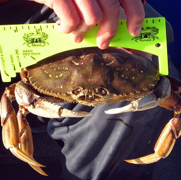
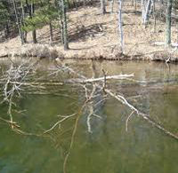

```{r echo=FALSE, eval=FALSE}
# Renders an appropriate HTML file for the webpage
setwd(here::here())
source("rhelpers/rhelpers.R")
modHTML("modules/CE/UEDAQuant2_CE1")
```

```{r echo=FALSE, results='hide', message=FALSE}
library(NCStats)
library(captioner)
source("../../rhelpers/knitr_setup.R")
tbls <- captioner(prefix="Table")
tbls(name="Commute","Summary statistics for the mean commute time (mins) for each state.")
tbls(name="Crabs","Summary statistics for post-smolt carapace length (mm) of Dungeness crab collected in California.")

figs <- captioner(prefix="Figure")
figs(name="Commute","Histogram for the mean commute time (mins) for each state.")
figs(name="Crabs","Histogram for post-smolt carapace length (mm) of Dungeness crab collected in California.")
```

----

## Shape and Outliers I

For each histogram below, describe the shape and presence of outliers.

```{r echo=FALSE, fig.height=3, fig.width=3, fig.show='hold'}
set.seed(125689)
n <- 200
xlbl <- "Quantitative Variable"
par(mar=c(2,2,2,2),mgp=c(0.5,0,0),tcl=-0.2)
hist(~rbeta(n,1,6),xlab=xlbl,main="#1",xaxt="n",yaxt="n")
hist(~rbeta(n,6,3),xlab=xlbl,main="#2",xaxt="n",yaxt="n")
hist(~c(rbeta(n,2,7),0.91),xlab=xlbl,main="#3",xaxt="n",yaxt="n")
hist(~rbeta(n,5,5),xlab=xlbl,main="#4",xaxt="n",yaxt="n")
hist(~rbeta(n,1,1),xlab=xlbl,main="#5",xaxt="n",yaxt="n")
hist(~rbeta(n,9,1),xlab=xlbl,main="#6",xaxt="n",yaxt="n")
hist(~c(rbeta(n,8,4),0),xlab=xlbl,main="#7",xaxt="n",yaxt="n")
hist(~c(rbeta(n/2,7,2),rbeta(n/2,2,7)),xlab=xlbl,main="#8",xaxt="n",yaxt="n")
```

----

## Commute Times


The [U.S. Census](http://www.indexmundi.com/facts/united-states/quick-facts/all-states/average-commute-time#map) asked individuals 16 years old and older "How long in minutes is your one-way commute to work each day?". The mean for individuals from each state was recorded with summary results shown in `r figs("Commute",display="cite")` and `r tbls("Commute",display="cite")`. Perform a thorough EDA with these results.

```{r CommuteHist, echo=FALSE, fig.width=4, fig.height=4, par1=TRUE}
df <- data.frame(time=c(24.2,18.8,24.6,21.3,27.2,24.5,24.8,24.8,29.7,25.9,27,
                        26,20,28,23.2,18.8,19,22.8,24.9,23.3,32,28,24,22.9,
                        23.9,23.1,18,18.1,23.8,26.3,30.4,21.6,31.6,23.6,16.9,
                        23,21,22.5,25.9,23.6,23.5,16.9,24.3,25,21.4,22.2,27.7,
                        25.7,25.5,21.7,18.3))
hist(~time,data=df,breaks=seq(16,32,2),xaxt="n",xlab="Mean Commute Time (mins)")
axis(1,seq(16,32,2))
```

`r figs("Commute")`

`r tbls("Commute")`

```{r CommuteSum, echo=FALSE, background="white"}
Summarize(~time,data=df,digits=2)
```

----

## Dungeness Crabs


Scientists were concered about the overexploitation of [Dungeness Crabs (*Cancer magister*)](https://en.wikipedia.org/wiki/Dungeness_crab) in some California waters. To better manage this species they examined the post-molt carapace length from a large sample of crabs. Their results are displayed in `r figs("Crabs",display="cite")` and `r tbls("Crabs",display="cite")`. Perform a thorough EDA with these results.

```{r CrabsHist, echo=FALSE, fig.width=4, fig.height=4, par1=TRUE}
df <- read.table("http://www.stat.berkeley.edu/~statlabs/data/crabs.data",header=TRUE)
hist(~postsz,data=df,w=10,xlab="Post-Molt Carapace Length (mm)")
```

`r figs("Crabs")`

`r tbls("Crabs")`

```{r CrabsSum, echo=FALSE, background="white"}
Summarize(~postsz,data=df,digits=1)
```

----

## Coarse Woody Debris

Coarse woody debris (CWD) in lakes is important for aquatic systems as it provides refuge for young fish and invertebrates as well as providing areas for periphyton to grow. Coarse woody debris was studied in the north basin of Allequash Lake in northern Wisconsin. Among other things, the researchers recorded the diameter (cm) of CWD found in the lake littoral zone and a qualitative measure of the degree to which the location where the CWD was found was exposed to winds (low or medium). The data (sampled from information on the [North Temperate Lakes Long Term Ecological Research website](https://lter.limnology.wisc.edu/datacatalog/search)) they observed are shown below.

<pre>
diameter  21  15  18  23  18  17  19  17  15  22  16  20  16  17  18  15  16  24  24  23
exposure med med med low med low med med med med med med low med med med med low med med

diameter  18  17  19  17  17  15  17  18  19  31  25  15  17  34  16  18  19  15  16  15
exposure med med med med med med med med low med med med med low low med med med low med

diameter  20  23  34  20  17  20  15  34  18  24
exposure med med low med med med med med med med
</pre>

[**HINT:** *these are the same data that you entered in [a previous class exercise](UEDACat_CE1.html#coarse-woody-debris); use that file and R script here.*] Load these data into R to answer the following questions.

1. Perform a univariate EDA for `diameter`.
1. Perform a univariate EDA for `diameter` separately for the low- and medium-`exposure` sites.

----

<div class="text-center">
<ul class="pagination pagination-lg">
  <li><a href="../UEDAQuant2.html">^</a></li>
  <li class="active"><a href="#">1</a></li>
  <li><a href="UEDAQuant2_CE2.html">2</a></li>
</ul>
