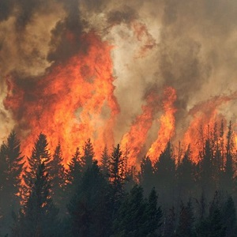
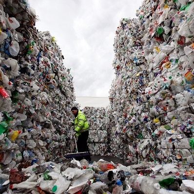

```{r echo=FALSE, eval=FALSE}
# Renders an appropriate HTML file for the webpage
setwd("C:/aaaWork/Web/GitHub/NCMTH107/modules/CE")
source("../../rhelpers/rhelpers.R")
modHTML("UnivEDA_CE1")
```

```{r echo=FALSE, results='hide', message=FALSE}
library(NCStats)
library(captioner)
source("../../rhelpers/knitr_setup.R")
tbls <- captioner(prefix="Table")
tbls(name="Commute","Summary statistics for the mean commute time (mins) for each state.")
tbls(name="Crabs","Summary statistics for post-smolt carapace length (mm) of Dungeness crab collected in California.")

figs <- captioner(prefix="Figure")
figs(name="Commute","Histogram for the mean commute time (mins) for each state.")
figs(name="Crabs","Histogram for post-smolt carapace length (mm) of Dungeness crab collected in California.")
figs(name="fires","Bar chart of frequency of forest fires in Montesinho Natural Park from 2000-2003.")
figs(name="plastic","Bar chart of the percentage of worldwide plastic waste by fate in 1995 and 2015.")
```

----

## Shape and Outliers I

For each histogram below, describe the shape and presence of outliers.

```{r echo=FALSE, fig.height=3, fig.width=3, fig.show='hold'}
set.seed(125689)
n <- 200
xlbl <- "Quantitative Variable"
par(mar=c(2,2,2,2),mgp=c(0.5,0,0),tcl=-0.2)
hist(~rbeta(n,1,6),xlab=xlbl,main="#1",xaxt="n",yaxt="n")
hist(~rbeta(n,6,3),xlab=xlbl,main="#2",xaxt="n",yaxt="n")
hist(~c(rbeta(n,2,7),0.91),xlab=xlbl,main="#3",xaxt="n",yaxt="n")
hist(~rbeta(n,5,5),xlab=xlbl,main="#4",xaxt="n",yaxt="n")
hist(~rbeta(n,1,1),xlab=xlbl,main="#5",xaxt="n",yaxt="n")
hist(~rbeta(n,9,1),xlab=xlbl,main="#6",xaxt="n",yaxt="n")
hist(~c(rbeta(n,8,4),0),xlab=xlbl,main="#7",xaxt="n",yaxt="n")
hist(~c(rbeta(n/2,7,2),rbeta(n/2,2,7)),xlab=xlbl,main="#8",xaxt="n",yaxt="n")
```

----

## Commute Times

The [U.S. Census](http://www.indexmundi.com/facts/united-states/quick-facts/all-states/average-commute-time#map) asked individuals 16 years old and older "How long in minutes is your one-way commute to work each day?". The mean for individuals from each state was recorded with summary results shown in `r figs("Commute",display="cite")` and `r tbls("Commute",display="cite")`. Perform a thorough EDA with these results.

```{r CommuteHist, echo=FALSE, fig.width=4, fig.height=4}
df <- data.frame(time=c(24.2,18.8,24.6,21.3,27.2,24.5,24.8,24.8,29.7,25.9,27,
                        26,20,28,23.2,18.8,19,22.8,24.9,23.3,32,28,24,22.9,
                        23.9,23.1,18,18.1,23.8,26.3,30.4,21.6,31.6,23.6,16.9,
                        23,21,22.5,25.9,23.6,23.5,16.9,24.3,25,21.4,22.2,27.7,
                        25.7,25.5,21.7,18.3))
ggplot(data=df,mapping=aes(x=time)) +
  geom_histogram(boundary=0,binwidth=2,closed="left",fill="gray80",color="black") +
  scale_x_continuous(name="Mean Commute Time (mins)",expand=expansion(mult=0.01)) +
  scale_y_continuous(name="Frequency",expand=expansion(mult=c(0,0.05))) +
  theme_NCStats()
```

`r figs("Commute")`

`r tbls("Commute")`

```{r CommuteSum, echo=FALSE, background="white"}
Summarize(~time,data=df,digits=2)
```

----

## Dungeness Crabs


Scientists were concerned about the overexploitation of [Dungeness Crabs (*Cancer magister*)](https://en.wikipedia.org/wiki/Dungeness_crab) in some California waters. To better manage this species they examined the post-molt carapace length from a large sample of crabs. Their results are displayed in `r figs("Crabs",display="cite")` and `r tbls("Crabs",display="cite")`. Perform a thorough EDA with these results.

```{r CrabsHist, echo=FALSE, fig.width=4, fig.height=4, par1=TRUE}
df <- read.table("http://www.stat.berkeley.edu/~statlabs/data/crabs.data",header=TRUE)
ggplot(data=df,mapping=aes(x=postsz)) +
  geom_histogram(boundary=0,binwidth=10,closed="left",fill="gray80",color="black") +
  scale_x_continuous(name="Post-Molt Carapace Length (mm)",expand=expansion(mult=0.01)) +
  scale_y_continuous(name="Frequency",expand=expansion(mult=c(0,0.05))) +
  theme_NCStats()
```

`r figs("Crabs")`

`r tbls("Crabs")`

```{r CrabsSum, echo=FALSE, background="white"}
Summarize(~postsz,data=df,digits=1)
```

----

## Forest Fires

[Cortex and Morais (2007)](http://www3.dsi.uminho.pt/pcortez/fires.pdf) describe attributes of forest fires in Montesinho Natural Park in Portugal. The number of forest fires by month from 2000-2003 are displayed in `r figs("fires",display="cite")`. Perform a thorough EDA with these results.

```{r ffBar, echo=FALSE, fig.width=5, fig.height=4}
ff <- read.csv("http://www.dsi.uminho.pt/~pcortez/forestfires/forestfires.csv",
               stringsAsFactors=FALSE) %>%
  mutate(month=FSA::capFirst(month),month=factor(month,levels=month.abb))
ggplot(data=ff,mapping=aes(x=month)) +
  geom_bar(fill="beige",color="black") +
  scale_y_continuous(name="Frequency of Fires",expand=expansion(mult=c(0,0.05))) +
  scale_x_discrete(name="Month") +
  theme_NCStats()
```

`r figs("fires")`

----


## Fate of Plastics

[Geyer et al. (2017)](http://advances.sciencemag.org/content/3/7/e1700782.full) estimated the fate of all plastic waste produced worldwide (their data [is available here](https://ourworldindata.org/grapher/global-plastic-fate)). Their results for two years are displayed in `r figs("plastic",display="cite")`. Use these results to perform a univariate EDA for the fate of plastic waste in 2015. Also describe how the fate of plastic waste has changed from 1995 to 2015.

```{r plasticBar, echo=FALSE, fig.width=6, fig.height=4}
pl <- read.csv("http://derekogle.com/NCMTH107/modules/CE/global-plastic-fate.csv") %>%
  filter(Year %in% c(1995,2015))
ggplot(data=pl,mapping=aes(x=Entity,y=Estimated.historic.plastic.fate....)) +
  geom_col(fill="steelblue",color="black") +
  scale_y_continuous(name="Percentage of Waste",expand=expansion(mult=c(0,0.05))) +
  scale_x_discrete(name="Fate") +
  theme_NCStats() +
  facet_wrap(vars(Year))
```

`r figs("plastic")`

&nbsp;

----

## Additional Practice

[Here are more exercises for practice if time permits.](UnivEDA_CE2)
