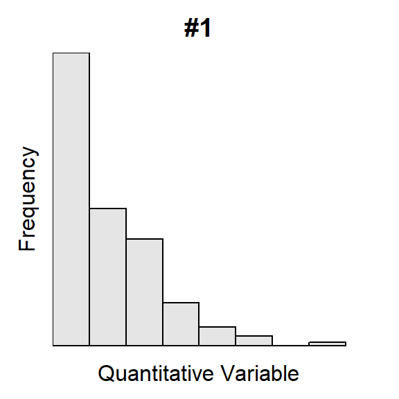
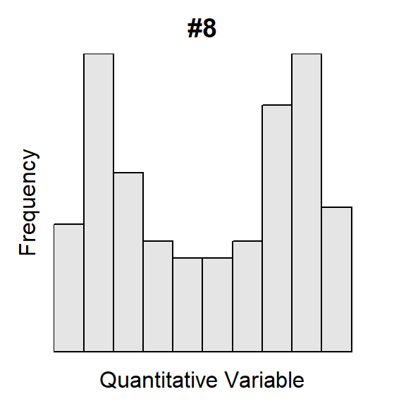

----

## Shape and Outliers I

For each histogram below, describe the shape and presence of outliers.



----

## Commute Times

The [U.S. Census](http://www.indexmundi.com/facts/united-states/quick-facts/all-states/average-commute-time#map) asked individuals 16 years old and older "How long in minutes is your one-way commute to work each day?". The mean for individuals from each state was recorded with summary results shown in Figure  1 and Table  1. Perform a thorough EDA with these results.


Figure  1: Histogram for the mean commute time (mins) for each state.

Table  1: Summary statistics for the mean commute time (mins) for each state.


```
     n   mean     sd    min     Q1 median     Q3    max 
 51.00  23.75   3.54  16.90  21.65  23.80  25.80  32.00 
```

----

## Dungeness Crabs


Scientists were concerned about the overexploitation of [Dungeness Crabs (*Cancer magister*)](https://en.wikipedia.org/wiki/Dungeness_crab) in some California waters. To better manage this species they examined the post-molt carapace length from a large sample of crabs. Their results are displayed in Figure  2 and Table  2. Perform a thorough EDA with these results.


