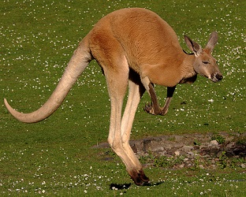

```{r echo=FALSE, eval=FALSE}
# Renders an appropriate HTML file for the webpage
setwd("C:/aaaWork/Web/GitHub/NCMTH107/modules/CE")
source("../../rhelpers/rhelpers.R")
modHTML("UnivSum_CE2")
```

```{r echo=FALSE, results='hide', message=FALSE}
library(NCStats)
source("../../rhelpers/knitr_setup.R")
```

----

1. **Calculate Summary Statistics**
    1. [Number of States Visited](#number-of-states-visited)
    1. [Home Range of Red Kangaroos](#home-range-of-red-kangaroos)
    1. [Brule River Gauge Heights](#brule-river-gauge-heights)
    1. [Population Density in Wisconsin Counties](#population-density-in-wisconsin-counties)
    1. [Creatine Phosphate Concentrations](#creatine-phosphate-concentrations)
    1. [Air Pollution](#air-pollution)
    1. [Your Own Numbers](#your-own-numbers)
1. **Histograms**
    1. [Wild Dog Pups](#wild-dog-pups)
1. **Bar Charts**
    1. [Brown Pelican Habitats](#brown-pelican-habitats)

&nbsp;

&nbsp;

----

## Number of States Visited

A student asked six of her friends how many states they had visited in their lifetime. Their answers 8, 3, 17, 15, 4, and 19. Compute the median, mean, standard deviation, and range of these data "by hand."

&nbsp;

----

## Home Range of Red Kangaroos

In a preliminary study, a researcher recorded the weekly home range of five Red Kangaroos (*Macropus rufus*) in New South Wales. The five home ranges were 258, 310, 560, 470, and 502 hectares. Compute the median, mean, standard deviation, and range of these data "by hand."

&nbsp;

----

## Brule River Gauge Heights

The following values are the maximum gauge heights of the Bois Brule River in Brule, WI from 10-25Feb05. Compute the median, IQR, and range.

```
1.56 1.54 1.54 1.57 1.58 1.61 1.60 1.69
1.99 2.11 1.98 1.76 1.69 1.99 1.86 1.53
```

&nbsp;

----

## Population Density in Wisconsin Counties

The following values are the population density (number of people per acre of land) for 15 randomly selected Wisconsin counties. Compute the median, IQR, and range.

```
429.0  67.8  52.1  97.4  57.9 354.9  16.2  19.1
127.0  27.6  10.2  54.6  28.8  30.1  20.2
```

&nbsp;

----

## Creatine Phosphate Concentrations

The table below contains the concentrations (International Units per liter) of creatine phosphokinase (an enzyme related to muscle and brain functions) in 36 male volunteers. Compute the median, IQR, and range.

```
121  82 100 151  68  58  95 145  64
119 104 110 113 118 203  62  83  67
201 101 163  84  57 139  60  78  94
 93  92 110  25 123  70  48  95  42
```

----

## Air Pollution

The table below contains the carbon monoxide levels (ppm) arising from one of the stacks for an oil refinery northeast of San Francisco between April 16 and May 16, 1993. The measurements were submitted as evidence for establishing a baseline to the Bay Area Air Quality Management District (BAAQMD). Compute the median, IQR, and range.

```
30 30 34  36  37  38  40  42 43 43 45
52 55 58  58  58  59  63  63 71 75 85
86 86 99 102 102 141 153 261 21
```

----

## Your Own Numbers

1. Hand calculate the mean and standard deviation for six numbers that you make up.
1. Hand calculate the mean and standard deviation for seven numbers that you make up.
1. Hand calculate the median and IQR for 14 numbers that you make up.
1. Hand calculate the median and IQR for 16 numbers that you make up.

See this [hint](UnivSum_CE1.html#hints) for how to check your answers with R.

----

&nbsp;

# Histograms
## Wild Dog Pups

[McNutt and Silk (2007)](https://www.semanticscholar.org/paper/Pup-production%2C-sex-ratios%2C-and-survivorship-in-McNutt-Silk/8bec71d9a4a6ced4896c346dff72df143a10a651) examined pup production, sex ratios and survivorship of African wild dogs (*Lycaon pictus*). In one part of their study, they computed the sex ratio of pups in each litter by dividing the number of males in the litter by the total number of pups in the litter (thus, 1.0 means all males and 0.7 means 70% were males). The results from making this calculations on their sample of litters is shown in the histogram below.

```{r echo=FALSE, fig.width=4, fig.height=4, par1=TRUE}
set.seed(34329034)
df <- data.frame(lsr=rep(seq(0.1,0.91,0.09),c(1,4,19,13,18,16,9,10,3,1))+runif(94,0,0.09))

ggplot(data=df,mapping=aes(lsr)) +
  geom_histogram(boundary=0,binwidth=0.1,closed="left",
                 fill="gray60",color="black",alpha=0.75) +
  scale_x_continuous(name="Litter Sex Ratio",expand=expansion(mult=0.02)) +
  scale_y_continuous(name="Frequency",expand=expansion(mult=c(0,0.05)),
                     breaks=seq(0,20,5),minor_breaks=seq(0,21,1)) +
  theme_NCStats() +
  theme(panel.grid.major.y=element_line(linetype="dashed",color="gray60"),
        panel.grid.minor.y=element_line(linetype="dashed",color="gray80"))
```

Use this histogram to answer these questions.

1. What is an individual in this example?
1. What is the variable in this example?
1. What type of variable is recorded?
1. How many individuals are represented in this histogram?
1. How many litters had a litter sex ratio between 0.6 and 1.0?
1. How many litters had a litter sex ratio between 0.0 and 0.1?
1. Which litter sex ratios range had the most litters observed?
1. Did most litters (the majority) have mostly male or mostly female pups?

----

&nbsp;

# Bar Chart
## Brown Pelican Habitats

[King et al. (2013)](https://www.aphis.usda.gov/wildlife_damage/nwrc/publications/13pubs/king132.pdf) examined the habitat use of [Brown Pelicans (*Pelecanus
occidentalis*)](https://en.wikipedia.org/wiki/Brown_pelican) in the Northern Gulf of Mexico. In one part of their study, they recorded the GPS location where each pelican was spotted. The bar chart below shows the percentages of those GPS locations in major habitats. Use this information to answer the questions further below. [Note that `Water`="shallow near-shore waters", `EEW`="estuarine emergent wetland", `Grassland`="shoreline grasslands", `UnShore`="unconsolidated shore", `DeepWater`="deeper offshore waters", and `Other`="all other habitats".]

```{r echo=FALSE, fig.width=7, fig.height=4, par1=TRUE}
tbl <- c(0.618,0.2551,0.0392,0.0271,0.0239)
tbl <- c(tbl,1-sum(tbl))*100
tbl <- data.frame(cats=factor(c("Water","EEW","Grassland","UnShore","DeepWater","other"),levels=c("Water","EEW","Grassland","UnShore","DeepWater","other")),
                  perc=tbl)

ggplot(data=tbl,mapping=aes(x=cats,y=perc)) +
  geom_col(fill="gray80",color="black",alpha=0.8) +
  scale_y_continuous(name="Percent of Recordings",expand=expansion(mult=c(0,0.05)),
                     breaks=seq(0,65,5),
                     minor_breaks=c(seq(0,5,1),seq(25,30,1),seq(60,65,1))) +
  scale_x_discrete(name="Main Habitats") +
  theme_NCStats() +
  theme(panel.grid.major.y=element_line(linetype="dashed",color="gray60"),
        panel.grid.minor.y=element_line(linetype="dashed",color="gray80"))
```

1. What is an individual in this example?
1. What type of variable is recorded?
1. What (approximate) percentage of individuals used "shallow nearshore waters"?
1. What (approximate) percentage of individuals used "estuarine emergent wetlands"?
1. What (approximate) percentate of individuals were not in the two most common habitat types?
1. What is the shape of this distribution?

----
