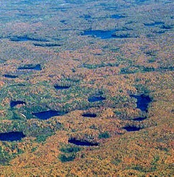

```{r echo=FALSE, eval=FALSE}
# Renders an appropriate HTML file for the webpage
setwd(here::here())
source("rhelpers/rhelpers.R")
modHTML("modules/CE/WhyStats_CE1")
```

```{r echo=FALSE, results='hide', message=FALSE}
library(NCStats)
source("../../rhelpers/knitr_setup.R")
```

----

## Realities


1. Identify and describe three "realities" that, if they did not exist, would eliminate the need for the field of statistics (i.e., what exists in nature and life that leads to the existence of the field of statistics).

<br><br><br>

----

## Variability


1. Define natural and sampling variability.
1. Describe natural and sampling variability within the context of a "real-life" (or realistic) situation of interest to you. Make sure to clearly articulate the situation (e.g., *"Consider the situation where ..."*) and then specifically define the two types of variability within the context of this situation (e.g., *"Within the situation just described, natural variability would be when ... and sampling variability would be when ..."*). [This situation is completely of your choosing and can be fictitious, but should be realistic. Alternatively, think of a situation that may have arisen in one of your other classes.]

<br>

----

## Wisconsin Lakes


There are `r formatC(nrow(ABDLakes),format="f",digits=0)` lakes in Ashland, Bayfield, and Douglas counties of Wisconsin. However, only `r formatC(nrow(filterD(ABDLakes,named)),format="f",digits=0)` of these are named. A random sample of named lakes from this population is extracted with the following R code:

```{r eval=FALSE, prompt=FALSE}
library(NCStats)
named <- filterD(ABDLakes,named)
srsdf(named,n=50,vars=c("county","area"))
```

Use this code and some hand (or calculator) calculations to answer the questions below.

1. Extract a sample of n=50 lakes with the (last line of) code above. Compare the sizes (area in acres) of the first three lakes. This is an example of what type of variability?
1. Compute the proportion of lakes in your sample that are from Bayfield County.
1. Extract another sample of n=50 lakes and compute the proportion of lakes that are from Bayfield County? Compare your two proportions. This is an example of what type of variability?
1. Of the 605 named lakes in the three counties, `r formatC(xtabs(~county,data=filterD(ABDLakes,named))[2],format="f",digits=0)` are from Bayfield County. Was the proportion of named lakes from Bayfield County in either of your samples equal to the proportion of all named lakes that were from Bayfield County?  Were you surprised?  Why or why not?

----
