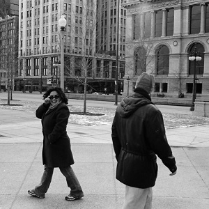

&nbsp;

1. [General chi-square Distribution Questions](#general-chi-square-distribution-questions)
1. Application Questions with Summarized Results
    1. [Distribution of Cyprinids in Asia](#)
    1. [Working Environment for Nurses](#working-environment-for-nurses)
    1. [Sex Effect on Heart Attack Deaths](#sex-effect-on-heart-attack-deaths)
    1. [School Uniforms](#school-uniforms)
    1. [Arthritis Pain Relievers](#arthritis-pain-relievers)
    1. [Turtle Excluder Devices](#turtle-excluder-devices)
    1. [Dolphin Behavior](#dolphin-behavior)
    1. [Response to Hello](#response-to-hello)
1. Application Questions with Raw Data
    1. [Saving Trees from Woodpeckers](#saving-trees-from-woodpeckers)
    1. [Diseases in Rocky Mountain Cervids](#diseases-in-rocky-mountain-cervids)
    1. [Why Americans Do Not Exercise](#why-americans-do-not-exercise)
    1. [Types of Animals in Different Zoos](#types-of-animals-in-different-zoos)

&nbsp;

----

&nbsp;

## General t Distribution Questions

Click on each question to see the answer, click on it again to close the answer.

<a data-toggle="collapse" href="#pval1">What is the p-value if &chi;2=10.25 and df=3?</a>

The p-value is 0.0167 as computed with distrib(10.25,distrib="chisq",df=3,lower.tail=FALSE)

<a data-toggle="collapse" href="#pval2">What is the p-value if &chi;2=10.25 and df=4?</a>

The p-value is 0.0364 as computed with distrib(10.25,distrib="chisq",df=4,lower.tail=FALSE).

<a data-toggle="collapse" href="#pval3">What is the p-value if &chi;2=10.25 and df=6?</a>

The p-value is 0.1145 as compute with distrib(10.25,distrib="chisq",df=6,lower.tail=FALSE).

----

## Distribution of Cyprinids in Asia

Researchers in Asia (Roberts, 2000) wanted to describe the distribution of the fish genera Cyprinidae in Asian rivers. They collected 228 fish from the Brahmaputra, Irrawaddy, and Salween rivers and recorded whether the fish was a member of the Cyprinidae family or not. Because the rivers were relatively equal in size, they expected the same proportions of Cyprinidae in each of the rivers. Using the data in the table below, test to see if there was a difference in the proportion of Cyprinidae among the rivers at the 5% level.

|    River    | Cyprinid | Not Cyprinid |
|:-----------:|:--------:|:------------:|
| Brahmaputra |    22    |      51      |
|  Irrawaddy  |    25    |      53      |
|   Salween   |    30    |      47      |

[See answer here](zRevExAns/ChiSquare.html#distribution-of-Cyprinids-in-sia)

----

## Working Environment for Nurses

The American Nurses Credentialing Center (ANCC) has created guidelines for nursing administration. Some research findings have suggested that ANCC-recognized hospitals also have favorable practice environments for nurses. To study this further and in relation to oncology units, Friese (2005) examined the practice environments and outcomes of nurses working in and out of oncology units in hospitals that adhere and don't adhere to the ANCC guidelines. As part of his study, he determined, through surveys, whether nurses were experiencing high emotional exhaustion (HEE) or not. The results of his study are shown in the table below. Use these results to determine, at the 5% level, if the proportion of nurses experiencing HEE differs among the four categories of hospitals.

|       Clinic Type      | HEE | not HEE |
|:----------------------:|:---:|:-------:|
| non-ANCC, non-Oncology | 362 |   534   |
|   non-ANCC, Oncology   |  58 |    92   |
|   ANCC, non-Oncology   | 197 |   558   |
|     ANCC, Oncology     |  30 |   125   |

[See answer here](zRevExAns/ChiSquare.html#working-environment-for-nurses)

----

## Sex Effect on Heart Attack Deaths

[Fiebach *et al.* (1990)](https://www.ncbi.nlm.nih.gov/pubmed/2299781) examined the immediate survival of 790 males and 332 females who were hospitalized following a myocardial infarction (i.e., a "heart attack"). During hospitalization, 70 men and 47 women died. Is there a difference, at the 5% level, in mortality rate (proportion of patients that died) between men and women during hospitalization?

[See answer here](zRevExAns/ChiSquare.html#sex-effect-on-heart-attack-deaths)

----

## Saving Trees from Woodpeckers

[Saenz *et al.* (1998)](https://www.srs.fs.usda.gov/pubs/474) examined the effectiveness of "restrictor plates" (a metal plate designed to reduce pecking by Pileated Woodpeckers (*Dryocopus pileatus*) in reducing damage by Pileated Woodpeckers) on cavity trees for Red-Cockaded Woodpeckers (*Picoides borealis*) in Eastern Texas. For each Red-Cockaded Woodpecker cavity hole they recorded whether the hole was fit with a restrictor plate or not and, ultimately, whether the cavity hole was damaged or not. The results of their study are recorded in [RestrictorPlates.csv](https://raw.githubusercontent.com/droglenc/NCData/master/RestrictorPlates.csv). Examine these data to determine, at the 5% level, if restrictor plates reduced the damage done by Pileated Woodpeckers.

[See answer here](zRevExAns/ChiSquare.html#saving-trees-from-woodpeckers)

----

## Diseases in Rocky Mountain Cervids

On the eastern slopes of the Rocky Mountains in Colorado, Wyoming, and Montana, Whitetail Deer (*Odocoileus virginianus*), Mule Deer (*Odocoileus hemionus*), and Elk (*Cervus canadensis*) habitats overlap. It has been observed that in these areas where these species interact, diseases common to each species tend to infect more animals than in other areas. To examine this phenomenon, infection information on all three species was observed from individuals killed during the hunting seasons in areas where the habitats overlapped. In particular, it was recorded whether the animal was infected with one of the diseases common to each species or not. These data are recorded in [CervidDisease.csv](https://raw.githubusercontent.com/droglenc/NCData/master/CervidDisease.csv). Test at the 1% significance level if there is a difference in the infection rate among the three species.

[See answer here](zRevExAns/ChiSquare.html#diseases-in-rocky-mountain-cervids)

----

## School Uniforms

Ashland High School conducted a survey to determine if parents or students favored the idea of uniforms being required apparel for attending school (December 5, 1999, Ashland Daily Press). The surveys were administered to 223 parents at parent-teacher conferences and to 572 students by the Student Council. No other information about the surveys was given in the report. From these surveys it was learned that 70 parents and 101 students FAVORED the wearing of uniforms. Determine, at the 5% level, if there is a difference in the level of support for wearing uniforms between parents and students.

[See answer here](zRevExAns/ChiSquare.html#school-uniforms)

----

## Arthritis Pain Relievers

Five hundred patients participated in a comparison of the effectiveness of three arthritic pain relievers (175 received medication A, 150 received medication B, and 175 received medication C). Each patient used one of the three medications for one month and then was asked if the product was effective. The results showed 115 patients using medication A, 78 patients using medication B, and 140 patients using medication C said their medication was effective. Test, at the 10% level, if there is a difference in effectiveness among the three medications.

[See answer here](zRevExAns/ChiSquare.html#arthritis-pain-relievers)

----

## Why Americans Do Not Exercise

USA Today presented two sets of data on why Americans don't exercise. One set was for 1000 randomly selected men. The other was for 1000 randomly selected women. The results of the surveys are recorded in [Exercise.csv](https://raw.githubusercontent.com/droglenc/NCData/master/Exercise.csv). Determine, at the 1% level, if the distribution of men and women differs among the six responses given.

[See answer here](zRevExAns/ChiSquare.html#why-americans-do-not-exercise)

----

## Turtle Excluder Devices

Shrimp trawlers are required to have turtle exclusion device (TED), that allows most Loggerhead Sea Turtles (*Caretta caretta*) to escape the net, thus reducing turtle mortality due to by-catch. In the Gulf of Mexico, the TEDs were originally required to be 32"x10" but a new law now requires to TEDs to be 71"x26" with the thought that turtle mortality would be further reduced by the larger opening. This thought was examined by recording the number of trawl tows that had at least one turtle mortality. In 75 tows with the original smaller opening there were 16 tows with at least one turtle mortality. In contrast, in 88 tows with the the newer larger opening there were 8 tows with at least one turtle mortality. Test at the 10% level if there is a significant difference in the proportion of trawl tows with at least one turtle mortality between trawls with the different sized openings.

[See answer here](zRevExAns/ChiSquare.html#turtle-excluder-devices)

----

## Dolphin Behavior

Researchers observed groups of dolphins off the coast of Iceland near Keflavik in 1998. The researchers recorded the time of the day and the main activity of the group, whether travelling quickly, feeding, or socializing. The number of dolphin groups observed by each time of day and activity is shown in the table below. Use this information to determine, at the 5% level if the proportion of groups exhibiting each activity differs by time of day.

| Time of Day | Traveling | Feeding | Socializing |
|:-----------:|:---------:|:-------:|:-----------:|
|   Morning   |     6     |    28   |      38     |
|     Noon    |     6     |    4    |      5      |
|  Afternoon  |     14    |    0    |      9      |
|   Evening   |     13    |    56   |      10     |

[See answer here](zRevExAns/ChiSquare.html#dolphin-behavior)

----

## Types of Animals in Different Zoos

The data in [Zoo1.csv](https://raw.githubusercontent.com/droglenc/NCData/master/Zoo1.csv) contains a list of animals found in several different zoos. In addition, each animal was classified into broad "type" categories ("mammal", "bird", and "amph/rep"). The researchers that collected these data wanted to examine if the distribution of broad animal types differed among zoos. Test the researcher's question at the 5% level.

[See answer here](zRevExAns/ChiSquare.html#types-of-animals-in-different-zoos)

----

## Response to Hello

Eight American undergraduate women were part of a study to determine if whether or not a response is received depends on the size of group addressed (Jones and Foshay 1984). Each student was instructed to say "Hello"" to strangers or groups of strangers that they encountered around campus, on the streets in town, in stores, etc. They were told to not make direct eye contact with anyone in the group but to look in the general direction of the group focusing on the shoulders or hair of individuals or the general middle of a group. The students recorded a variety of information for each encounter including how many individuals were in the group and whether at least one person responded to the greeting. The study included 119 people greeted individually, 94 groups of two or three, and 27 groups of four, five or six. They found that 92 of the individuals, 65 of the groups of two or three, and 13 of the groups of four, five, or six responded to the greeting. Determine, at the 5% level, if there is a significant difference in the frequency of responses among the three different sizes of groups (i.e., individuals; two or three; or four, five, or six).

[See answer here](zRevExAns/ChiSquare.html#response-to-hello)

----
