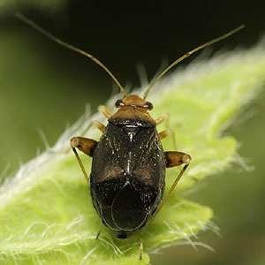

----

<strong>Note:</strong> Your answers to the questions below should follow the <a href="../resources/hwformat" target="_blank">expectations for homework found here</a> (and <a href="../resources/FAQ/FAQs/HWFormat_Example.pdf" target="_blank">demonstrated here</a>). Date due on <a href="../resources/Dates-Current.html" target="_blank">Dates page</a>.

----

## Confidence Regions Calculations

For each situation below, (a) identify the level of confidence; (b) whether a lower confidence bound, upper confidence bound, or confidence interval should be constructed; (c) find Z* (include a drawing that illustrates your calculation); (d) construct the confidence region; and (e) specifically interpret the confidence region.

1. &alpha;=0.05, HA: &mu;<80, n=30, &sigma;=20, x&#772;=73.
1. &alpha;=0.05, HA: &mu;&#8800;1500, n=40, &sigma;=800, x&#772;=1370.

----

## Beetle Size

Researchers examined the size of two different species of beetles. They hypothesized that the thorax length of the *Halticus oleracea* species would be greater than 190 mm. The data for their study is in Beetles.csv ([file](https://github.com/droglenc/NCData/raw/master/Beetles.csv), [meta](https://github.com/droglenc/NCData/blob/master/Beetles_meta.txt)).  Use this information to (i) construct an appropriate confidence region assuming &sigma;=14 and &alpha;=0.05, and (ii) summarize your findings in terms of the beetle's thorax size.

----

## Calf Growth

Calf growth early in life should be approximately 1000 g per day. Owners of a large cattle farm want to assure that their calves are growing at approximately this rate because slow growth might suggest a feeding problem and fast growth would suggest a future size problem (i.e., too many big animals in the available space). The owners want to sample enough of their calves so that they can estimate the growth rate to within 50 g per day, with 99% confidence, assuming that variabilty between individual calves is approximately 200 g per day. Calculate their required sample size.

----
