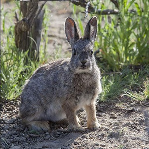
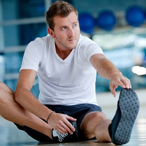

----

## Elephant Seals

While studying the foraging ecology of northern elephant seals (*Mirounga angustirostris*), marine biologists from California observed the health of wild seals in fenced enclosures of two different water temperatures (<47F and >47F) and compared these results to the health of domestic seals in two pools, with water temperatures analogous to the wild seals.  The wild seals were allowed to eat what they wanted, but the domestic seals were fed a known diet.  There were 20 wild seals and 20 domestic seals, each of which was randomly allocated to the two water temperatures (enclosures for the wild seals).  Use this information to answer the questions below.

1. What is the response variable?
1. What are the factors (list all of them)?
1. How many levels are there (list in same order as factors in answer 2)?
1. How many treatments are there?
1. How many replicates are there?
1. Physically, what is a replicate in this experiment (i.e., not a number)?
1. Describe how you would allocate individuals to treatments.  Show your R work.

[See answer here](zRevExAns/DataProduction_Experiments#elephant-seals)

----

## Sugar Beets

An agronomist is interested in the effect of plowing depth (10 cm, 17 cm, and 25 cm) and amount of applied fertilizer (none or 3 kg per acre) on the harvest of sugar beets. There are 36 nearly identical plots (fields) available for research.  The agronomist has asked you to help design an experiment.  Specifically, you are asked the questions below.

1. What are the factors (list all of them)?
1. How many levels are there (list in same order as factors in answer a)?
1. How many treatments?
1. How many replicates for each treatment?
1. Physically, what is a replicate (i.e., not a number)?
1. What is the response variable?
1. Describe how you would allocate individuals to treatments.  Show your R work.

[See answer here](zRevExAns/DataProduction_Experiments#sugar-beets)

----

## Translocating Rabbits

Translocation is an important tool in modern wildlife management. Current techniques, however, result in the death of many translocated individuals shortly after release in their new homes. Researchers in France (Letty *et al.* 2000) simultaneously examined the use of tranquilization (tranquilized or not) and acclimatization pens (pens where an individual can "get used to" the new environment; used acclimatization pen or not) on the survival rate (survived or not) of translocated rabbits. Their experiment used a total of 64 European wild rabbits. Use this information to answer the questions below.

1. What is the response variable?
1. What are the factors (list all of them)?
1. How many levels are there (list in same order as factors in answer c)?
1. How many treatments are there?
1. Physically, what is a replicate (i.e., not a number)?
1. How many replicates are there?
1. Describe how you would allocate individuals to treatments.  Show your R work.

[See answer here](zRevExAns/DataProduction_Experiments#translocating-rabbits)

----

## Eating Habits of Deer

In 1994, biologists studied the health of whitetail deer (*Odocoileus virginianus*) as it relates to eating habits. Sixty-four deer were randomly allocated into four groups. One group was to be kept on a deer farm and fed a strict diet. The other three groups would be sent to Channel Island off the coast of Alaska. One of the Channel Island groups would be restricted to browsing in prairies to simulate farm fields. The second was to be restricted to browsing in hardwood forests. The third Channel Island group would be fed a strict diet on the island. The researchers literally followed these deer around for 9 months, recording what the deer ate as they moved. Urine was also collected to assess the health of the deer. Use this information to answer the questions below.

1. What is the response variable?
1. What are the factors (list all of them)?
1. How many levels are there (list in same order as factors in answer b)?
1. How many treatments are there?
1. How many replicates are there?
1. What is an individual in this experiment?
1. Describe how you would allocate individuals to treatments.  Show your R work.

[See answer here](zRevExAns/DataProduction_Experiments#eating-habits-of-deer)

----

## Chemistry Reaction

A chemical engineer is designing the production process for a new product. The chemical reaction that produces the product may have higher or lower yield, depending on the temperature and stirring rate in the vessel in which the reaction takes place. The engineer decides to investigate the effect on yield of two temperatures (50C and 60C) and three stirring rates (60, 90, and 120 rpm). A new vessel should be used for each production and only 30 vessels exist. Help the engineer set up this experiment by answering the questions below.

1. What is the response variable?
1. What are the factors (list all of them)?
1. How many levels are there (list in same order as factors in answer a)?
1. How many treatments are there?
1. How many replicates are there?
1. Physically, what is a replicate (i.e., not a number)?
1. Identify the individuals for each treatment.  Show your R work.

[See answer here](zRevExAns/DataProduction_Experiments#chemistry-reaction)

----

## Diet, Exercise, Blood Pressure

A student is designing an experiment to determine the simultaneous effects of calcium in the diet and regular exercise on blood pressure. In this experiment, some subjects will be given a calcium supplement pill and some will be given a placebo sugar pill. In addition, some subjects will be required to perform aerobic exercises once a day, whereas others will not. The researcher has 32 male subjects available that are as similar as possible (similar ages, weights, initial blood pressures, etc.).  Help the student design this experiment by answering the questions below.

1. What are the factors (list all of them)?
1. How many levels are there (list in same order as factors in answer a)?
1. How many treatments are there?
1. What is the response variable?
1. How many replicates are there?
1. Physically, what is a replicate (i.e., not a number)?
1. Identify the individuals for each treatment.  Show your R work.

[See answer here](zRevExAns/DataProduction_Experiments#diet,-exercise,-blood-pressure)

----
