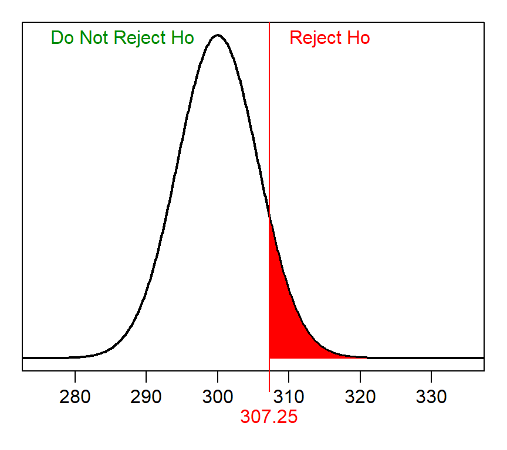
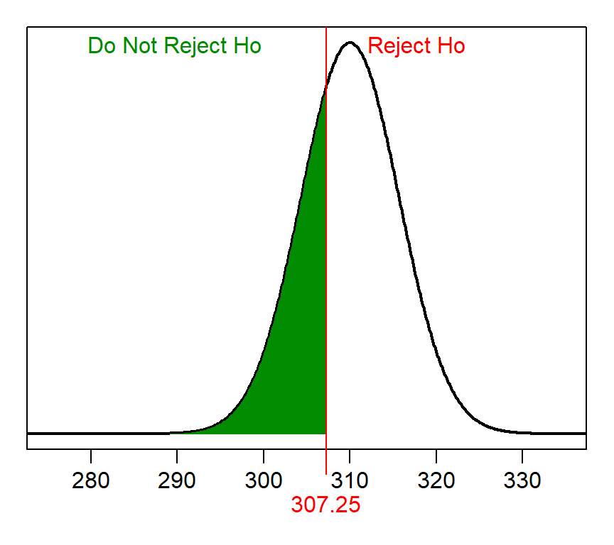

----

A Type II error is defined as not rejecting a false H<sub>0</sub>. The probability of making a Type II error is &beta;, which cannot usually be calculated because one would have to know the true population mean. We calculated &beta; in class, however, to demonstrate its concept and to see what types of things can change the relative size of &beta;.

## First Example
Calculating &beta; requires knowing &alpha;, n, &sigma;, the H<sub>A</sub> (and, thus, the H<sub>0</sub>), and the actual or true population mean. This example, defines these items as:

* &alpha; = 0.10
* n = 50
* &sigma; = 40
* H<sub>A</sub>: &mu;&gt;300
* actual population mean is 310

Calculating &beta; is a four-step process. The **first step** is to identify the null distribution, or the sampling distribution assuming that H<sub>0</sub> is true. In this case, the null distribution is normal (because n=40&gt;30) with a mean of 300 (from assuming that H<sub>0</sub> is true) and a standard ERROR of $\frac{40}{\sqrt{50}}$=5.657.

The **second step** is to identify the "rejection wall" on the null distribution. The rejection wall is the sample mean such that values "more extreme" represent rejecting H<sub>0</sub>. In this case, this would be the sample mean that has an area of &alpha; "greater" (because H<sub>A</sub> is a "greater than"). This REVERSE calculation on the null distribution is as follows:


```r
> distrib(0.10,mean=300,sd=40/sqrt(50),type="q",lower.tail=FALSE)
```

```
[1] 307.2496
```

Thus, sample means greater than 307.25 will result in H<sub>0</sub> being rejected, whereas smaller values will lead to H<sub>0</sub> not being rejected. This rejection wall looks like the following on the null distribution.



The **third step** is to identify the ACTUAL distribution, or the sampling distribution centered on the true population mean. In this case, the actual distribution is also normal (because n=40&gt;30) with a mean of 310 (from the actual population mean given above) and the same standard error of 5.657.

The **fourth step** is to compute the proportion of sample means in the "do not reject H<sub>0</sub>" region of the ACTUAL distribution. This FORWARD calculation is shown below and illustrated in the figure below.


```r
> distrib(307.25,mean=310,sd=40/sqrt(50))
```

```
[1] 0.3134354
```


Thus, &beta; for this situation is 0.3134.

<div class="alert alert-warning">
<strong>Note:</strong> 
<ul>
<li>The second step is always a REVERSE calculation with &alpha; more extreme as defined by H<sub>A</sub>.</li>
<li>The fourth step is always a FORWARD calculation in the OPPOSITE direction of &alpha; in the second step.</li>
</ul>
</div>

----

## Second Example
This example, defines these items as:

* &alpha; = 0.05
* n = 80
* &sigma; = 100
* H<sub>A</sub>: &mu;&lt;550
* actual population mean is 520

The null distribution in the **first step** is normal (because n=80&gt;30) with a mean of 550 (from assuming that H<sub>0</sub> is true) and a standard ERROR of $\frac{100}{\sqrt{80}}$=11.180. The "rejection wall" in the **second step** is 568.39, which has &alpha; "less" (because of H<sub>A</sub>).


```r
> distrib(0.05,mean=550,sd=100/sqrt(80),type="q")
```

```
[1] 531.61
```


The actual distributioin in the **third step** is normal with a mean of 520 and standard error of 11.180. The proportion of sample means in the "do not reject H<sub>0</sub>" region of the actual distribution for the **fourth step** is shown below and illustrated in the figure below. Thus, &beta; is 0.1495.


```r
> distrib(531.61,mean=520,sd=100/sqrt(80),lower.tail=FALSE)
```

```
[1] 0.149535
```


----
