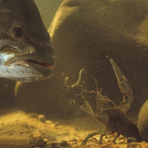

----

  <strong>Note</strong> Your answers to the questions below should follow the <a href="../../resources/hwformat" target="_blank">expectations for homework found here</a> (and <a href="../../resources/FAQ/FAQs/HWFormat_Example.pdf" target="_blank">demonstrated here</a>).

----

## Crayfish and Bass

As part of their Biology Capstone research, a Northland College student wanted to determine the mean carapace length of Rusty Crayfish (*Orconectes rusticus*) in a lake with Smallmouth Bass (*Micropterus dolomieu*). In 2015, the student gathered (as randomly as possible) and measured the carapace length of 235 Rusty Crayfish from the lake with Smallmouth Bass.

1. Identify the individual, variable, population, parameter, sample, and statistic.
1. What type of variable is the variable you identified? [*Be specific*]

----

## Transfer of Invasive Species

Many invasive aquatic organisms have been transferred to the Great Lakes in the ballast water of trans-oceanic ships. In an effort to minimize the number of new invading species, ships are now required to release their ballast water before entering the St. Lawrence Seaway. Ships laden with cargo generally do not contain ballast. However, their ballast tanks often contain some residual amount of water and, thus, may harbor invasive organisms. Researchers with Michigan Sea Grant ([more information on page 9 here](http://www.miseagrant.umich.edu/downloads/upwellings/sum02.pdf)) examined the water found in 43 ballast tanks from 22 cargo-laden boats entering the Seaway in 2001. They were interested in determining the proportion of ballast tanks that contained living organisms.

1. Identify the individual, variable, population, parameter, sample, and statistic.
1. What type of variable is the variable you identified? [*Be specific*]

----

## Variable Types

For each question below, identify the specific type of variable. Include a short sentence that explains your reasoning.

1. The concentration (ppm) of lead at 119 sites in Chequamegon Bay.
1. An actuary rates potential insurees as "low risk", "moderate risk", or "high risk".
1. A Sociologist asked respondents from which medium they receive most of their information about wolves: "TV", "Newspaper", "Outdoor Magazines", "Public Policy Meetings", "Friends or Family", or "Other".
1. The Koppen scheme of classifying "climates" contains five principal groups: "Tropical rainy", "dry", "temerate rainy", "Cold snowy forest", and "Polar".

----
