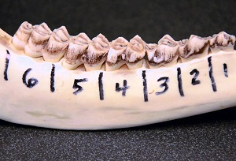

&nbsp;


1. Application Questions with Summarized Results
    1. [Shrike Habitate Use](#shrike-habitat-use)
    1. [Media Treatment of President Clinton](#media-treatment-of-president-clinton)
    1. [Cola Taste Test](#cola-taste-test)
    1. [Corn Genetics](#corn-genetics)
    1. [Lake Association Survey](#lake-association-survey)
    1. [Fair Coin?](#fair-coin)
    1. [Distribution of Blood Types](#distribution-of-blood-types)
    1. [Poll of Political Support](#poll-of-political-support)
    1. [Age Distribution of Deer](#age-distribution-of-deer)
    1. [Trawling Bycatch](#trawling-bycatch)
1. Application Questions with Raw Data
    1. [Otter Mortalities](#otter-mortalities)
    1. [Randomness of CD Player](#randomness-of-cd-player)


&nbsp;

----

&nbsp;

----

## Shrike Habitate Use


In the same study used in the example of this module, Bohall and Wood (1987) more closely examined the habitat use of the shrikes observed in the open habitat by looking at four "sub-habitats" within these areas. Of the 1456 shrike observations in this habitat, 149 were in "settled" areas, 944 were in improved pastures, 192 were in overgrown pastures, and 171 were in crop fields. In addition, 20.5% of this habitat was considered to be "settled", 58.6% was improved pasture, 10.3% was overgrown pasture, and 10.6% was crop fields.   Use these results to determine, at the 5% level, if shrikes found in open areas use the sub-habitats in proportion to their availability.

[See answer here](zRevExAns/GOFTest.html#shrike-habitat-use)

----

## Media Treatment of President Clinton


Between June 11 and 15, 1993, the Times Mirror Center for People and the Press interviewed 1006 adults concerning their views on media treatment of the then newly inaugurated President Clinton. They found 433 of those sampled felt that news organizations were "criticizing Clinton unfairly." Test the hypothesis (with &alpha; = 0.10) that more than 45% of all adults feel that Clinton has been criticized unfairly.

[See answer here](zRevExAns/GOFTest.html#media-treatment-of-president-clinton)

----

## Cola Taste Test


A random selection of consumers present at the Mall of America were allowed to taste three types of cola (Pepsi, Coke, and a generic brand). After tasting each type (which were supplied to each person in a random order) the person was to select which cola they preferred. The results indicated that 57 people preferred Pepsi, 63 preferred Coke, and 34 preferred the generic brand. Is there evidence, at the 5% level, that these customers prefer one brand over the others?

[See answer here](zRevExAns/GOFTest.html#cola-taste-test)

----

## Corn Genetics


A particular type of corn is known to have one of four types of kernels: purple-smooth, purple-wrinkled, yellow-smooth, and yellow-wrinkled (see figure below). The purple (P) and smooth (S) alleles are dominant. The cross between heterozygous individuals (i.e., PpSs) should produce a 9:3:3:1 ratio of purple-smooth, purple-wrinkled, yellow-smooth, and yellow-wrinkled individuals. Of the kernels shown in the graphic to the right (a random picture location but not a random selection of each individual) 32 are purple-smooth, 14 are purple-wrinkled, 8 are yellow-smooth, and 4 are yellow-wrinkled. Use the results to determine, at the 5% level, if the theoretical 9:3:3:1 ratio is upheld with these data.

[See answer here](zRevExAns/GOFTest.html#corn-genetics)

----

## Lake Association Survey


The leader of a local lake association conducted a survey of all members of the association. One question on the survey was, "What is your preferred method of receiving notices from the lake association: by regular mail, by e-mail, by phone, by poster (at the local boat landing), or other?"  Of the surveys returned, 47 respondents preferred regular mail, 63 e-mail, 17 phone, 73 by poster, and 8 some other method. *Of the respondents who did not prefer some other method*, is there evidence, at the 5% level, of a difference in the preferred method of contact?

[See answer here](zRevExAns/GOFTest.html#lake-association-survey)

----

## Otter Mortalities


Philcox *et al.* (1999) examined patterns in the road-related mortalities of otters (*Lutra lutra*) in Britain from 1971 to 1996. One aspect of their analysis was to examine the sex ratio of road-killed otters. The sex of all otters for which sex could be identified are recorded in [OtterMort.csv](https://raw.githubusercontent.com/droglenc/NCData/master/OtterMort.csv). Use these data to determine if there is a significant (at the 1% level) bias in the sex ratio of road-killed otters.

[See answer here](zRevExAns/GOFTest.html#otter-mortalities)

----

## Fair Coin?


hile imprisoned by the Germans during World War II, the English mathematician John Kerrich tossed a coin 10000 times and obtained 5067 heads. Use his results to determine (at the 1% level) whether the coin was fair or not (i.e., equal chance of heads and tails).

[See answer here](zRevExAns/GOFTest.html#fair-coin)

----

## Randomness of CD Player


Fisher claims that the randomization function of its "Studio-Standard" 60-disc CD changer is completely random. To test this assertion, the owner of one of these units randomly filled the CD changer with 20 copies of "The Best of Taj Mahal" and 40 copies of "Beethoven's Greatest."  Each CD had 20 songs on it. The owner set out to test the randomness of the CD player by listening to 100 songs chosen by the CD changer. The owner recorded whether a song came from the Taj Mahal (T) CD or the Beethoven (B) CD. The data collected are listed below (organized into rows of 25 for convenience). Test, at the 5% level, the hypothesis that the randomization function on the CD changer is indeed random.

```
    T T B B B B T B T B T B B B T B T B B B B B B B B
    T T T B B T B T T B T B B T B T B B B T T B T T B
    T B B T B B B T B B B B T T B B B B B B B B T T B
    B T T B B T B B T T B T B B T B T B B B B T B T B
```
[See answer here](zRevExAns/GOFTest.html#randomness-of-cd-player)

----

## Distribution of Blood Types


Past data suggest that of the patients that a hospital serves 44% have type O, 45% have type A, 8% have type B, and 3% have type AB blood. In a more recent survey they found that 67 patients had type O, 83 had type A, 29 had type B, and 8 had type AB. Use the more recent results to determine, at the 5% level, if the past results still hold.

[See answer here](zRevExAns/GOFTest.html#distribution-of-blood-types)

----

## Poll of Political Support


A county district attorney would like to run for the office of state district attorney. She has decided that she will give up her county office and run for state office if more than 65% of her party constituents support her. As her campaign manager, you collected data on 950 randomly selected party members and find that 660 party members support the candidate. Test at the 5% significance level whether she should give up her county office and run for the state office.

[See answer here](zRevExAns/GOFTest.html#poll-of-political-support)

----

## Age Distribution of Deer


Suppose that you know that a population of deer is at a stable age distribution and stable population size. In addition, it is hypothesized that the survival rate from year-to-year is 50%. Through a random sample of animals from this population you determine that 134 are in the 0-1 age group, 66 are aged 1-2, 30 are aged 2-3, 13 are aged 3-4, 4 are aged 4-5, and 6 are aged 5-6. Use these results to determine, at the 10% level, if the survival rate is indeed 50%. [*Hint: Find the expected number of animals in each age category. The expected number in the first age category, X, is found by solving the following equation X+(0.5<sup>1</sup>+0.5<sup>2</sup>+0.5<sup>3</sup>+0.5<sup>4</sup>+0.5<sup>5</sup>)X = n where n is the total number of observed animals. The expected values in the remaining categories are determined from the value of X and the hypothesized survival rate.*]

[See answer here](zRevExAns/GOFTest.html#age-distribution-of-deer)

----

## Trawling Bycatch


An Alaskan Pollock (*Theragra chalcogramma*) trawling boat will discontinue trawling in an area if the by-catch of King Salmon (*Oncorhynchus tshawytscha*) caught in that area exceeds 10% of the catch. In a very large trawl catch the independent observer on the boat randomly sampled 1256 fish and found that 145 were King Salmon. Is there evidence, at the 10% level, that the boat should discontinue trawling in that area?

[See answer here](zRevExAns/GOFTest.html#trawling-bycatch)

----
