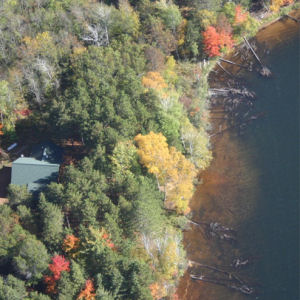

----

## Coarse Woody Debris

Coarse woody debris (CWD) in lakes is important for aquatic systems as it provides refuge for young fish and invertebrates as well as providing areas for periphyton to grow.  Coarse woody debris was studied in the north basin of Allequash Lake in northern Wisconsin.  Among other things, the researchers recorded the diameter (cm) of CWD found in the lake littoral zone and a qualitative measure of the degree to which the location where the CWD was found was exposed to winds (low or medium).  The data (sampled from information on the [North Temperate Lakes Long Term Ecological Research website](http://lter.limnology.wisc.edu/spatial/source/data_cat_new.htm)) they observed are shown below.

<pre>
diameter  21  15  18  23  18  17  19  17  15  22  16  20  16  17  18  15  16  24  24  23
exposure med med med low med low med med med med med med low med med med med low med med

diameter  18  17  19  17  17  15  17  18  19  31  25  15  17  34  16  18  19  15  16  15
exposure med med med med med med med med low med med med med low low med med med low med

diameter  20  23  34  20  17  20  15  34  18  24
exposure med med low med med med med med med med
</pre>

Use this information to answer the following questions.  Use R to answer all questions even though most questions can be answered by observing these simple data from the table above.  You should have an R script saved in RStudio and a MSWord document formatted as directed in section 1.4 of the textbook when you are finished.

1. Enter the data into Excel, save as a CSV file, and load the data into RStudio.
1. What is (just) the diameter measurement for the seventh individual?
1. What data was recorded for the seventeenth individual?
1. What data was recorded for the seventh, seventeenth, and twenty-seventh individuals?
1. Isolate the following subsets of data (show the structure or a view of the resultant data.frame to verify your results).
    * Only CWD at low-exposure sites.
    * Only CWD where the diameter was greater than 20 cm.
    * Only CWD where the diameter was greater than 20 cm and was observed in low-exposure sites.
    * Only CWD where the diameter was between 20 and 30 cm.

----

## Cars

[Locke (1993)](http://www.amstat.org/publications/jse/v1n1/datasets.lock.html) recorded data on a random sample of cars from the 1993 model year.  His data are in [93cars.csv](https://github.com/droglenc/NCData/raw/master/93cars.csv).  
Use this information to answer the following questions (by using R).  You should have an R script saved in RStudio and a MSWord document formatted as directed in section 1.4 of the textbook when you are finished.

1. Download the data from the class webpage and load the data into RStudio.
1. What is (just) the horsepower for the 73rd car in the sample?
1. What data were recorded for the thirteenth individual?
1. What data were recorded for the thrteenth, 22nd, and 91st individuals?
1. Isolate the following subsets of data (show the structure or a view of the resultant data.frame to verify your results).
    * Cars that were manufactured by Ford.
    * Cars that get more than 25 miles per gallon in the city.
    * Cars that had an automatic transmission and get more than 25 miles per gallon on the highway.
    * Cars that had a horsepower between 150 and 200.
    * Cars that were either domestically manufactured or were four cylinders.

----
