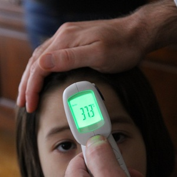

----

## Identifying Hypotheses

For each research hypothesis or statement below, construct the null and alternative hypotheses (use their respective symbols) and explicitly define the parameter in the hypotheses.

1. The mean number of murders per burrough in New York City in 2010 was less than 90.
1. Washburn High School publicizes that 61% of its students are invovled in at least one extracurricular activity.  A parent organization believes that the percentage is higher.
1. The Toyota dealership has advertised that oil changes will be completed in 15 minutes or less.  Test whether their advertisement is incorrect.
1. The National Institute of Diabetes and Digestive and Kidney Diseases reports that the average 
cost of bariatric (weight loss) surgery is $22,500.  You think that this information is incorrect. 

----

## P-Value Calculations and Decisions

Compute the p-value, include a drawing to support your calculation, and make a decision about H0 for each situation below.

1. &alpha;=0.10, HA: &mu;>75, n=50, &sigma;=12, x&#772;=80.5.
1. &alpha;=0.05, HA: &mu;&#8800;14, n=25, &sigma;=6, x&#772;=10.2.
1. &alpha;=0.01, HA: &mu;>880, n=80, &sigma;=90, x&#772;=918.
1. &alpha;=0.10, HA: &mu;<15000, n=50, &sigma;=8000, x&#772;=13700.
1. &alpha;=0.01, HA: &mu;&#8800;800, n=25, &sigma;=60, x&#772;=676.
1. &alpha;=0.05, HA: &mu;<80, n=30, &sigma;=20, x&#772;=53.
1. &alpha;=0.05, HA: &mu;&#8800;1500, n=40, &sigma;=800, x&#772;=1370.

----

## Body Temperature

[Machowiak (1992)](http://www.ncbi.nlm.nih.gov/pubmed/1302471)[^1] provide a critical examination of whether normal body temperature was 37oC.  They recorded the orally-determined body temperatures of 65 male and 65 female subjects.  Their data is found in NormTemp.csv ([file](https://github.com/droglenc/NCData/raw/master/NormTemp.csv), [meta](https://github.com/droglenc/NCData/blob/master/NormTemp_meta.txt)).  Use this information to (i) construct statistical hypotheses, (ii) compute the sample mean, (iii) compute the p-value assuming that &sigma;=0.41, (iv) make a decision about the hypotheses using &alpha;=0.05, and (v) summarize your findings in terms of body temperatures.

----

### Footnotes

[^1]: This question was adapted from [Shoemaker (1996)](http://www.amstat.org/publications/jse/v4n2/datasets.shoemaker.html).

----

<ul class="pagination pagination-lg">
  <li><a href="index.html">^</a></li>
  <li class="active"><a href="#">1</a></li>
  <li><a href="CE2.html">2</a></li>
</ul>
