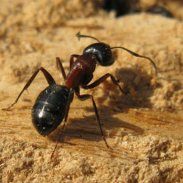

----

## Carpenter Ants

Suppose that the distribution of number of [Carpenter Ants (*Camponotus* spp.)](https://en.wikipedia.org/wiki/Carpenter_ant) in a nest is known to be N(1400,300).  From this, answer the following questions.

1. What is an individual?
1. What is the variable?
1. What type of variable is that?
1. What is &mu;?
1. What is &sigma;?

Additionally, for each question below (a) identify the type of question (e.g., "forward-left", "reverse-between") and then (b) answer the question.

6. What percentage of nests have more than 1900 ants?
1. What is the number of ants such that 15% of nests have more ants?
1. What is the number of ants such that 33% of nests have fewer ants?
1. What percentage of nests have between 700 and 1900 ants?
1. What percentage of nests have fewer than 300 ants?
1. What is the number of ants such that 5% of nests have more ants?
1. The most common 80% of nests have between what two numbers of ants?

----

<ul class="pagination pagination-lg">
  <li><a href="index.html">^</a></li>
  <li><a href="CE1.html">1</a></li>
  <li><a href="CE2.html">2</a></li>
  <li class="active"><a href="#">3</a></li>
  <li><a href="CE4.html">4</a></li>
  <li><a href="CE5.html">5</a></li>
  <li><a href="CE6.html">6</a></li>
</ul>
