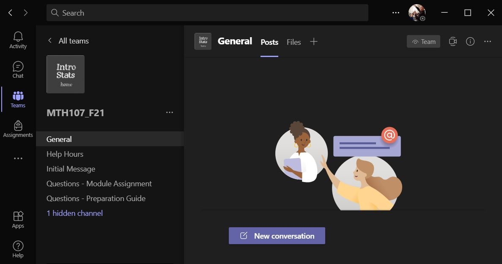

Note that there is a short assignment at the very bottom of this page.

Microsoft Teams is a group communication and collaboration platform that you will primarily use to ask me questions. One of the main features that I like about Teams is that it allows you to show me your computer so that I can more quickly help you troubleshoot R-related problems. You are likely familiar with Teams from other classes at Northland. However, below is a quick guide to getting started.

## Getting the App
You can get the Teams app through your Northland account. There are multiple ways to do this but the easiest is install the app [from this page](https://teams.microsoft.com/uswe-01/downloads){:target="_blank"} (*select the "Download Teams" button and follow the directions*).

In previous classes you may have accessed Teams through your web browser. I have found that Teams works more fluidly as an app rather than through the browser. Thus, I encourage you to install and run Teams through the app if you are using your own computer. If you choose to run Teams through the browser than you will need to use Chrome (*especially if you are using a Mac*) or Edge (rather than Firefox, Safari, IE, etc) to be able to show me your screen.

If possible, use the Teams app rather than Teams through the web browser. If you must use a browser than use Chrome or Edge.

&nbsp;

## Joining the Team
In Teams, follow these steps to join the MTH107 team.

1. Select "Teams" on the left side of the app. If you are already in a team, then you may need to select the link that says "< All Teams" to return to your list of teams.
1. Now select the "Join or Create Team" button.

{:start="3"}
1. In the "Join a team with a code" tile (the second tile) enter the code "pimojtc" (without quotes) into the box that says "Enter code".

{:start="4"}
1. Press the "Join team" button in that tile (it will appear when the code is entered). You should then be part of the team and it should look similar to the screen below (the name may be slightly different; e.g., different date).

&nbsp;

## Using Teams
The MTH107 Team currently has four main channels as seen in the screenshot above:

* **General**: For asking general questions (due dates, how to install R, etc.).
* **Questions -- Preparation Guide**: For asking questions about the module preparations.
* **Questions -- Module Assignments**: For asking questions about the module assignments.

In each channel you can start a new conversation (i.e., question) by pressing the "New Conversation" button.

You can also contribute to previous conversation by replying to previous messages.

I have Teams organized so that I will get notified when you post a question. Thus, I hope that this will be an efficient way to ask me questions outside of class and a way so that other students can learn from the answers.

<!----
For "official" help hours, I will open up a meeting at the appointed time (see the syllabus). When you go to the "Help Hours" channel you will see a banner that will give you an option to "Join" the ongoing meeting (the meeting name may be different).

In an ensuing dialog box you will be asked to identify your audio and video sources. For many systems these will be appropriately selected by default. Once you have selected the settings for your system you can press the "Join now" button.

---->

If you would like to "meet" with me outside of official office hours then send me a message and if I am available I will set up a meeting that you can join as shown above.

If you are using the Teams app, you will be able to show me your screen by pressing "Share Content" button which is right next to the red "Leave" button in the upper-right corner of the Teams meeting window.

When you do this you will then need to select which window or screen to share. I find it is easier to share a screen rather than just a window.

When you are finished with the meeting just press the red "Leave" button in the upper-right corner.

The video below has a few more hints on how to use Teams for class.

{:target="_blank"}

&nbsp;

## Receiving Notifications of Questions
By default, you will not receive notifications of questions from other students and my answers in the channels described above. To get these you must specifically tell Teams to notify you as described in the following steps.

* Select a channel from which you want to be notified.
* Select the three "dots" on the far right side of that channel

* Select "Channel Notifications"
* Select "All Activity" such that a checkbox will be shown for that item.

My preference is that you do this for at least the "General", "Questions - Class Preparation Reading", and "Questions - Module Assignments" channels.

&nbsp;

## Assignment
To demonstrate to me that you have joined the course team please go to the "Initial Message" channel and start a new conversation where you either ask me a question (about anything ... class, me, Northland, life) or tell me something about you (anything ... e.g., where you are from, your favorite fish, your favorite meal).
