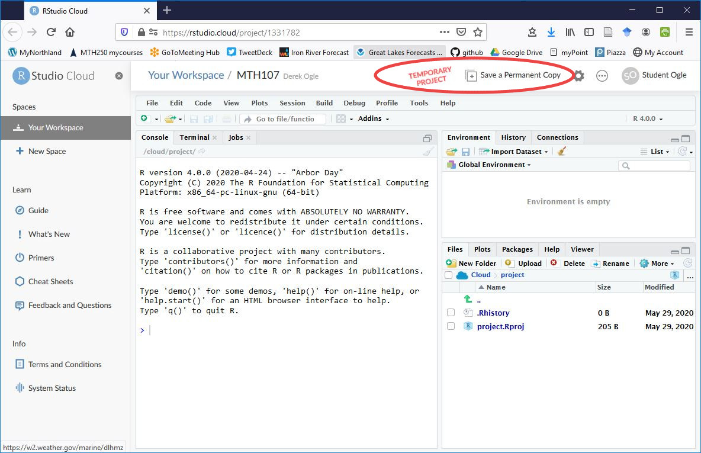

```{r setup, include=FALSE}
knitr::opts_chunk$set(echo=TRUE,fig.align='center',comment="#R>  ")
```

# What is R and RStudio
R is a software environment for performing statistical analyses. RStudio is a helper program that makes it easier to use R. Below are four videos to introduce you to R and RStudio.

<aside>
I will refer to R, but you will interact with RStudio.
</aside>

* [What is R?](https://www.youtube.com/watch?v=XcBLEVknqvY)
* [What's Up With R?](https://www.youtube.com/watch?v=ZwYQPtU2Pa0) [*stop at 1:51*]
* [What is RStudio (part 1)](https://www.youtube.com/watch?v=riONFzJdXcs) [*stop at 2:27*]
* [What is RStudio (part 2)](https://www.youtube.com/watch?v=riONFzJdXcs) [*only from 3:26 to 4:13*]

Detailed methods for downloading, installing, and configuring R, RStudio, and `NCStats` on your personal computer are given on the [Resources page of the course website](http://derekogle.com/NCMTH107/resources#computer).

&nbsp;

# Installing R, RStudio, NCStats
R and RStudio can be installed to your personal computer, but does not work well if you have a ChromeBook or if your machine is old (especially Macs). If you don't have your own machine or you have a ChromeBook or old machine then please follow the ["RStudio-in-the-Cloud" directions](#rstudio-in-the-cloud) further below. Otherwise follow the Windows or Mac directions below.

## Windows
To install R on a Windows machine, downloaded the installer from [this site](https://cloud.r-project.org/bin/windows/base/) by selecting the “Download R X.X.X for Windows” link at the top. Locate the installer on your computer and run it. Using all of the default choices will perform an acceptable install for this class.

To install RStudio on a Windows machine, download the installer from [this link](https://rstudio.com/products/rstudio/download/#download) by selecting the “DOWNLOAD RSTUDIO FOR WINDOWS” button. Locate the installer on your computer and run it. Using all of the default choices will perform an acceptable install for this class.

Install `NCStats` as [described here](#ncstats).

## Mac
To install R on a Mac, downloaded the installer from [this site](https://cloud.r-project.org/bin/macosx/) by selecting one of the “R-X.X.X.pkg” links appropriate for your operating system under the “Latest Release” section. Locate the “.pkg” file on your computer and install it per usual. Using all of the default choices will perform an acceptable install for this class.

To install RStudio on aMac, download the installer from [this link](https://rstudio.com/products/rstudio/download/#download) by selecting the “DOWNLOAD RSTUDIO FOR MACOS” button (you can also select the MacOS option under the “All Installers” section). Locate the “.dmg” file on your computer and install it per usual. Using all of the default choices will perform an acceptable install for this class.

Install `NCStats` as [described here](#ncstats).

## NCStats
The latest `NCStats` may be installed by running these lines in R/RStudio:

```
if (!require('manipulate')) utils::install.packages('manipulate')
if (!require('remotes')) install.packages('remotes'); require('remotes')
remotes::install_github('droglenc/NCStats',type='binary')
```

This installation may fail if other packages do not install properly (primarily the `Rcpp` and `curl` packages). These failures may be ameliorated by manually installing packages responsible for the errors (see [these directions](http://derekogle.com/IFAR/supplements/installations/InstallPackagesRStudio.html)).

E-mail me if you continue to experience difficulties installing `NCStats`.

## RStudio-in-the-Cloud
Analyses with R and RStudio can be run through a web browser on “the cloud”, thus eliminating the need to install these softwares and the associated packages on your computer. Follow the directions below if you would like to try using R/RStudio in the cloud. **Only follow these directions if you don't plan to use R/RStudio on your own computer and did not install R/Studio/NCStats as described in the three sections above.**

You must create a free RStudio Cloud account to use this service. Go to [the RStudio Cloud website](https://rstudio.cloud/) and select “Get Started.” In the ensuing dialog box enter your e-mail adddress, a password, and your first and last names. Press “Sign up.” In a subsequent screen you will be asked to provide a name for the account with prompts to use your first and last name. Just press “Create Account” here.

Once you have created your account, follow [this link to the “MTH107” project](https://rstudio.cloud/project/2239963), which should open a project that looks close to that below. Currently this project is in my “workspace.” Click on the red “Save a Permanent Copy” item in the top bar to save the project to your workspace (see below). When you return in the future this project will appear in the left-hand menu, open it to begin your work.

```{r echo=FALSE, layout="l-body-outset"}

```

&nbsp;

# R Basics
## Saving
Results are not saved in R. Rather, "scripts" of successful R commands are saved and, then, if the analysis needs to be re-done, the entire set of commands is opened and run again. When writing a report, all tabular and graphical output should be copied from R and pasted into your report document. This document will serve as your analysis report and can be modified to include answers to questions, references to the tables and graphs, etc. Most data used in this class will be entered into R through "comma-separated values" text file (discussed later).

R does allow one to save a "workspace", though I urge you not to do that. Rather, save your "good" commands in a script and save your "good" results in a report document; do not save the workspace.

<aside>
Do NOT save the workspace.
</aside>

## Expressions and Assignments
Expressions in R are mathematical "equations" that are evaluated by R with a result seen immediately. An example of an expression in R is

```{r}
5+log(7)-pi
```

where `log()` and `pi` are built-in functions used to compute the natural log and find the value of $\pi$, respectively. Expressions in R are like using a calculator where the result is shown, but not saved for subsequent analyses. In addition, expressions in R follow the same order of operations and use of parentheses as expressions entered into your calculator.

Results from an expression are typically saved for further computations by assigning the results to an object with the assignment operator (i.e., `<-`). The general form for saving the result of an expression into an object is `object <- expression`. The result of the expression will not be seen unless the object name is subsequently typed into R (but see below). For example, the result of the previous expression is saved into an object called `x` and then viewed with

```{r}
x <- 5+log(7)-pi
x
```

The result of an expression can be both assigned and printed by surrounding the command in parentheses. For example, the following assigns the result of the expression to `y` and prints the result.^[The spaces between the expression and the parentheses are only needed to increase legibility.]

```{r}
( y <- 15*exp(2) )
```

An object can be named whatever you want, with the exception that it cannot start with a number or symbol (e.g., `!`, `@`), contain a space, or be the name of a reserved word or function (e.g., `pi` or `log`). Object names should be short and simple enough that you can remember what is contained in the object. It is also good practice to view the object immediately after making the assignment to make sure that it contains results that seem appropriate.

<aside>
Object names should be short and informative.
</aside>


&nbsp;

# Functions and Arguments
R contains many "programs," or functions, to perform particular tasks. A function is "called" by typing the function name followed by open and closed parentheses.^[Regular curved parentheses have two primary uses in R: (1) to control order of operations in expressions (as with a calculator) and (2) to contain the arguments sent to a function.] The `log()` function, used in the previous section, is an example of a function. Arguments, which the function will use to perform its task, are contained within the parentheses. In `log()` above, the argument is the number in parentheses (and for which the natural log will be computed). Many other functions will be described below and in subsequent modules.

<aside>
Function names are followed by parentheses.

Arguments are within function parentheses.
</aside>

&nbsp;

# NCStats Package
`NCStats` is a set of R functions that makes the statistical methods used in this class easier. You need to load the `NCStats` package at the beginning of every R script used in this class. Packages are loaded by including the package name within `library()`.

```{r}
library(NCStats)
```

# Corrections {.appendix}
If you see any errors (code, typographical, or logical) please bring these to [my attention](mailto:dogle@northland.edu).
