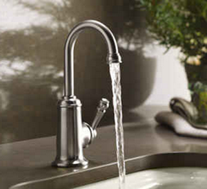

----

<strong>Note:</strong> Your answers to the questions below should follow the <a href="../../resources/hwformat" target="_blank">expectations for homework found here</a> (and <a href="../../resources/FAQ/FAQs/HWFormat_Example.pdf" target="_blank">demonstrated here</a>). Date due on <a href="../../resources/Dates-Current.html" target="_blank">Dates page</a>.

----

## Food Choice by Chipmunks

An "arena" contains 8 acorns and 9 kernels of corn. Assume that a chipmunk placed in the arena chooses items to eat at random. Use this information to answer the questions below.

1. What is the probability that the chipmunk eats an acorn?
1. What is the probability that the chipmunk eats a kernel of corn?
1. What is the probability that the chipmunk eats a kernel of corn assuming that it has already eaten six kernels of corn and no acorns?

----

## Water Usage

Assume that it is known that the daily water usage for a household is normally distributed with a mean of 90 gallons and a standard deviation of 20 gallons. Use this information to answer the questions below.

1. What is the probability that less than 60 gallons is used by this household on a random day?
1. What is the probability that between 75 and 150 gallons is used by this household on a random day?
1. What is the probability that more than 100 gallons is used by this household on a random day?

----
