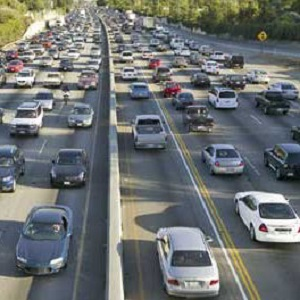

----

## Melatonin and Sleep

MIT researchers examined the effect of [melatonin](http://www.webmd.com/sleep-disorders/tc/melatonin-overview) on sleep.  Suppose that we know that men given a placebo fell asleep according to a N(15,5) distribution.  For each question below identify (a) the distribution that would be used to answer the question, (b) whether the question can be answered or not, (c) specific characteristics of the required distribution, and (d) if appropriate, the answer to the question.

1. What is the probability, with 4 randomly selected men, of observing a mean of more than 12 mins?
1. What is the probability that a randomly selected man will fall asleep in more than 12 mins?
1. What is the probability that 25 randomly selected will have a mean time to fall asleep of more than 15.5 minutes?

----

## Pollutants in Auto Exhaust

The level of nitrogen oxides (NOX) in the exhaust of a particular car model is right-skewed with a mean of 0.9 grams per mile (g/mi) and a standard deviation of 0.15 g/mi.  For each question below identify (a) the distribution that would be used to answer the question, (b) whether the question can be answered or not, (c) specific characteristics of the required distribution, and (d) if appropriate, the answer to the question.

1. What is the probability that a car will have a NOX greater than 1 g/mi?
1. What is the probability that a random sample of 15 cars will have a mean NOX greater than 1 g/mi?
1. What is the probability that a random sample of 50 cars will have a mean NOX greater than 0.92 g/mi?
1. What is the probability that a random sample of 50 cars will have a mean NOX less than 0.85 g/mi?
1. What is the mean NOX such that only 1% of samples of 50 cars have a larger mean?

----

## Acorn Length

Suppose that it is known that the distribution of lengths of acorns is slightly right-skewed with a mean of 21 mm and a standard deviation of 6 mm.  For each question below identify (a) the distribution that would be used to answer the question, (b) whether the question can be answered or not, (c) specific characteristics of the required distribution, and (d) if appropriate, the answer to the question.

1. What is the probability that an acorn will have a length greater than 25 mm?
1. What is the probability that the mean length of a sample of 20 acorns will be greater than 25 mm?
1. What is the probability that the mean length of a sample of 50 acorns will be between 20 and 25 mm?
1. What is the probability that the mean length of a sample of 6 acorns will be less than 20 mm?
1. What is the probability that an acorn will have a length less than 20 mm?

----

## People in Car

A study of rush-hour traffic in San Francisco counted the number of people in a car entering a freeway at a suburban interchange.  Suppose that, in the population, this count has a mean of 1.5 people with a standard deviation of 0.75.

1. Do you expect this count to follow a normal distribution?  What are two pieces of evidence to support your answer?
1. What is the probability that a random sample of 40 cars will have a mean number of passengers of less than 1.2?
1. What is the probability that a random sample of 50 cars will have a mean number of passengers of greater than 2.0?
1. What is the probability that a random sample of 5 cars will have a mean number of passengers of greater than 2.0?
1. Suppose that 700 cars pass through this intersection in one hour.  What is the probability that these 700 cars will carry more than 1075 people?

----

## Plowing Snow

Suppose that it is know that the distribution of times spent plowing a single city block on snow days is right-skewed with a mean of 45 seconds and a standard deviation of 28 seconds.

1. What is the probability that in a sample of 5 blocks that the mean is greater than 60 seconds?
1. What is the probability that it will take longer than 60 seconds for one block?
1. What is the probability that in a sample of 40 blocks will have a mean between 40 and 50 seconds?
1. What is the Q1 for the mean plow time in samples of 40 blocks?

----

<ul class="pagination pagination-lg">
  <li><a href="Probability.html">^</a></li>
  <li><a href="Probability_CE1.html">1</a></li>
  <li class="active"><a href="#">2</a></li>
</ul>

----
